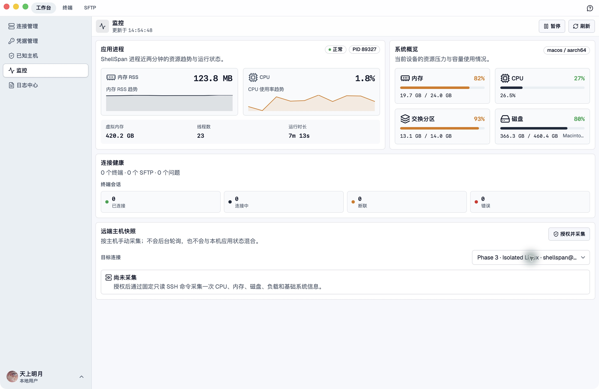
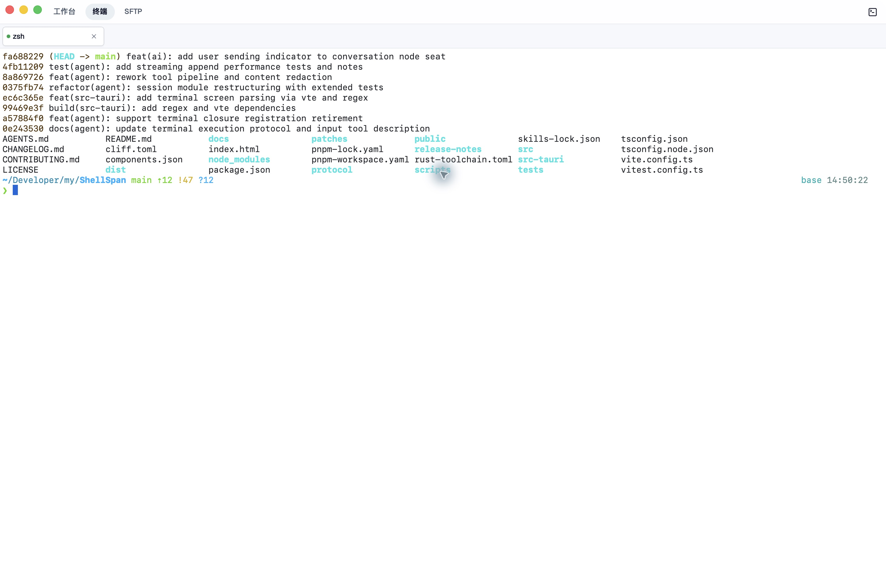
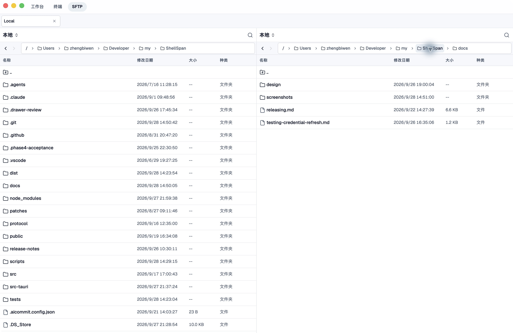
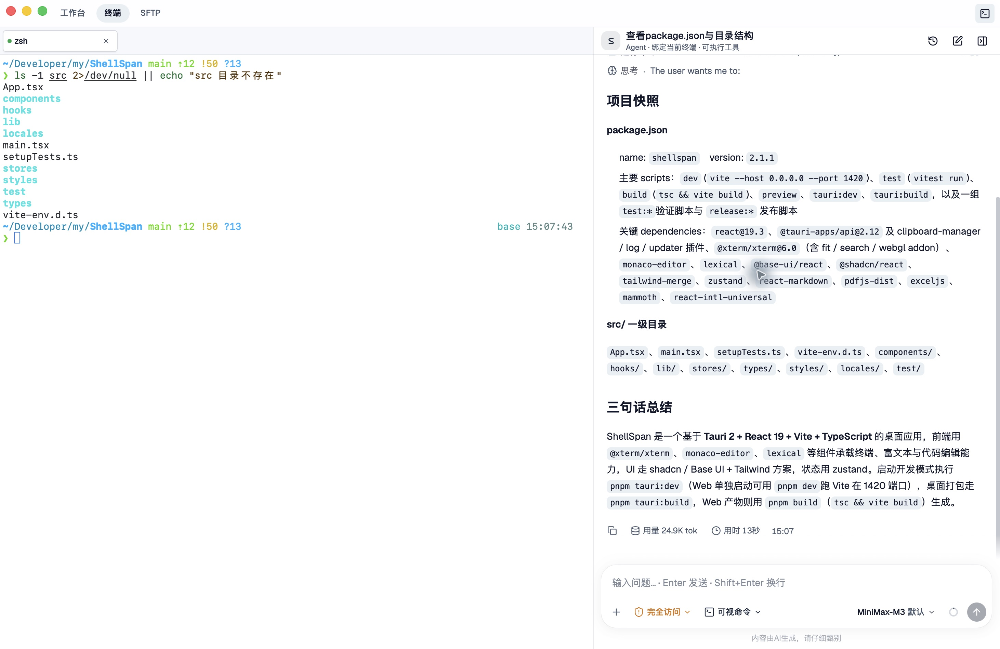

# ShellSpan

[简体中文](./README.md) · English

ShellSpan is a desktop SSH client for remote system administration, with an integrated terminal, file manager, monitoring tools, and AI assistant.

[Download](https://github.com/hi-fullmoon/ShellSpan/releases/latest) · [Report an issue](https://github.com/hi-fullmoon/ShellSpan/issues) · [Contributing](./CONTRIBUTING.md)

## Features

- **Terminal**: SSH and local terminals, tabbed sessions, jump hosts, and port forwarding
- **File management**: Dual-pane SFTP browsing, drag-and-drop transfers, resumable transfers, and file previews
- **Connection management**: Saved connections, password and private key authentication, and credentials managed through the system keychain
- **Administration tools**: Local and remote monitoring, log viewing, and deployment management
- **AI assistant**: Runs tasks within terminal sessions, with administration skills, operation approvals, and the ability to stop at any time

## Screenshots

These screenshots show the macOS development build, including local monitoring, a local terminal, project file browsing, and the terminal agent.

### Workbench

View application resource trends, system capacity, and connection health in one place.



### Terminal

View project commit history and directory contents in the terminal, with support for local shells and SSH sessions.



### File manager

Browse project and document directories side by side. Each pane can independently use the local file system or a remote SFTP connection.



### AI assistant

Open the AI assistant in the terminal and describe a task in natural language. The terminal agent runs commands in the current session and summarizes the results based on their actual output.

**Example: Explore the current project**

Navigate to the project directory, open the AI assistant in the top-right corner of the terminal, and enter:

> Run read-only commands in the current terminal to inspect the name, version, scripts, and dependencies in package.json, and list the immediate subdirectories under src. Then summarize the project's technology stack and how to start it in three sentences. Do not modify files or read other configuration files or credentials.

The screenshot shows an actual run: terminal commands and directory listings appear on the left, while the assistant summarizes project dependencies, directory structure, and startup commands on the right.



## Technology stack

Tauri 2 · Rust · React 19 · TypeScript · Tailwind CSS 4 · xterm.js

## Local development

Requirements: Node.js 24+, pnpm 11, stable Rust, and the [system dependencies required by Tauri 2](https://v2.tauri.app/start/prerequisites/).

```bash
pnpm install       # Install dependencies
pnpm tauri:dev     # Start the desktop application
pnpm test          # Run unit tests
pnpm build         # Type-check and build the frontend
pnpm tauri:build   # Build desktop installers
```

## License

[MIT](./LICENSE)
