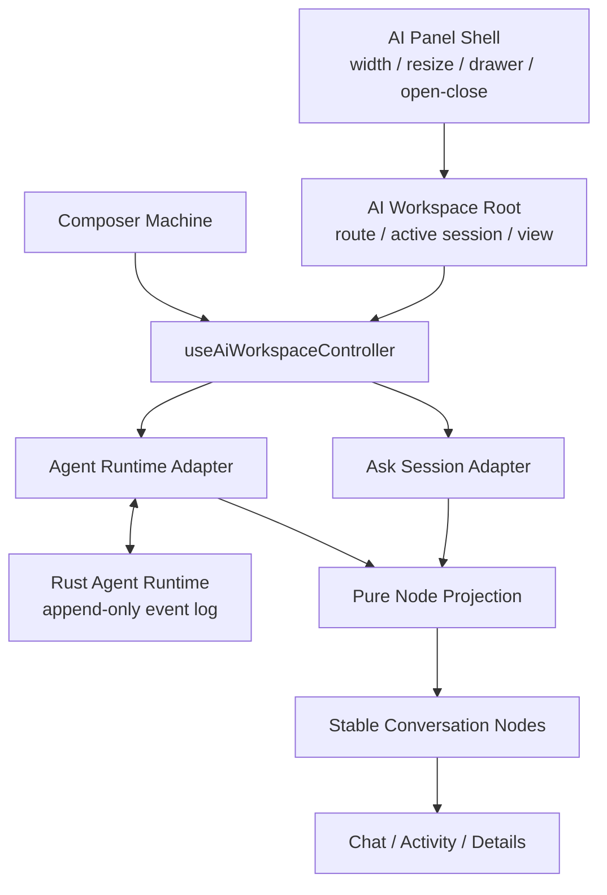
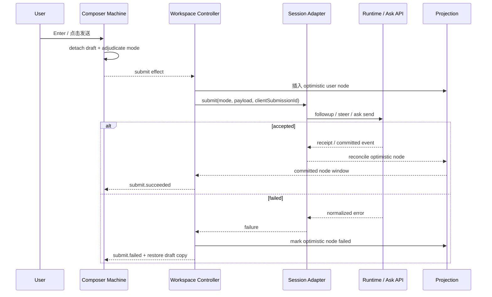

# ShellSpan AI 对话面板 DeepSeek Harness 化实施方案

> 文档状态：实施基线（Draft for implementation）  
> 编写日期：2026-09-02  
> 适用范围：ShellSpan 桌面端 AI 面板  
> 核心约束：**保留现有右侧 320–720px 可调宽面板及其开关、拖拽、持久化和窄屏 Drawer 行为；全面重做面板内部的 UI 布局、交互逻辑与前端状态组织。**

## 1. 结论先行

本次改造不把 ShellSpan 变成 DeepSeek Harness 的三栏全屏应用，也不改变终端工作区与 AI 面板之间的空间关系。实施边界如下：

- 保留 [`AiPanel`](../src/components/ai/ai-panel.tsx) 的右侧 `aside` 容器、320px 最小宽度、720px 最大宽度、拖拽调整宽度、键盘调整宽度、本地持久化、标题栏开关和窄屏 Drawer。
- 保留 Rust Agent Runtime 的 Session、事件日志、工具执行、审批、恢复和子 Agent 机制；React 继续只消费已提交事件，不建立第二份 Agent 业务状态。
- 推翻当前面板内部的“配置工具栏 + 多层状态条 + Alert 堆叠 + Ask/Agent 分叉 + 大输入框”结构。
- 采用 DeepSeek Harness 的核心产品模型：**稳定会话骨架、事件投影节点、滚动归属、常驻 Composer、队列/转向提交策略、审批接管输入区、会话浏览和详情导航。**
- UI 使用 ShellSpan 已安装的 shadcn primitives 与现有语义化 token 重建，不直接复制 DeepSeek Harness 的 CSS、三栏尺寸或插件框架。
- Ask 与 Agent 在第一阶段共享同一套界面和交互协议，但保留各自后端适配器；是否把 Ask 最终迁移为“无工具 Agent Session”作为后续运行时决策，不阻塞 UI 改造。

最终形态可以概括为：

```text
ShellSpan 主工作区
└── 右侧 AI Panel（仍为 320–720px）
    ├── 40px 会话标题栏
    ├── Conversation / Activity 视图
    │   ├── 空态 Hero 或事件投影对话流
    │   └── 面板内全屏的会话浏览 / 工具详情子视图
    └── Sticky Composer Seat
        ├── 审批面板（有审批时接管）
        ├── Context Dock / Queue Dock / 错误恢复条
        └── 输入框 + 策略控件 + 发送/停止
```

## 2. 目标、非目标与不可变约束

### 2.1 目标

1. 让 AI 面板在 320–720px 全宽区间内都像一个完整、稳定、可连续工作的对话产品，而不是设置表单与消息列表的拼接。
2. 使普通 Ask 与 Agent 在视觉层和交互层统一：同一会话头、同一消息布局、同一 Composer、同一错误表达和同一历史入口。
3. 让 Agent 的 append-only 事件日志自然映射成稳定、有类型的对话节点；流式更新时只更新对应节点，不反复重建整条消息列表。
4. 明确运行中输入的语义：排队到下一 Turn、转向到下一安全 Step、停止任务三者不能混淆。
5. 把审批从消息流里的重复重型卡片，提升为当前任务的首要交互，并在保留完整审计信息的前提下接管 Composer 区域。
6. 保留 ShellSpan 的终端上下文、连接权限和运行时安全边界；DeepSeek Harness 只作为前端产品与架构参考。
7. 将当前 2,000 行以上的 [`ai-panel.tsx`](../src/components/ai/ai-panel.tsx) 拆成可测试的视图、控制器、投影与纯状态机。

### 2.2 非目标

- 不改变 `AppShell → MainContent → AiPanel` 的页面级布局。
- 不引入 DeepSeek Harness 的常驻左侧会话栏或右侧详情栏。
- 不改变 AI 面板 320–720px 的尺寸约束。
- 不把 Agent 执行循环迁回 React，不在 Zustand 复制 Rust Runtime 的任务状态。
- 不在本阶段重写 Provider、Native Tool Pipeline、Recovery、Fleet 或事件持久化。
- 不引入 DeepSeek Harness 的 Cordis/插件槽体系；ShellSpan 使用轻量、显式、类型安全的节点 renderer map。
- 不为了视觉一致性硬编码 DeepSeek 的品牌色、字体或 logo。
- 不承诺第一阶段即可编辑、删除、拖拽运行时 Inbox 项；该能力需要后端命令与事件合同配套扩展。

### 2.3 必须原样保留的外壳能力

以下行为视为兼容性合同，不允许在 UI 重构中退化：

| 能力 | 当前实现 | 实施要求 |
| --- | --- | --- |
| 面板位置 | 主工作区右侧 `aside` | 不变 |
| 宽度范围 | 320–720px | 不变 |
| 默认宽度 | 400px | 不变 |
| 主内容最小宽度 | 480px | 不变 |
| 宽度持久化 | `shellspan.aiPanelWidth` | key 与语义不变 |
| 指针缩放 | pointer capture + `requestAnimationFrame` | 逻辑原样保留或等价抽取 |
| 键盘缩放 | 每次 24px | 不变，并保留可访问名称 |
| 面板开关 | TitleBar 中的 AI 按钮 | 不变 |
| 紧凑视口 | Drawer 呈现 | 不变，只替换 Drawer 内部内容 |

## 3. 现状审计

### 3.1 当前前端结构

当前 [`src/components/ai/ai-panel.tsx`](../src/components/ai/ai-panel.tsx) 同时承担了：

- 面板尺寸与拖拽；
- Provider、模型与模式选择；
- Ask 对话的创建、持久化和流式输出；
- Agent Session 的创建、继续、转向、停止与恢复；
- 终端上下文采集与显示；
- 错误、断线、审批和权限提示；
- 对话视图和 Composer 渲染；
- 紧凑视口 Drawer 包装。

这导致三个直接问题：

1. **外壳与业务耦合。** 任何会话交互调整都可能碰到宽度、Drawer 或终端绑定逻辑。
2. **状态来源混杂。** Rust Agent snapshot、事件投影、Ask 消息、UI 导航、草稿和异步命令状态在一个组件内协调。
3. **视觉优先级倒置。** Provider、绑定、权限、警告等辅助信息长期占据上部空间，对话与当前行动反而被压缩。

当前 Agent 展示又被拆成 [`agent-session-view.tsx`](../src/components/ai/agent-session-view.tsx)、[`agent-conversation-view.tsx`](../src/components/ai/agent-conversation-view.tsx)、[`agent-tool-row.tsx`](../src/components/ai/agent-tool-row.tsx) 和 [`agent-activity-view.tsx`](../src/components/ai/agent-activity-view.tsx)。这些组件已经证明了“Conversation/Activity 来自同一事件流”的方向正确，但展示仍偏向嵌套 Card、Collapsible 和管理面板，不够接近连续对话体验。

### 3.2 当前可复用基础

以下资产应直接复用，而不是重写：

- [`agent-session-client.ts`](../src/lib/agent-session-client.ts)：订阅优先、补齐 committed events、处理 gap 的客户端。
- [`agent-session-projection.ts`](../src/lib/agent-session-projection.ts)：纯 Conversation / Activity 投影基线。
- [`agent-session.ts`](../src/types/agent-session.ts)：Session、Inbox、Turn、Step、审批、工具、Artifact、Recovery、Subagent 和 Task 事件合同。
- [`chat-primitives.tsx`](../src/components/ai/chat-primitives.tsx)：ShellSpan 对 shadcn Message、Bubble、Marker、MessageScroller 的统一包装。
- [`message-scroller.tsx`](../src/components/ui/message-scroller.tsx)：滚动 viewport、anchor、可见性与“跳到底部”按钮。
- [`aiStore.ts`](../src/stores/aiStore.ts)：现有 Ask 会话与面板开关的兼容状态。
- [`aiSettingsStore.ts`](../src/stores/aiSettingsStore.ts)：Provider、默认模型、上下文行数和 Agent 开关设置。
- [`base.css`](../src/styles/base.css)：应用现有语义化颜色与 shadcn token。
- Rust [`agent_runtime/`](../src-tauri/src/agent_runtime/)：唯一可执行 Agent 架构。

### 3.3 运行时现状

当前 Runtime 已支持：

- 创建、启动、继续和转向 Session；
- `nextTurn` / `nextStep` 两条 Inbox lane；
- 停止 Session；
- 工具批准与拒绝；
- Session 列表、详情、归档；
- committed event 分页与实时订阅；
- Artifact 读取；
- Recovery、子 Agent 与 Fleet 事件。

其中 `followup` 与 `steer` 的语义已分别对应“下一 Turn”和“下一安全 Step”，非常适合映射 DeepSeek Harness 的 Queue / Steer UX。当前主要缺口不是运行语义，而是：

- Inbox 项缺少修改、删除、重新排序的命令；
- Session 缺少明确的重命名命令；
- Ask 仍使用单独的前端会话模型；
- 任意文件/图片附件没有统一的 composer attachment 合同；
- “模型向用户提问”“Plan Review”等专用交互节点尚未形成稳定事件类型。

## 4. DeepSeek Harness 参考范围

本方案参考本地 `deepseek-harness` 的以下实现：

- [`AppFrame.tsx`](../../deepseek-harness/packages/client/ui-layout/src/client/AppFrame.tsx) 与 [`columns.ts`](../../deepseek-harness/packages/client/ui-layout/src/client/columns.ts)：页面层级与主/辅视图关系。
- [`ConversationRoot.tsx`](../../deepseek-harness/packages/client/ui-conversation/src/client/skeleton/ConversationRoot.tsx)：空态、活跃态和常驻输入区骨架。
- [`ConversationSession.tsx`](../../deepseek-harness/packages/client/ui-conversation/src/client/skeleton/ConversationSession.tsx)：会话标题和视图组织。
- [`InputBar.tsx`](../../deepseek-harness/packages/client/ui-conversation/src/client/skeleton/InputBar.tsx)：输入、运行态、策略切换与停止。
- [`machine.ts`](../../deepseek-harness/packages/client/ui-conversation/src/client/input/machine.ts) 与 [`submission-policy.ts`](../../deepseek-harness/packages/client/ui-conversation/src/client/input/submission-policy.ts)：可测试的提交状态机和 Queue/Steer 决策。
- [`ChatView.tsx`](../../deepseek-harness/packages/client/ui-chat/src/client/chat/ChatView.tsx)：事件节点、乐观回显、滚动归属与列表更新。
- [`ChatNodeSeat.tsx`](../../deepseek-harness/packages/client/ui-chat/src/client/chat/ChatNodeSeat.tsx)：按 discriminated union 分派的稳定节点席位。
- [`MessageItem.tsx`](../../deepseek-harness/packages/client/ui-chat/src/client/chat/MessageItem.tsx) 与 [`ReasoningRow.tsx`](../../deepseek-harness/packages/client/ui-chat/src/client/chat/ReasoningRow.tsx)：用户消息、助手消息和推理行的视觉层级。
- [`QueueDock.tsx`](../../deepseek-harness/packages/client/ui-conversation/src/client/queue/QueueDock.tsx)：运行中输入队列。
- [`ApprovalPanel.tsx`](../../deepseek-harness/packages/client/ui-approval/src/client/ApprovalPanel.tsx)：审批接管 Composer。
- [`DetailsPanel.tsx`](../../deepseek-harness/packages/client/ui-chat/src/client/details/DetailsPanel.tsx)：工具输入/输出详情。

### 4.1 应复制的原则

- Conversation 根骨架在空态与活跃态之间不卸载 Composer。
- 后端事件先投影成稳定 keyed nodes，再由节点渲染器输出 UI。
- 用户消息使用克制的右侧气泡；助手消息与工具过程不套大气泡。
- 页面只展示一个 Turn 级运行状态，避免每个流式片段重复 spinner。
- 用户发送后立即乐观回显；网络/运行时失败时恢复草稿且保留重试入口。
- 滚动行为服从用户位置：只有在底部附近才自动跟随，用户上滚后不抢焦点。
- 运行中的 Enter 和加速快捷键具有明确、互补的 Queue/Steer 语义。
- 审批是当前行动，不应只是历史流里的一张次要卡片。

### 4.2 不应复制的实现

- 不复制 280px 左侧栏、640px 中心最小宽度、360px 详情栏等全屏三栏参数。
- 不在 320–720px 面板内再常驻一条会话侧栏或详情侧栏。
- 不复制 DeepSeek 的 CSS Modules、品牌 token、字体和 logo。
- 不复制其手写滚动容器；ShellSpan 的 shadcn `MessageScroller` 继续拥有滚动行为。
- 不复制其插件注册体系；使用显式 TypeScript renderer map。
- 不为视觉一致性绕过 ShellSpan Runtime 的权限、审批、事件提交和恢复规则。

## 5. 目标信息架构

### 5.1 面板内导航

AI 面板内采用单栈导航，不再嵌套永久栏：

```ts
type AiPanelRoute =
  | { kind: "conversation"; sessionId: string | null }
  | { kind: "sessions" }
  | { kind: "toolDetails"; sessionId: string; nodeKey: string }
  | { kind: "artifactDetails"; sessionId: string; artifactId: string }
```

规则：

- `conversation` 是默认路由。
- 点击历史按钮进入 `sessions`，该视图覆盖面板内容区，但不覆盖或改变外层 `aside`。
- 点击工具行进入 `toolDetails`，返回后恢复原对话滚动位置和焦点。
- 详情视图始终在同一个 320–720px 面板内呈现；即使宽度为 720px，也不启用永久双栏，以免布局在拖拽过程中跳变。
- Route 是纯 UI 状态，不写入 Agent 事件日志。

### 5.2 主骨架

```text
┌──────────────────────────────┐
│ 会话标题 / 状态      历史 新建 × │ 40px
├──────────────────────────────┤
│ Conversation  Activity       │ 32px（Agent 会话显示）
├──────────────────────────────┤
│                              │
│       MessageScroller        │ flex: 1
│                              │
│                   [↓]        │
├────── 36px gradient mask ────┤
│ Context / Queue / Recovery   │ 可选 docks
│ ┌──────────────────────────┐ │
│ │ composer textarea        │ │
│ │ preset model       send  │ │
│ └──────────────────────────┘ │ sticky seat
└──────────────────────────────┘
```

Header 只保留会话级动作。Provider、模型、权限、终端绑定等低频配置进入 Composer 工具行的 popover/combobox 或设置入口，不再长期占据消息区上方。

### 5.3 视图状态

#### 空会话

```text
┌──────────────────────────────┐
│ 新会话               历史  × │
│                              │
│             ✦                │
│      今天想在终端里做什么？    │
│   [当前终端] [Agent · 请求批准] │
│                              │
│ ┌──────────────────────────┐ │
│ │ 输入问题或任务…            │ │
│ │ Ask/Agent  模型       ↑    │ │
│ └──────────────────────────┘ │
└──────────────────────────────┘
```

- Hero 与 Composer 组成一个居中 seat。
- 第一次提交后，Composer 节点本身移动到底部，不重新创建 DOM；这能保留输入法、焦点和未提交附件状态。
- Hero 使用 ShellSpan 品牌图标与文案，不使用 DeepSeek logo。
- 当前终端和会话 preset 以紧凑 chip 呈现，可点击修改。

#### 活跃会话

```text
┌──────────────────────────────┐
│ 修复远程部署脚本   运行中  … × │
│ 对话  活动                    │
│                              │
│                     用户气泡 │
│ 助手正文                     │
│ Think · 已分析 3 个文件   ›   │
│ ✓ Read package.json       ›  │
│ ◌ Run tests              ›  │
│                              │
│              [跳到最新 ↓]    │
│ ┌ Queue · 2 ──────────────┐ │
│ └──────────────────────────┘ │
│ ┌──────────────────────────┐ │
│ │ 可继续输入…               │ │
│ │ 转向/排队            ■    │ │
│ └──────────────────────────┘ │
└──────────────────────────────┘
```

#### 等待审批

```text
┌──────────────────────────────┐
│                              │
│ 对话历史                     │
│                              │
├──────────────────────────────┤
│ 需要批准：执行远程命令         │
│ 目标、意图、风险摘要           │
│ [查看完整参数]                │
│ [拒绝]        [批准一次]       │
└──────────────────────────────┘
```

- 审批面板占用 Composer seat；原输入草稿保留在状态机中，但暂时不可编辑。
- 对话中保留一条简洁的审批 marker，审批完成后成为不可变审计节点。
- 完整 target、arguments、effect、risk、digest 和结果仍可在详情中查看，不削弱现有安全信息。

## 6. 320–720px 响应式规范

外层宽度范围不变，内部组件按容器宽度而非窗口宽度适配。优先使用 CSS container query；若现有构建链验证存在问题，再使用 `ResizeObserver` 只计算离散密度档位，不参与滚动。

| 宽度 | 密度 | 具体行为 |
| --- | --- | --- |
| 320–399px | compact | 左右 padding 12px；标题省略；非关键 header 动作收入 `DropdownMenu`；Composer 工具行图标化；用户气泡最大 88%；Activity tab 只显示图标 + 可访问名称 |
| 400–559px | standard | 左右 padding 16px；标题 + 状态可同时出现；用户气泡最大 84%；常用 preset 显示短标签 |
| 560–720px | comfortable | 内容仍是单列；左右 padding 20px；用户气泡最大 78–82%；工具行可显示图标和文字；详情仍使用面板内路由，不拆双栏 |

统一尺寸建议：

| 元素 | 尺寸/规则 |
| --- | --- |
| Panel Header | 高 40px，单行，`border-b` |
| View Tabs | 高 32px；Ask 无 Activity 时隐藏整行 |
| 对话内容 | `min-width: 0`，最大宽度为可用宽度，不套桌面端 680–920px 固定中心列 |
| 消息间距 | Turn 间 24px，节点内 8–12px；使用 `gap-*`，不使用 `space-y-*` |
| 用户气泡 | 圆角约 22px；语义色 `bg-muted` / `text-foreground`；右对齐 |
| 助手消息 | 无外层气泡；正文全宽；代码、表格和列表允许横向滚动 |
| Composer | 左右距 12–16px；圆角约 22px；最小编辑高度 52px；最大 14 行或 336px |
| Sticky Mask | Composer 上方约 36px 背景渐变，只遮盖视觉，不拦截指针 |
| 触控目标 | 最小 32×32px；主要发送/停止按钮 36×36px |

不允许在 compact 档直接隐藏语义重要信息。图标化动作必须具备 `Tooltip`、`aria-label` 与键盘焦点。

## 7. 目标前端架构

### 7.1 分层



职责边界：

- **AI Panel Shell**：只知道开关、宽度、拖拽、紧凑 Drawer 与内容插槽。
- **Workspace Root**：只协调当前 route、active session、Conversation/Activity tab、Hero/Active 相位。
- **Controller**：把 UI intention 转为 Ask 或 Agent adapter 调用，处理乐观提交、错误恢复和命令幂等。
- **Adapter**：隐藏 Ask 与 Agent 后端差异，输出统一 snapshot 和 nodes 输入。
- **Projection**：纯函数，不发命令、不访问 store、不读取 DOM。
- **View**：只渲染节点并派发 intention。
- **Composer Machine**：纯 reducer/effect 解释器，不直接调用 Tauri。

### 7.2 建议目录

```text
src/components/ai/
├── ai-panel.tsx                         # 仅外壳与 compact drawer
├── workspace/
│   ├── ai-workspace-root.tsx            # 主骨架与 route outlet
│   ├── ai-session-header.tsx
│   ├── ai-session-tabs.tsx
│   ├── ai-empty-hero.tsx
│   ├── ai-conversation.tsx
│   ├── ai-conversation-node-seat.tsx
│   ├── ai-activity.tsx
│   ├── ai-session-browser.tsx
│   ├── ai-tool-details.tsx
│   ├── ai-artifact-details.tsx
│   ├── ai-composer-seat.tsx
│   ├── ai-composer.tsx
│   ├── ai-context-dock.tsx
│   ├── ai-queue-dock.tsx
│   ├── ai-approval-panel.tsx
│   └── use-ai-workspace-controller.ts
├── nodes/
│   ├── user-message-node.tsx
│   ├── assistant-message-node.tsx
│   ├── reasoning-node.tsx
│   ├── tool-node.tsx
│   ├── approval-marker-node.tsx
│   ├── lifecycle-marker-node.tsx
│   ├── retry-node.tsx
│   └── error-node.tsx
└── chat-primitives.tsx                 # 保留并按需扩展

src/lib/ai/
├── session-adapter.ts                  # 统一 adapter contract
├── ask-session-adapter.ts
├── agent-session-adapter.ts
├── conversation-node.ts
├── conversation-projection.ts
├── composer-machine.ts
├── submission-policy.ts
├── optimistic-submission.ts
└── session-title.ts

src/stores/
└── aiWorkspaceStore.ts                 # 仅 UI/草稿/导航状态
```

可以根据实现进展合并小文件，但不能重新把网络命令、投影、滚动和所有视图塞回 `ai-panel.tsx`。

### 7.3 UI Store 边界

新增 `aiWorkspaceStore` 只保存可丢弃或可从权威源恢复的 UI 状态：

```ts
type AiWorkspaceState = {
  activeSessionIdByScope: Record<string, string | null>
  routeByScope: Record<string, AiPanelRoute>
  selectedTabBySession: Record<string, "conversation" | "activity">
  draftBySession: Record<string, ComposerDraft>
  scrollAnchorBySession: Record<string, ScrollAnchor | null>
  expandedNodeKeysBySession: Record<string, string[]>
  pendingSubmissionBySession: Record<string, PendingSubmission | null>
}
```

不得放入该 store 的内容：

- Agent status、Turn/Step、Inbox 权威内容；
- approval 是否待处理；
- tool execution/result；
- task plan、recovery、subagents、fleet；
- committed event cursor。

这些状态继续来自 Runtime snapshot、event client 和纯投影。Store 可以缓存 view model，但缓存必须带 `sessionId + throughSeq + projectionVersion`，且随 event client 结果失效。

## 8. 统一会话与 Adapter 合同

### 8.1 统一视图模型

Ask 与 Agent 不强行共享后端数据结构，只共享前端可见合同：

```ts
type AiSessionKind = "ask" | "agent"

type AiSessionSummary = {
  id: string
  kind: AiSessionKind
  title: string
  updatedAt: string
  status: "idle" | "running" | "waiting" | "completed" | "failed" | "cancelled"
  scopeKey: string
  archived: boolean
}

type AiSessionView = {
  summary: AiSessionSummary
  nodes: AiConversationNode[]
  activity: AgentActivityProjection | null
  inbox: AiInboxItem[]
  pendingApproval: AiPendingApproval | null
  throughSeq: number | null
  canLoadOlder: boolean
}

interface AiSessionAdapter {
  list(input: ListSessionsInput): Promise<AiSessionSummaryPage>
  open(sessionId: string): Promise<AiSessionView>
  subscribe(sessionId: string, listener: SessionListener): () => void
  submit(sessionId: string | null, input: SubmitInput): Promise<SubmitReceipt>
  stop(sessionId: string): Promise<void>
  archive(sessionId: string): Promise<void>
  loadOlder(sessionId: string, cursor: string): Promise<AiConversationNode[]>
}
```

Agent adapter 包装现有 `agent_runtime_*` typed calls 与 committed event client。Ask adapter 包装 `aiStore` 和现有 Ask streaming API。组件禁止通过 `kind` 直接调用后端；差异只能存在于 adapter/controller 层。

### 8.2 Ask / Agent preset 规则

- 新会话开始前允许选择 Ask 或 Agent。
- 第一条消息成功提交后 preset 锁定，不允许把同一个会话从 Ask 切为 Agent，或从 Agent 切回 Ask。
- 若用户需要切换，在 UI 中创建新会话并继承未提交草稿；不要把两种历史拼接到同一 session。
- Agent preset 同时选择 permission mode；已运行 Session 的权限仍遵循现有连接级规则。
- Provider/model 是 Session 创建参数。是否允许运行中切换模型取决于 Runtime 合同；UI 不先行伪造。

### 8.3 两阶段统一策略

**阶段 A：UI 统一、后端双适配。** 风险最低，可先获得主要体验收益，并保持 Ask 只读语义。

**阶段 B：评估 Ask 运行时统一。** 若 Runtime 能正式支持 `capabilities: none`、禁止工具、无审批的轻量 Session，可把 Ask 迁为 Agent Event Log 的一个 preset。迁移前必须解决旧 Ask 历史读取、Provider 流式差异、存储升级和归档兼容；不能只在前端把字段名改成 Agent。

## 9. 事件投影与节点模型

### 9.1 设计原则

Runtime event 是业务事实，Conversation node 是展示事实。一个节点可以由多个事件逐步补全，但必须拥有稳定 key：

```ts
type AiConversationNode =
  | UserMessageNode
  | AssistantMessageNode
  | ReasoningNode
  | ToolNode
  | ApprovalMarkerNode
  | LifecycleMarkerNode
  | RetryNode
  | ErrorNode

type ConversationNodeBase = {
  key: string
  sessionId: string
  turnId: string | null
  stepId: string | null
  firstSeq: number
  lastSeq: number
  timestamp: string
}

type ToolNode = ConversationNodeBase & {
  kind: "tool"
  callId: string
  name: string
  summary: string
  state: "preparing" | "approval" | "running" | "succeeded" | "failed" | "rejected"
  effect: AgentEffect
  durationMs: number | null
  detailRef: ToolDetailRef
}
```

### 9.2 Key 生成规则

| 节点 | key |
| --- | --- |
| 用户消息 | `user:{eventId 或 seq}` |
| 助手消息 | `assistant:{turnId}:{messageId 或首个 chunk seq}` |
| 推理 | `reasoning:{turnId}:{stepId}` |
| 工具 | `tool:{callId}` |
| 审批 | `approval:{approvalId}` |
| 生命周期 marker | `marker:{eventType}:{seq}` |
| 重试 | `retry:{turnId}:{attempt}` |
| 错误 | `error:{scope}:{seq}` |

同一工具的 `tool/call → tool/approval → tool/execution → tool/result` 更新同一个 `tool:{callId}`，不能追加四张独立卡。`assistant/chunk` 更新同一个 Assistant node；`assistant/message` 将其提交为 complete。

### 9.3 Renderer map

```ts
const nodeRenderers: {
  [K in AiConversationNode["kind"]]: React.ComponentType<{
    node: Extract<AiConversationNode, { kind: K }>
  }>
} = {
  userMessage: UserMessageNodeView,
  assistantMessage: AssistantMessageNodeView,
  reasoning: ReasoningNodeView,
  tool: ToolNodeView,
  approvalMarker: ApprovalMarkerNodeView,
  lifecycleMarker: LifecycleMarkerNodeView,
  retry: RetryNodeView,
  error: ErrorNodeView,
}
```

新增节点类型时，TypeScript 必须强制补齐 renderer。不要使用包含几十个条件分支的单个 `MessageItem`。

### 9.4 Conversation / Activity 一致性

Conversation 与 Activity 必须由同一份已排序 event window 投影，并共享以下前置检查：

- `sessionId` 一致；
- `seq` 连续或明确声明分页边界；
- 重复事件去重；
- gap 触发 committed-event backfill；
- terminal status 只有在对应 terminal event 已存在时才接受；
- projection version 变化时清理旧缓存。

现有 [`agent-session-projection.ts`](../src/lib/agent-session-projection.ts) 不应被废弃；应逐步拆出 `projectConversationNodes`，并保留 Activity projection 与已有测试样本。

## 10. 对话节点视觉规范

### 10.1 User message

- 右对齐；最大宽度随容器档位为 78–88%。
- 使用 `Message` + `Bubble`，气泡使用语义色，不使用 raw hex。
- 连续用户消息可缩小垂直间距，但每个事件仍保持独立 key。
- 乐观消息显示轻量 pending 状态；提交确认后就地转为 committed，不闪动、不重复。
- 失败时保留气泡，显示“未发送 · 重试”，同时把文本恢复为草稿副本；用户可以修改后再次提交。

### 10.2 Assistant message

- 左对齐，无大面积气泡背景。
- Markdown、代码块、表格、引用与列表继续使用 ShellSpan 的富文本渲染能力。
- 流式光标只出现在当前 Assistant node 末尾；一个 Turn 不出现多个 spinner。
- 复制动作在 hover/focus 时出现，compact 宽度下也必须可键盘访问。

### 10.3 Reasoning row

- 默认折叠为单行，例如“思考 · 已分析 3 个文件”。
- 运行中允许低对比度 shimmer，但尊重 `prefers-reduced-motion`。
- 展开后只展示允许暴露的摘要/事件信息；不得把 Provider 未授权的隐藏推理链当作正文展示。
- 结束后展示耗时或摘要，不显示持续 spinner。

### 10.4 Tool row

- 默认是紧凑行：状态图标、工具名、目标摘要、耗时、详情箭头。
- 不在消息流默认展开完整 JSON、stdout 或参数表。
- 点击进入面板内 `toolDetails` route；返回恢复原位置。
- 状态使用图标 + 文本，不只靠颜色表达。
- 写入、破坏性或外部副作用工具可显示 effect badge，但 badge 不取代审批。

### 10.5 Marker 与错误

- 生命周期、重试、压缩、恢复等非消息事件使用 `Marker`。
- 临时命令失败使用相邻 inline error 或 Sonner；需要用户处理的持久错误进入 Composer 上方 recovery dock。
- 不再在 Header 下方堆叠多张大 Alert。
- 配置缺失（无 Provider、终端未连接、Agent 被禁用）应变成明确的空态 blocker，提供唯一主要动作。

## 11. 滚动与长会话合同

[`MessageScroller`](../src/components/ui/message-scroller.tsx) 是唯一滚动 owner。视图组件不得再注册第二套 `scroll` listener、`ResizeObserver` 或手动 `scrollTop = scrollHeight`。

行为要求：

1. 初次打开会话定位到上次保存 anchor；若无 anchor，定位到最新消息。
2. 用户处于底部阈值内时，流式 token 和新节点自动跟随。
3. 用户向上滚动后取消跟随；新消息只激活“跳到最新”按钮。
4. 当前用户提交的乐观消息必须滚入视野，但不强制把用户长期锁在底部。
5. 向上分页加载旧事件时，以首个可见 node key + offset 恢复视觉位置，不能跳动。
6. Composer 高度变化由布局自然吸收，MessageScroller 仍保留底部内容可见。
7. 切换 Conversation/Activity 或进入详情前保存 anchor；返回时恢复。
8. Session 切换的 anchor 隔离，不共享一个全局 scrollTop。

如果现有 shadcn primitive 不直接暴露“首个可见 key + offset”，优先在其公开 hook 上增加薄适配层；只有验证无法满足时才扩展本地 wrapper，不能绕过 primitive 新建平行滚动系统。

大列表性能要求：

- `MessageScrollerItem` 保留 `content-visibility: auto`；
- nodes 按 key 细粒度 memo；
- streaming chunk 合并后按 animation frame 或小批次提交 UI；
- 旧事件按页加载，不一次把所有 artifact/output 注入 DOM；
- 工具详情延迟读取 artifact；
- 5,000 个投影节点下，输入和滚动不能出现持续主线程阻塞。

## 12. Composer 与提交状态机

### 12.1 Composer 常驻原则

空态 Hero、活跃对话和 waiting 状态共享同一个 `AiComposerSeat` 实例。布局相位变化只改变 seat 的位置与可见模块，不以 `key` 强制重建编辑器。

输入建议沿用现有 `Textarea` / `InputGroup` 组合，而不是在首版引入 contenteditable。原因是 ShellSpan 已有输入法与受控草稿基础，优先完成状态机和交互一致性；后续只有在 mention、inline attachment 等能力明确需要时再评估 contenteditable。

### 12.2 状态模型

```ts
type ComposerPhase =
  | "editing"
  | "adjudicating"
  | "submitting"
  | "awaitingApproval"
  | "recovering"

type ComposerState = {
  phase: ComposerPhase
  draft: ComposerDraft
  detached: DetachedSubmission | null
  lastError: SubmissionError | null
  preferredBusyMode: "queue" | "steer"
}

type ComposerEvent =
  | { type: "draft.changed"; value: string }
  | { type: "submit.requested"; accelerated: boolean }
  | { type: "submit.adjudicated"; mode: SubmissionMode }
  | { type: "submit.succeeded"; receipt: SubmitReceipt }
  | { type: "submit.failed"; error: SubmissionError }
  | { type: "approval.opened"; approval: AiPendingApproval }
  | { type: "approval.closed" }
  | { type: "stop.requested" }
  | { type: "session.changed"; sessionId: string | null }

type ComposerEffect =
  | { type: "submit"; mode: SubmissionMode; payload: DetachedSubmission }
  | { type: "stop"; sessionId: string }
  | { type: "focusEditor" }
  | { type: "announce"; message: string }

type SubmissionMode = "start" | "nextTurn" | "nextStep"
```

Reducer 只返回 state + effects；controller 解释 effect 并调用 adapter。这样 Queue/Steer、错误恢复、双击/重复提交和输入法测试都可以完全脱离 Tauri。

### 12.3 键盘与发送策略

| Session 状态 | 普通 Enter | Cmd/Ctrl+Enter | 主按钮 |
| --- | --- | --- | --- |
| 新会话 / idle，草稿非空 | Start / Next Turn | 同普通 Enter | 发送 |
| running，草稿非空 | 使用用户的 busy preference，默认 Next Turn | 使用相反策略，默认 Next Step | 发送/排队 |
| running，草稿为空 | 不提交 | 不提交 | 停止 |
| waiting approval | 不作用于草稿 | 不作用于草稿 | 审批动作接管 |
| submitting | 新草稿可继续编辑；不重复提交 detached payload | 同左 | 显示提交中 |
| IME composing | 不提交 | 不提交 | 正常点击可提交 |

补充规则：

- `Shift+Enter` 始终换行。
- plain Enter 是否发送沿用产品当前设置；若未提供设置，本方案默认 Enter 发送、Shift+Enter 换行。
- 触发提交时先把当前草稿 detach 成不可变 payload，立即清空编辑器并允许用户输入下一条。
- `submitting` 期间连续按 Enter 不能重复发送同一个 payload。
- Session 切换前保存草稿；不同 Session 草稿隔离。
- 文本只包含空白时不得提交。

### 12.4 提交时序



为避免 optimistic node 与 committed `user/message` 重复，提交请求应携带稳定的 `clientSubmissionId`。如果短期无法修改 Runtime 事件合同，则 adapter 使用 `(sessionId, normalized content, submit timestamp window, expected next seq)` 做临时 reconcile；这只是迁移方案，最终应把 id 写入命令和事件。

## 13. Queue、Steer 与 Stop

### 13.1 用户可见语义

- **排队（Next Turn）**：当前 Turn 完成后，以新用户消息开启下一 Turn。
- **转向（Next Step）**：在当前运行任务的下一个安全 Step 边界注入指令。
- **停止**：取消模型请求、审批等待、工具/进程和后代 Agent，并等待 committed terminal event。

不要用一个含糊的“发送”状态覆盖三者。Composer 工具行显示当前 busy preference；Tooltip 和快捷键说明必须写出“排队到下一轮”或“在下一步骤转向”。

### 13.2 Queue Dock

第一阶段 Queue Dock 只展示 Runtime snapshot 中已提交的 Inbox 项和本地 pending 项：

- lane 图标与文本；
- 内容单行摘要；
- queued / pending / claimed 状态；
- 失败重试提示。

第二阶段增加编辑、删除、重排后，必须遵循 commit-before-publish：

- 前端发出 mutation command；
- Runtime 校验 Session 状态、item revision 和 lane；
- Runtime 追加 inbox mutation event；
- snapshot/event projection 更新；
- 前端再把 optimistic mutation 标记为 committed。

不允许只在 Zustand 删除某个 queued item，因为刷新后它会从 Runtime 重新出现。

### 13.3 建议新增运行时合同

```rust
enum AgentInboxMutation {
    Update { item_id: String, expected_revision: u64, content: String },
    Remove { item_id: String, expected_revision: u64 },
    Reorder { lane: InboxLane, ordered_item_ids: Vec<String> },
}

struct AgentInboxMutationInput {
    session_id: String,
    mutation: AgentInboxMutation,
}
```

建议事件：

- `agent/inbox/item_updated`
- `agent/inbox/item_removed`
- `agent/inbox/reordered`

如果希望严格控制事件词汇，也可扩展现有 `agent/inbox/spliced` 为带 operation/revision 的版本，但必须升级 event contract version 并保留旧事件解码。

## 14. Approval 接管模型

### 14.1 行为

- projection 从未解决的 `tool/approval` 事件派生唯一 active approval。
- active approval 出现后，`AiComposerSeat` 切换为 `AiApprovalPanel`；草稿仍保存在 machine state。
- 批准/拒绝按钮发送 typed Tauri command；按钮进入 pending，防止重复点击。
- 只有 committed approval/result event 才关闭面板。命令返回但事件未提交时，保持 pending 并允许 committed stream 修复。
- Session 切换后，审批只在对应 Session 展示；Header 需要在历史列表和当前会话上标出“等待批准”。
- 多个审批按 Runtime 的安全顺序处理；不得把后续审批越过前一个执行。

### 14.2 信息层级

默认层展示：工具名、目标、意图、effect、风险摘要和两个主要动作。完整参数、冻结 target、digest、expiry、use count 与历史结果进入 Details。敏感字段继续由 Rust 脱敏，React 不自行读取秘密原文。

### 14.3 可访问性

- Approval 标题与描述必须存在，满足 Dialog/AlertDialog 语义。
- 打开后把焦点移到标题或最安全的默认动作；不默认聚焦“批准”。
- `Escape` 不等同于拒绝，也不能悄悄关闭未处理审批。
- 批准与拒绝都有清晰的 pending、成功和错误公告。

## 15. 会话浏览、详情与 Activity

### 15.1 Session Browser

Session Browser 是面板内的全高子视图：

- Header：返回、标题“历史会话”、新建。
- 可选 filter：全部 / Ask / Agent / 运行中 / 已归档。
- 列表项：标题、kind、最后更新时间、状态、当前 scope 摘要。
- 点击打开；运行中的 Session 切换不应停止后台任务。
- 归档使用 `DropdownMenu → AlertDialog`；归档是外部状态写入，需要明确目标。
- 首版可不做全文搜索；当会话量大时再增加 Runtime-backed search，而不是前端加载全部记录过滤。

### 15.2 Tool / Artifact Details

- 工具详情按 sections 展示 Summary、Input、Output、Evidence、Timing、Approval。
- JSON 使用语义化 code surface，并提供复制；超长输出只展示 bounded preview。
- Artifact 在进入详情时调用现有 get-artifact 命令，不注入主消息列表。
- 返回按钮恢复对话 anchor。
- Details route 不改变 Session 的 Conversation/Activity selected tab。

### 15.3 Activity

Activity 继续展示现有能力，但改为轻量信息架构：

1. 当前 Session 状态与耗时；
2. Plan；
3. 当前 Turn / Step；
4. Agent tree / Fleet；
5. Context / Artifact；
6. Recovery；
7. 较早 Turn 时间线。

减少 Card 套 Card。顶层使用 sections、Separator、compact rows；只有确实需要独立表面和边界的内容才使用 Card。Conversation 与 Activity tab 仅 Agent Session 出现；Ask Session 默认不显示空的 Activity tab。

## 16. shadcn 与样式落地规范

优先复用项目已安装组件：

| 场景 | 组件 |
| --- | --- |
| 消息滚动 | `MessageScroller` |
| 用户/助手消息 | `Message`、`Bubble` |
| 系统与生命周期 | `Marker` |
| Composer | `InputGroup`、`Textarea`、`Button` |
| 模式与模型选择 | `Combobox` / `Select` / `DropdownMenu` |
| Conversation / Activity | `Tabs` |
| 工具行展开摘要 | `Collapsible`（只用于轻量本地摘要） |
| 详情列表 | `ScrollArea`、`Separator`、`Table` |
| 审批 | `AlertDialog` 语义或等价受控 panel |
| 状态 | `Badge`、`Spinner`、Lucide icons |
| 确认与反馈 | `AlertDialog`、Sonner |

工程规则：

- 使用 `cn()` 合并 class。
- 使用 `bg-background`、`bg-muted`、`text-muted-foreground`、`border-border` 等语义 token。
- 若需要 AI 专用 alias，在 [`base.css`](../src/styles/base.css) 的主题层定义并映射到现有 token，不新增一套平行颜色系统。
- 使用 `gap-*` 布局，不使用 `space-y-*`。
- 正方形按钮使用 `size-*`。
- 图标使用 Lucide，并通过按钮组件的 icon slot / `data-icon` 约定布局。
- Base UI 组合使用 `render`，不使用 Radix 风格 `asChild`。
- 不新增 `Sheet` 假设；会话和详情使用面板内 route。现有 compact viewport 继续使用已安装 `Drawer`。
- 动画只用于位置、opacity 和小范围高度过渡；尊重 reduced motion，不用动画掩盖状态延迟。

建议新增少量语义 alias（名称可在实现时按现有 token 规范调整）：

```css
--ai-composer-surface: var(--card);
--ai-composer-border: var(--border);
--ai-message-user: var(--muted);
--ai-sticky-mask: var(--background);
--ai-tool-success: var(--success);
--ai-tool-danger: var(--destructive);
```

如果现有主题没有 `--success`，应补充全应用语义 token，而不是在 AI 组件内写 emerald/green 色值。

## 17. 文件级实施清单

### 17.1 保留并收缩 `ai-panel.tsx`

目标：将 [`ai-panel.tsx`](../src/components/ai/ai-panel.tsx) 收缩到约 250–400 行。

保留：

- width bounds 与 clamp；
- localStorage 恢复；
- pointer / keyboard resizing；
- desktop `aside`；
- compact Drawer；
- open/close wiring；
- 渲染 `<AiWorkspaceRoot />`。

迁出：

- Provider / model / mode 控件；
- Ask / Agent 发送分支；
- Session 创建与订阅；
- Context collection；
- Error/Alert 组织；
- Conversation / Activity；
- Composer；
- Approval；
- 历史列表。

第一步应先做无视觉变化的 extraction，并用 characterization tests 锁住宽度和 Drawer 行为；不要边拆外壳边换视觉。

### 17.2 投影层

- 扩展 [`agent-session-projection.ts`](../src/lib/agent-session-projection.ts) 生成稳定 `AiConversationNode[]`。
- 旧 `ConversationProjection` 在迁移期保留适配，避免一次性破坏全部测试。
- 建立固定 event fixture，覆盖 chunk、tool lifecycle、approval、retry、compaction、recovery、subagent 和 terminal。
- `agent-conversation-view.tsx` 在 V2 完成后变成兼容 wrapper 或删除。

### 17.3 Workspace Controller

- 只暴露 UI intention：`newSession`、`openSession`、`submit`、`stop`、`approve`、`reject`、`archive`、`openDetails`、`back`。
- 对 Tauri error 做统一归一化：auth、rate limit、offline、conflict、cancelled、terminal、unknown。
- 为命令附带 client operation id，防止重复点击。
- controller 不把 Runtime snapshot 复制到 UI store。

### 17.4 Composer

- 新增纯 `composer-machine.ts` 和 `submission-policy.ts`。
- `ai-composer.tsx` 只收 state、capabilities 和 callbacks。
- Context 与 Queue 是 Composer seat 的 sibling dock，不嵌入 textarea DOM。
- approval 通过 seat slot 替换 composer surface。

### 17.5 Rust / Tauri

P0 不需要改变 Agent 执行路径。P1/P2 建议增加：

- `client_submission_id` 贯穿 followup/steer 与 `user/message` / inbox event；
- inbox update/remove/reorder commands；
- session rename command + event；
- 必要时增加 paginated session search；
- 若实现 Ask Runtime 统一，再增加无工具 capability preset 和旧数据迁移。

所有新命令必须：

- 在 [`commands.rs`](../src-tauri/src/agent_runtime/commands.rs) 只做输入解析与 Runtime 委托；
- 在 Runtime 校验 session lifecycle 与 revision；
- commit event 后再 publish；
- 在 [`lib.rs`](../src-tauri/src/lib.rs) 注册；
- 在 [`tauri.ts`](../src/lib/tauri.ts) 提供 typed wrapper；
- 补 Rust 与 TypeScript contract tests。

### 17.6 国际化

新增文案必须进入现有 locale 文件，不把中文或英文硬编码在 JSX。至少覆盖：

- 新会话、历史、对话、活动；
- Ask/Agent preset；
- 排队到下一轮、在下一步骤转向、停止；
- 等待审批、批准一次、拒绝、查看详情；
- 跳到最新、加载更早；
- 未发送、重试、恢复草稿；
- 无 Provider、终端未连接、Session 已结束；
- compact 模式下所有 icon-only action 的可访问名称。

## 18. 后端能力缺口与优先级

| 能力 | 当前状态 | UI 首版处理 | 最终处理 | 优先级 |
| --- | --- | --- | --- | --- |
| Session list/open/archive | 已有 | 直接接入 | 保持 | P0 |
| committed events/backfill | 已有 | 直接接入 | 保持 | P0 |
| followup/steer | 已有 | 映射 Queue/Steer | 增加 submission id | P0/P1 |
| stop | 已有 | 空草稿运行态主按钮 | 保持 | P0 |
| approve/reject | 已有 | Composer takeover | 保持 | P0 |
| tool/artifact details | 已有基础 | panel route + lazy load | 增强 evidence 展示 | P0 |
| Inbox edit/delete/reorder | 缺失 | 只读 Queue Dock | 增加 mutation commands/events | P1 |
| Session rename | 缺失或未暴露 | 自动标题，只读 | 增加 rename | P1 |
| client submission reconcile | 缺失显式 id | adapter 临时匹配 | contract 写入 id | P1 |
| Ask/Agent 同一 Runtime | 未实现 | 双 adapter | 评估 capabilityless Agent | P2 |
| 任意附件 | 未形成合同 | 仅终端 context | artifact/attachment contract | P2 |
| User Question / Plan Review 节点 | 未形成合同 | 普通消息/Activity | 新事件类型与专用节点 | P2 |

## 19. 分阶段实施计划

### Phase 0：基线与特征测试

目的：在大规模重构前冻结不能退化的行为。

工作项：

- 为 320、400、720px clamp 和窗口不足时的上界增加单元测试。
- 为 pointer resize、ArrowLeft/ArrowRight resize、localStorage 恢复增加组件测试。
- 为 desktop `aside` 与 compact Drawer 写结构测试。
- 截取空态、Ask 活跃、Agent running、waiting approval、failed、Activity 的基线截图。
- 固化典型 Agent event fixtures 和 Ask streaming fixtures。

验收：只新增测试和 fixture；生产行为不变；现有测试全部通过。

### Phase 1：外壳解耦

目的：把不可变外壳和可重写内部工作区分开。

工作项：

- 提取 `AiPanelShell` / `AiPanelResizeHandle` 或等价私有组件。
- 把现有内部内容临时封装为 `LegacyAiPanelContent`。
- 保证 `AiPanelShell` 接受单一 content slot。
- 加入 `aiPanelV2` feature flag，但默认仍使用 legacy content。

验收：视觉与行为无变化；`ai-panel.tsx` 不再直接包含发送、投影和审批细节。

### Phase 2：统一 Adapter 与节点投影

目的：先建立数据路径，再换 UI。

工作项：

- 定义 `AiSessionAdapter`、`AiSessionView` 和 `AiConversationNode`。
- 实现 Agent adapter，复用 committed event client。
- 实现 Ask adapter，将现有消息映射为相同 node union。
- 把 Agent projection 扩展为稳定 keyed nodes。
- 建立 node renderer map 与最小 node views。

验收：同一测试渲染器可消费 Ask 和 Agent；投影纯函数覆盖所有现有 Agent event family；无双写。

### Phase 3：DeepSeek 风格主骨架与消息流

目的：完成主要视觉重构。

工作项：

- 实现 Workspace Root、Header、Hero、Conversation、Activity tabs 和 Composer seat。
- 使用 MessageScroller 重建消息流。
- 实现 user/assistant/reasoning/tool/marker/error 节点。
- 实现三档容器宽度适配。
- 简化 Header，把设置类控件移动到 Composer 工具行。

验收：320、400、720px 均无横向溢出；空态到活跃态 Composer 不卸载；流式输出只有一个运行指示；旧外壳不变。

### Phase 4：Composer 状态机与运行中输入

目的：实现可预测、可测试的 Queue/Steer UX。

工作项：

- 实现 pure composer reducer/effects。
- 实现 submission policy、busy preference 与快捷键。
- 实现 detached draft、乐观 user node、失败恢复和防重复提交。
- 接入 followup/steer/stop。
- 实现只读 Queue Dock。

验收：所有状态转移有 table-driven tests；IME 不误发；运行态空草稿停止；乐观消息不重复；失败后文本可恢复。

### Phase 5：审批、历史、详情与 Activity 收敛

目的：完成 DeepSeek Harness 的关键工作流闭环。

工作项：

- 审批接管 Composer seat。
- Session Browser panel route。
- Tool/Artifact Details route 与 lazy artifact fetch。
- Activity 减少嵌套 Card，保留所有现有信息。
- 保存/恢复 session scroll anchor 和 tab。

验收：审批信息与现有安全合同等价；返回详情不丢滚动位置；切换运行中 Session 不停止任务；Activity 与 Conversation throughSeq 一致。

### Phase 6：运行时增强

目的：补足 Queue 编辑和乐观 reconcile 的合同缺口。

工作项：

- 增加 client submission id。
- 增加 inbox update/remove/reorder。
- 增加 session rename。
- 按 event contract version 做兼容解码。
- UI 从只读 Queue Dock 升级为可编辑 Dock。

验收：所有 mutation commit-before-publish；并发 revision 冲突可见且可恢复；刷新后 Queue 与 UI 一致。

### Phase 7：切换、清理与文档

目的：让 V2 成为默认实现并移除双轨负担。

工作项：

- 默认打开 `aiPanelV2`，保留一个版本的快速回退开关。
- 收集本地 debug 指标与错误日志，处理兼容问题。
- 删除 `LegacyAiPanelContent`、旧投影适配和废弃样式。
- 更新 [`agent-runtime-vnext.md`](agent-runtime-vnext.md) 与 [`terminal-agent.md`](terminal-agent.md)。
- 若 Ask 尚未 Runtime 统一，明确记录双 adapter 是正式边界而不是临时双写。

验收：旧组件无生产引用；无死文案、死样式和未使用 store 字段；完整质量门通过。

## 20. 测试方案

### 20.1 单元测试

| 模块 | 必测内容 |
| --- | --- |
| panel bounds | 320/720 clamp、主内容 480px 约束、窗口变化 |
| conversation projection | seq 排序、gap、chunk 合并、tool lifecycle、approval、retry、terminal |
| Ask projection | user/assistant/stream/error 映射 |
| composer machine | 每个 phase/event/effect 组合、重复提交、session switch |
| submission policy | idle/running/waiting、普通/accelerated、空/非空 draft |
| optimistic reconcile | 成功、失败、超时、重复 committed event、session switch |
| session title | 首条消息标题、空标题、Unicode、长度截断 |

### 20.2 React 组件测试

- 320 / 400 / 720px 容器下关键控件存在且无关键文本丢失。
- Hero → Active 时 textarea DOM identity 与焦点保持。
- Shift+Enter、IME composing、Enter、Cmd/Ctrl+Enter。
- MessageScroller 跟随/脱离跟随/跳到底部。
- 加载旧事件前后首个可见 node 不跳动。
- approval takeover 打开、pending、成功、失败和草稿恢复。
- Session Browser 打开/返回/切换/归档确认。
- Tool Details 返回后恢复 anchor。
- Agent Conversation / Activity throughSeq 一致。
- icon-only controls 都有可访问名称。

### 20.3 Adapter 集成测试

- mock Tauri command + event subscription 的 subscribe-first 顺序。
- snapshot 与 buffered frames 合并。
- gap backfill 和 full resync。
- terminal event 晚于命令返回时 UI 不提前完成。
- followup/steer/cancel 错误归一化。
- optimistic submission 与 committed user event reconcile。

### 20.4 Rust 测试

运行时增强阶段至少覆盖：

- inbox update/remove/reorder 的 lifecycle 校验；
- revision conflict；
- claimed item 不可被非法修改；
- mutation event 持久化失败时不 publish、不改变 snapshot；
- client submission id 幂等；
- terminal session 拒绝新 mutation；
- 旧 event contract 读取兼容。

### 20.5 可访问性测试

- Header、Tabs、Conversation region、Composer 和审批具有明确 landmark/role。
- 新消息与状态变化通过克制的 `aria-live` 公告，不逐 token 朗读。
- 颜色不是状态的唯一表达。
- 所有 popover/dialog 有 title/description。
- resize handle 可键盘操作并播报当前宽度。
- focus 不会在流式更新、节点 reconcile 或 route 返回时丢失。
- reduced motion 下关闭 shimmer 和非必要位移动画。

### 20.6 性能测试

建立开发态 benchmark/diagnostics，目标如下：

- 5,000 个轻量节点首次恢复不长时间冻结 UI；
- 单个 assistant chunk 更新不导致所有历史节点 render；
- 50 个 tool nodes 的详情 JSON 不在主列表预渲染；
- 连续 20 次 streaming update 不触发滚动抖动；
- Composer 输入在 streaming 和 Activity 更新期间保持响应；
- Session 切换可取消旧视图订阅，后台 Runtime 任务继续运行。

### 20.7 质量门

每个阶段至少执行：

```bash
pnpm test:agent:runtime
pnpm test:scripts
pnpm test
pnpm build
cargo fmt --manifest-path src-tauri/Cargo.toml --all -- --check
cargo clippy --manifest-path src-tauri/Cargo.toml --all-targets --all-features -- -D warnings
cargo test --manifest-path src-tauri/Cargo.toml --all-features --no-fail-fast
```

涉及真实 Provider 或 SSH/SFTP 的检查继续使用现有 ignored/live fixture 机制，不把密钥写进命令、日志、截图或测试文件。

## 21. Feature Flag、迁移与回滚

### 21.1 Flag

建议使用单一 `aiPanelV2` flag 控制 content slot，不复制 Runtime：

```text
AiPanelShell
├── flag off → LegacyAiPanelContent
└── flag on  → AiWorkspaceRoot
```

Flag 只用于短期发布保护。V1/V2 都调用同一个 Agent Runtime，禁止建立第二份 Agent 日志或兼容执行引擎。

### 21.2 数据迁移

- 面板宽度 key 不变，无需迁移。
- Agent Session 无需迁移；V2 从现有事件日志重新投影。
- Ask 会话由 adapter 读取现有 `aiStore` 数据；若后续统一 Runtime，另写显式、幂等、可审计的数据迁移。
- UI drafts/route/scroll anchor 可使用新 versioned storage key；读取失败时安全回到默认，不影响 Session 业务数据。
- 旧 Agent 历史的只读导入规则保持不变。

### 21.3 回滚

- V2 问题可关闭 content flag 回到 V1。
- 回滚不更换 Runtime、不重写事件、不转换 Session。
- 若已经发布新 event contract，旧应用必须能忽略未知可选事件或由升级策略明确阻止不兼容降级。
- V1 删除前至少保留一个稳定发布周期，并确认核心工作流 parity。

## 22. 风险与缓解

| 风险 | 影响 | 缓解 |
| --- | --- | --- |
| 在重构中误改面板尺寸逻辑 | 破坏用户明确约束 | Phase 0 characterization tests；先抽壳后换内容 |
| UI store 复制 Runtime 状态 | 刷新不一致、审批错误 | 明确 store 禁区；event log 继续唯一事实源 |
| optimistic node 重复 | 用户消息出现两次 | client submission id；临时 reconcile 有专项测试 |
| 运行中 Enter 语义不清 | 指令被错误排队或转向 | 显式 preference、Tooltip、相反快捷键、纯 policy tests |
| Composer 重挂载 | 丢焦点、IME/草稿异常 | 常驻 seat；DOM identity 测试 |
| 长输出拖慢消息列表 | 输入卡顿、滚动跳动 | keyed memo、分批更新、lazy details、artifact preview |
| 审批视觉简化削弱安全信息 | 用户误批准 | 主面板保留目标/意图/风险；完整冻结信息进详情；不默认聚焦批准 |
| Queue 只改前端 | 刷新后复现旧项 | P0 只读；P1 必须 Runtime mutation + committed event |
| Ask/Agent 过早统一 | 语义与存储回归 | 先双 adapter；Runtime 统一独立评审 |
| 宽度变化产生布局跳变 | 拖拽体验差 | 单列到底；只切密度，不切永久双栏 |
| DeepSeek 样式直接复制 | 与主题/组件体系冲突 | 复制行为原则，使用 shadcn 与 ShellSpan tokens 重实现 |

## 23. 验收标准（Definition of Done）

### 外壳

- [ ] AI 面板仍固定在主工作区右侧。
- [ ] 宽度仍为 320–720px，默认 400px。
- [ ] 指针、键盘 resize、本地持久化和窗口约束全部通过测试。
- [ ] TitleBar 开关和紧凑 Drawer 行为无回归。

### 对话体验

- [ ] 空态、活跃态、运行态、waiting approval、failed 和 terminal 都有明确布局。
- [ ] Hero → Active 不重建 Composer。
- [ ] 用户气泡、助手正文、推理、工具、marker 和错误层级符合本方案。
- [ ] Conversation 只由稳定 keyed nodes 渲染。
- [ ] 用户上滚后 streaming 不抢滚动位置。
- [ ] 历史分页和详情返回不造成视觉跳动。

### Composer

- [ ] Ask/Agent 使用同一个 Composer 组件。
- [ ] 新会话 preset 在首次提交后锁定。
- [ ] idle/running/waiting/submitting/error 的键盘语义有完整测试。
- [ ] Queue、Steer、Stop 文案与动作一一对应。
- [ ] 乐观提交成功不重复，失败可恢复和重试。
- [ ] IME、Shift+Enter 和连续提交不误触。

### Agent 安全与一致性

- [ ] React 不执行工具，不伪造 approval authority。
- [ ] Agent 业务状态继续只来自 committed event log。
- [ ] Approval 接管 Composer，但保留现有完整审计信息。
- [ ] Conversation / Activity 投影来自同一 event window。
- [ ] terminal 状态在 terminal event 提交后才展示。
- [ ] Inbox 编辑功能若上线，已实现 Runtime mutation 与 commit-before-publish。

### 工程质量

- [ ] `ai-panel.tsx` 已收缩为外壳职责。
- [ ] 无新平行滚动系统、无新平行颜色体系、无第二份 Agent store。
- [ ] 320/400/720px 组件测试或视觉回归通过。
- [ ] 可访问性检查通过。
- [ ] TypeScript、Vitest、Vite build、Rust fmt/clippy/test 全部通过。
- [ ] V1 清理前有 feature flag 回退与至少一个稳定发布周期。

## 24. 推荐决策与暂缓项

为避免实施中反复讨论，建议直接采用以下决策：

1. **采用面板内 route，而不是在 AI 面板中嵌套侧栏。** 这是对 320–720px 约束最稳定的适配。
2. **首版继续使用 Textarea/InputGroup，不急于复制 contenteditable。** 状态机和提交语义比编辑器技术更关键。
3. **首版 Queue Dock 只读。** 没有 Runtime mutation 前不提供假的编辑能力。
4. **Ask/Agent 首版双 adapter。** 共享 UI，不共享未经验证的业务存储。
5. **Composer busy 默认 Enter = Next Turn，Cmd/Ctrl+Enter = Next Step。** UI 允许用户切换默认 busy preference，快捷键始终执行相反策略。
6. **工具详情始终用面板内 route。** 720px 也不启用常驻详情列。
7. **Activity 保留，但不是默认首页。** 默认进入 Conversation，Activity 只承载运行诊断和任务结构。
8. **不直接复制 DeepSeek CSS。** 用 ShellSpan 的 shadcn primitives 和语义 token 重建等价体验。

需要单独产品/运行时评审、但不阻塞 Phase 0–5 的事项：

- Ask 是否最终迁移到 capabilityless Agent Session；
- Queue 编辑/删除/重排的冲突策略；
- 任意附件与 Artifact 的上传、权限和保留策略；
- User Question、Plan Review 是否成为一等事件类型；
- Session 自动标题是否由本地规则、当前模型或专用轻量模型生成。

## 25. 最终实施顺序

实施时严格按以下依赖顺序推进：

```text
冻结外壳行为
  → 抽离 AiPanelShell
  → 建立统一 Adapter 合同
  → 建立稳定事件节点投影
  → 重建 Conversation / Hero / Composer 骨架
  → 接入 Composer 状态机和 Queue/Steer/Stop
  → 审批接管 Composer
  → 会话浏览 / 工具详情 / Activity
  → Runtime Inbox 与 submission-id 增强
  → 灰度切换、删除 Legacy
```

这条顺序保证每一阶段都有可运行产物，并把风险最大的运行时合同修改放在 UI 基础稳定之后。它也保证用户明确要求的“右侧 320–720px 面板不变”从第一步到最后一步都可由自动化测试验证，而内部设计则可以彻底替换。
