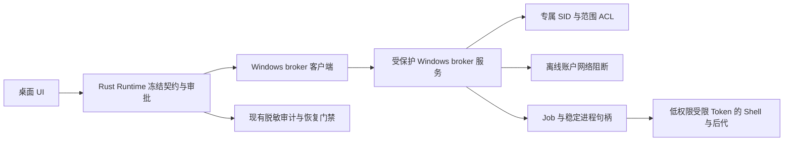

# Windows Agent Shell 沙箱首版设计

日期：2026-10-07。状态：阶段 A 独立原型已实施部分验证，验收 NO-GO；生产保持 unavailable。详情见 [阶段 A 验收交接](agent-shell-sandbox-windows-stage-a-handoff.md)。
2026-10-08 子项更新见 [续作记录](agent-shell-sandbox-windows-stage-a-2026-10-08.md)：自有 output 的限定继承、新对象创建/重开及暂停 primary 身份/Job 已通过；恢复后的 loader 仍以 0xc0000022 退出。下文保留初次失败记录，不能据此推定任意项目已通过。
后续实机确认：单 restricting SID 无法打开三个 KnownDlls 共享对象，而 UAC setup 也无法取得这些对象的 WRITE_DAC。原型现于机器资源创建前拒绝；本机当前启动方案的可行性需重新评审，不能通过扩大 DLL 白名单或宽泛 SID 宣称解决。

## 1. 结论与范围

首版采用 **专用低权限账户 + 受限 Token + 文件 ACL + 系统防火墙/WFP + Job Object**，保留项目原目录实时读写，不要求复制工作区或安装自研内核驱动。

参考 Codex 官方公开机制，结合 ShellSpan 已有的冻结契约、审批、取消和恢复接口设计。本文不是 Codex 源码逐行移植，也不将 Codex 的产品保证直接外推到 ShellSpan。

本方案替代上一轮“文件过滤驱动作为 Windows 首版前置条件”的计划。已有 minifilter 与 PSEC 探针保留为实验资料；不作为本方案可用性的证据，也不自动开启生产入口。macOS 现有 Seatbelt 契约不因本方案放宽。

| 项目 | 首版决策 |
| --- | --- |
| 支持平台 | Windows 11 x64，本地固定工具链；其他平台另行验收 |
| 执行入口 | 本地 Direct Shell 及所属进程 stdin/wait/kill |
| 策略 | readOnly、workspace；host 保持现有账户执行语义 |
| 目录 | 本机 NTFS 原目录，限定可验证权限和对象身份的路径 |
| 安装 | 用户明确启动一次管理员批准的设置；桌面应用日常不提权 |
| 网络 | 默认拒绝；首版受限 Shell 不开放 networkTarget/localService 授权 |
| 敏感文件 | 拒绝已识别的现有文件/目录，保留项目根 .env.local 只读例外 |
| 动态名称规则 | 不承诺持续禁止后来新建/重命名的所有 .env 名称族 |
| 能力等级 | 验收后最多 partial，不报告 full |
| 未就绪时 | unavailable，拒绝派发；不切换到 host 或较弱后端 |

## 2. Codex 参考依据与本方案选择

Codex 官方文档介绍两种 Windows 模式：elevated 使用专用低权限沙箱账户、文件权限、防火墙及本地策略；unelevated 使用当前用户派生的受限 Token、ACL 和较弱的环境离线控制。elevated 需要管理员批准设置，并不表示命令以管理员权限运行；两种模式默认使用私有桌面。[官方 Windows 说明](https://learn.chatgpt.com/docs/windows/windows-sandbox)

其权限文档指出，原生 Windows 的 deny-read 通配符可能在启动前按限定深度扫描并展开为路径快照。这不是对未来所有名称变化的持续内核拦截。[官方权限说明](https://learn.chatgpt.com/docs/permissions)

ShellSpan 首版只实现 elevated 思路。unelevated 的较弱网络控制不能代替当前 `network=deny` 契约，因此暂不开放。受限 Token 的具体 restricting SID 集合、权限掩码和 WFP 过滤条件属于本方案的实施与验证内容，不能依据上述概述认定 Codex 使用同一组参数。

## 3. 安全目标与接受的限制

必须阻止：项目外未授权读写、readOnly 项目修改、已冻结敏感文件读取/内容覆盖、宿主凭据与 ShellSpan 数据读取、未经允许的网络出口，以及从模型/子进程访问高权限 broker。

运行时最小系统路径和工具链例外需明确列出；“项目外拒绝”不表示系统运行库也不可读。账号、沙箱目录与允许集合属于控制器管理，模型不能改写。

首版接受并披露：

- `.env` 匹配以每次派发前的实际文件快照为准。派发后宿主新增秘密文件，不保证立刻受保护；模型生成新的 `.env` 文件也不按名称自动禁止。
- 文件 ACL 不提供完整内容/路径对象隔离。现有文件的删除后重建、父目录重命名、重解析点、硬链接、受同账户程序修改的 DACL 等必须分别验收和披露，不把启动扫描当成持续防护。
- 管理员、SYSTEM、内核攻击及宿主用户主动破坏隔离配置不属于此边界；配置变化被发现后仍须停止新派发。
- Windows 系统服务代办、COM/RPC、命名管道及设备入口可能扩大访问面；测试发现可利用绕过时，该目标不能通过预检，不能仅以“文件 ACL 正常”宣称安全。

秘密优先放入工作区外的系统钥匙串或独立拒绝目录。目录变化监测只用于使准备结果失效、停止派发和提示，不作为无竞态的安全边界。

## 4. 组件与信任边界

### 4.1 桌面 Runtime

继续作为资源审批、最新 Session 身份和 `bindingRevision` 的权威。模型请求只产生资源意图，不能提交任意 Token、PID、Job、账户、ACL 或防火墙指令。Runtime 校验后把冻结调用交给内部 broker 客户端。

UI 通过 `src/lib/ipc/tauri.ts` 访问类型化 Rust IPC；不会直接连接服务。受限 Shell 的其他宿主工具入口继续按现有 pipeline 门禁拒绝。

### 4.2 设置程序与 broker

设置程序在明确的用户动作后触发 UAC，安装受保护的服务/二进制，创建有限数量的专用账户、必要登录权和离线规则。不开启桌面应用管理员模式，不关闭防火墙、Secure Boot 或签名验证。

broker 使用 LocalSystem 所需的最小职能处理账户、Token、ACL 和进程创建；只有固定操作集，没有“以 SYSTEM 执行任意命令”、远程服务端口或任意注册表/文件写入接口。命令字符串只作为低权限子进程输入，不由服务 shell 拼接执行。

服务文件、配置、状态、IPC 端点、Token 和 Job 句柄必须对沙箱身份不可写/不可获取。仅允许本机连接，验证命名管道客户端 Token 与所属宿主用户，拒绝沙箱账户、匿名及远程连接。高权限 ACL 操作前 impersonate 客户端验证其原有访问权，不能因服务身份扩大用户原本不能访问的目录。

客户端请求仅支持 `prepare / launch / input / wait / cancel / release / status` 等受控语义，带协议版本、请求 ID、会话身份、创建时间、绑定版本与契约摘要。服务维护不可变拥有记录，后续操作凭 opaque handle 且再次核对调用者，不能凭 PID 认领资源。对消息长度、并发、输出、进程数、路径数和截止时间设上限。

### 4.3 沙箱身份与并发

每个活动执行槽使用独立低权限账户；不让活跃命令共用可写账户和累计授权。池耗尽时排队，不能降级复用活跃身份。账户凭据仅由受保护的系统 credential reference 持有，不能放进配置、SQLite、日志或子进程环境。

从该账户 Token 构造去除高危权限的受限主 Token；以执行槽/调用专属 restricting SID 限定允许对象。允许列表不能加入 Everyone、Authenticated Users 等 SID 以绕过限制性访问检查。Windows 对 restricting SID 进行额外访问检查，两类检查都需允许；“另建普通账户”本身不等于文件白名单。[Windows 受限 Token 说明](https://learn.microsoft.com/en-us/windows/win32/secauthz/restricted-tokens)

普通 SID 与 restricting SID 的具体组合、新建文件默认 DACL、目录遍历权限和系统启动兼容性先用独立原型验证。跨调用不得沿用临时授权；身份复用前必须确认旧 Job 已结束、旧 ACL 已撤销且状态干净，不确定的槽位进入隔离状态。

阶段 A 已验证真实 `CreateRestrictedToken / AccessCheck` 的双重 SID 检查，但专用账户 fixture 的 workspace 新建产物创建/重开检查失败。**现有文件添加非继承 ACE 不足以支持新建文件工作流**；不得据此开放 workspace。必须分别验证创建、首次句柄、关闭后重开、子目录、后代 Token 默认 DACL 与父级继承的组合；调整为可追踪的继承/新对象权限方案之前保持 NO-GO。不能用放宽 Everyone 或限制性 SID 集合来修复兼容性。

默认使用私有桌面，所有后代保持同一或更低权限上下文。不得继承宿主 Token、凭据、服务端口或无关文件句柄。

## 5. 文件权限与敏感路径

### 5.1 路径准备

按调用冻结规范化路径、卷、文件对象身份与允许/拒绝集合，并在 dispatch 前复核。首版拒绝 UNC/网络盘、非 NTFS、根驱动器、用户 HOME 整体、不可检查的继承链，以及无法证明落在允许范围内的 junction/symlink/reparse point。将短名称、大小写、ADS 和 `..` 作为边界输入处理。

只给范围内对象添加专属 SID 的必要 ACE，不给 Users/Everyone 广泛授权，不对项目使用 FullControl，不禁用已有安全描述符或夺取所有权。用户原有 DACL、所有者与继承语义继续保留；无法安全增量修改就拒绝目标。

| 资源 | readOnly | workspace |
| --- | --- | --- |
| 项目普通文件 | 读取/遍历 | 读取/创建/内容修改及允许的重命名/删除 |
| 系统与选定工具链 | 最小只读/执行 | 最小只读/执行 |
| 命令专属 temp/cache/profile | 必要读写 | 必要读写 |
| 宿主 HOME、私钥、钥匙串、ShellSpan 存储 | 拒绝，独立明确例外除外 | 同左 |
| 启动快照中的 .env 名称族 | 拒绝读取/内容写入 | 同左 |
| 冻结项目根 .env.local | 只读 | 只读 |
| .git、ShellSpan/Agent 权限与规则目录 | 首版只读 | 首版只读；相关修改须另行设计 |

readOnly 模式可写的命令临时目录不是项目写入授权。首次 workspace 若 Git 操作需要修改 `.git`，首版应报告具体能力限制；不能临时解除保护以让命令通过。

### 5.2 .env 快照规则

每次命令准备时枚举项目内现有 `.env`、`.env.*`（按 Windows 名称语义）和已知敏感对象，不只扫描上次启动时的列表。扫描采用明确的节点/时间预算；无法完整扫描选定范围或出现权限错误就拒绝准备，不静默截断。项目根 `.env.local` 只读例外不得覆盖私钥、运行时存储等独立敏感规则，也不能通过链接指向外部秘密。

对已有敏感文件禁止读、内容修改和权限修改，并针对父目录 `DELETE_CHILD`、文件 DELETE、目录/文件重命名做真实反例。若一个特定目录无法在保持正常工作流的同时保护这些现有对象，该目标应拒绝，而不是声明已保护。

即使通过以上反例，仍不承诺同名替换和后续新增文件受名称规则持续保护。这条限制写入能力摘要与文档；不使用 FileSystemWatcher 作为保护保证。

既有 project-file read grants 可在后续小阶段映射为当前调用的只读 ACE，仍以现有文件、签名、期限、目标与显式审批为准。首批打通默认执行时先拒绝此扩展；对尚未实现的授权返回明确不支持，不忽略授权后派发。

### 5.3 ACL 变更与回滚

变更前将对象身份、原安全描述符摘要、拟添加的专属 SID/ACE 和事务状态保存到控制器受保护的 journal；变更成功后保存回执。递归传播、受保护子 DACL、部分成功和继承产生的 ACE 都纳入拥有集合，失败立即撤销已知变更。

恢复时只撤销可证明属于该执行槽的 ACE，保留宿主在此期间的其他 ACL 改动；不能把完整旧 DACL 无条件覆盖回去。ACL 合并冲突、文件对象替换或归属不明时保留清理债务，隔离槽位，必要时暂停该项目的新派发。

## 6. 网络首版：可验证的默认拒绝

使用 Windows 自带防火墙/WFP 机制，按专用离线身份设置所有网络配置文件上的出入站阻断，覆盖 IPv4/IPv6、TCP/UDP 和后代程序。规则不依赖可被沙箱改写的环境变量，也不能只匹配 powershell.exe 路径。

具体 user-SID 过滤条件、入站/出站层、回环和 DNS 行为需要原型验证：这里是实施目标，不声称普通防火墙规则天然覆盖这些情况。若系统/企业策略使账户级过滤无法生效或允许绕过，报告 unavailable。HTTP_PROXY、离线环境变量与客户端自觉仅作为兼容辅助。

离线阻断应由机器设置持久保持，不能因 broker 崩溃、动态过滤会话关闭而先行失效。broker 退出同时关闭自己独占拥有的 Job；残留账户保留离线阻断和停用状态，不能先移除规则再清理进程。

默认拒绝阶段不添加“block all + allow proxy”组合来宣称有例外；Windows 规则优先级及代理绕过需另行设计。明确公网目标、DNS 选择和 Node LocalService 等现有 macOS 授权暂不映射到 Windows。后续受控代理阶段通过独立验收后才开放，不能临时允许账户全部联网。

2026-10-09 专用账户反例：保留四项持久账户 SID ALE 过滤器，仅在固定诊断 LPAC primary 增加 internetClient 后，真实后代 DnsQueryEx UDP/TCP 均解析成功，两个自有 DNS 接收端各实际收到一次查询。见 [系统代办反例](evidence/windows-stage-a-2026-10-09-dns-sid-block-system-profile.json)。因此账户 SID block 不足以封锁 DNS 代办，不得依靠它允许网络 capability；默认候选继续不授予网络能力，当前仍 NO-GO。原能力集合及诊断二进制已恢复，资源已独立回收。

2026-10-09 下一项网络候选实验：现有代码只使用 ALE_USER_ID 的账户安全描述符，不能把已观测的 DNS 代办反例视为封闭。微软文档列出 ALE_PACKAGE_ID 可用于 CONNECT/RECV_ACCEPT 等 ALE 层，且其条件类型为 FWP_SID，见 [层可用条件](https://learn.microsoft.com/en-us/windows/win32/fwp/filtering-conditions-available-at-each-filtering-layer) 与 [条件数据类型](https://learn.microsoft.com/en-us/windows-hardware/drivers/network/filtering-condition-data-types)。这仅证明 API 条件可用，不证明 DNS 服务代办流量保留原调用包身份；该点必须实测。

候选实施必须保留原四项持久账户 SID block，另以本轮冻结且实际 Token 核验过的 package SID 安装四项独立 block；不能在原过滤器追加 package 条件而缩小原账户保护范围。新增 filter keys、package identity、意图与拥有状态必须先写受保护 journal，Resume 前重新查询实际过滤器条件，恢复按精确 key/layer/action/SID 核验并在执行树停止后最后退役。不得通过阻断整个 DNS Client 服务、通用 svchost 或宿主端口影响其他程序。固定反例实验仍使用本轮自有 DNS 接收端和明确临时网络能力，根与实际后代分别查询 UDP/TCP并核对接收计数；默认能力集合保持独立验证。若包条件仍不能封锁代办，继续 NO-GO，不能把超时或 87 转成明确拒绝。该候选尚未安装或验证，不算阶段 A 完成证据。
2026-10-09 包过滤候选已得到实际否证：保留四账户 ALE_USER_ID 与四独立 ALE_PACKAGE_ID BLOCK，仅固定诊断增加 internetClient，根与实际后代 DNS UDP/TCP 均成功、自有接收端各收到两次查询。见 [包规则代办反例](evidence/windows-stage-a-2026-10-09-dns-package-block-internet-system-profile.json)。规则安装/精确查询/退役已实测，但不能据此声称 DNS 封闭；默认仍不授予网络能力，代办网络方案继续 NO-GO。新增包规则不替代原账户防护。

2026-10-09 下一项代办边界候选为 WFP RPC_UM 的精确调用账户条件，而不是继续使用 ALE 连接身份。官方 [逐层条件表](https://learn.microsoft.com/en-us/windows/win32/fwp/filtering-conditions-available-at-each-filtering-layer) 明确 RPC_UM 可用 REMOTE_USER_TOKEN、RPC_IF_UUID 与 RPC_PROTOCOL；没有列出 ALE_USER_ID 或 ALE_PACKAGE_ID，不能直接复制连接层条件。官方 [条件定义](https://learn.microsoft.com/en-us/windows/win32/fwp/filtering-condition-identifiers-) 指定 REMOTE_USER_TOKEN 为 FWP_SECURITY_DESCRIPTOR_TYPE，RPC_PROTOCOL 为 FWP_UINT8，LRPC 为可选协议类型。可行性尚需实际验证：DNS 的本机代办路径是否经过这一层、实际令牌是否仍代表沙箱账户，文档不能替代实测。

后续固定实验只允许本轮新创建且禁用/无管理员权限的账户 SID，持久拥有 key 与唯一完整安全描述符必须先入受保护 journal，查询核验、精确退役和旧账户规则保留应先实现；不得安装无账户条件的全局 RPC block，不修改 DNS 服务配置或已有系统接口 ACL。先验证普通自有账户与 SYSTEM 对照仍可查询，再验证真实 Low LPAC 根和后代，读取自有 DNS 接收计数。若调用身份缺失/层不支持/查询未知，拒绝派发并保留债务。即使固定 DNS 路径可被拒绝，完整 COM/RPC/设备代办矩阵仍须单独验收；不能由单个接口外推全部系统服务。
2026-10-09 RPC_UM 候选亦被固定DNS实测否证：保留精确账户REMOTE_USER_TOKEN规则、四账户/四包连接规则，真实根及后代的DNS UDP/TCP仍成功，自有接收端各收到两次。见 [RPC规则代办反例](evidence/windows-stage-a-2026-10-09-dns-rpc-block-internet-system-profile.json)。这说明该候选不足以封锁本机DNS路径，不证明调用实际经过RPC_UM或匹配到该条件；下一步需要入口及调用身份观测，继续NO-GO。所有本轮规则及槽资源已精确恢复。

网络测试要同时检查沙箱 API 结果和自有接收端；UDP Send 成功不能证明包到达。并测试 DNS/系统服务代办、直接 socket、回环、私网、子进程换 executable 的路径，不能把 curl 失败外推为全部网络拒绝。

阶段 A 的四个持久账户 SID ALE 过滤器安装和撤销成功，但当前原型在宿主进程的受限 impersonation 线程上创建 socket，IPv4/IPv6 回环 TCP/UDP 接收端均实际收到连接或包。因此该测试形态不能作为专用账户主 Token 的网络证据，也不能推断 WFP 方案已经成功或整体无效。下一轮阶段 A 必须以实际专用账户受限 **primary Token 子进程** 创建 socket，验证其实际身份，并覆盖后代与系统服务代办。受限 impersonation 不作为沙箱执行入口或替代路径。

## 7. 启动、取消与恢复

每次派发严格按以下顺序：

1. Runtime 核对最新 Session、target、策略、surface、bindingRevision、审批与授权有效期，冻结调用。
2. broker 验证调用者、原访问权、系统设置和目标，获得干净执行槽。
3. journal 记录准备事务；冻结路径与敏感快照，安装/核对该槽 ACL 和离线规则。
4. 创建私有 profile/temp/cache、显式环境及有限 stdio 句柄。使用可信固定绝对路径的 Shell；不 source 用户 profile，不继承宿主 PATH、HOME、API key、代理和 Git 凭据配置。
5. 创建受限主 Token 和 suspended 根进程；先创建 Job、配置 KILL_ON_JOB_CLOSE/禁止 breakaway，启动所属生命周期监控并关联 Job。
6. 核对冻结身份与实际 Token/Job/ACL/网络事实，写入拥有回执；最后 Resume。此前失败必须终止已创建的 suspended 进程并确认清理。
7. Resume 后沿用现有 stdio、输出截断、超时、stdin 绑定和事件模型；所有阻塞 API 在专用 worker 执行。

`schedulerAdmission` 遵循现有 notStarted/started/unknown。恢复不能根据 PID、名称前缀或历史审计认领进程，不能恢复 live grants 或重放 uncertain 命令。旧准备记录在重启后失效，只进入清理流程。

取消先停止该调用输入/派发，终止所属 Job，等待稳定进程对象与可信后代监控确认退出。Job 的 ActiveProcesses 为零不是唯一证据。根进程自然退出也不能遗忘仍运行的后代；没有完整证据则 `terminationConfirmed=false`，保留身份/ACL/网络防护和清理债务。

只有确认所属进程树终止后，才清理临时数据、撤销临时 ACE 并回收执行槽。默认停用账户不替代杀进程。强制崩溃、服务退出、桌面断连和机器重启均须有实机证据。

## 8. 安装、预检与能力展示

安装设置和执行预检分离。现有无参数 `agent_runtime_probe_native_sandbox` 继续仅运行专用 fixture，不弹 UAC、不创建机器账户、不修改用户项目。未来新增设置/status IPC 时，同步 Rust、lib.rs 注册、TS 类型、适配器与双语文案。

全局预检成功不能替代项目预检；真实项目需在 prepare 阶段验证其卷、ACL、工具链和权限集合。预检不读取项目秘密内容，仅验证固定 fixture 与对象权限事实。预检结果带后端/配置版本和有效期，派发重新检查，策略变化和目标切换立即失效。

| 状态 | 产品行为 |
| --- | --- |
| 未设置/用户取消 UAC/企业禁止设置 | unavailable，保留原策略，说明设置失败原因 |
| 设置完成但全局或目标反例失败 | unavailable，不创建可运行子进程 |
| 核心反例通过且目标已验证 | partial，files=true、network=true；展示 Windows 快照/对象限制 |
| 生命周期覆盖尚未完整证明 | processLifecycle=false，即使普通取消已通过 |
| ACL 恢复、进程清理或机器配置不确定 | 暂停新派发，保留清理拥有记录，要求恢复处理 |

限制和持续状态放入现有能力摘要/恢复 Alert，设置操作的一次性结果用 Toast。设置和卸载动作沿用共享 Dialog，中文和英文说明清楚：“管理员批准设置；实际命令低权限运行”。不提供自动 host 回退；用户显式选择 host 仍沿用原审批规则。

## 9. 接入点与实现阶段

| 位置 | 后续职责 |
| --- | --- |
| native/windows_sandbox.rs | 后端事实门禁；实验 PSEC 测试独立标识，不能改名冒充新后端 |
| 新 Windows broker/settings/ACL/network 模块 | 按职责隔离系统变更、事务、IPC 和校验 |
| native/process.rs | 增加受限 Windows child/controller 接口；host/SSH 路径保持原语义 |
| sandbox.rs 与 sandbox_authorization | Windows 支持范围、冻结契约和未支持 grants 的明确拒绝 |
| sandbox_audit / 现有恢复拥有机制 | 脱敏设置事实、准备回执、取消与清理债务；不保存账户密码/live grants |
| lib.rs、types、ipc/tauri.ts | 如确需新设置 IPC，则成套注册/适配和回归 |
| AI settings、双语 locales | 设置状态、实际能力、已知限制与显式 host 选择 |
| 独立 Windows 验收入口 | 使用自有 fixture 验证实际账户/Token/ACL/WFP/Job，不 mock OS 边界 |

阶段 A：账户、Token、ACL 与 SID 网络阻断原型。完成 readOnly/workspace 默认路径与负例；若低层方案无法兑现边界，先调整设计，不接生产。

阶段 B：受控设置程序/broker，journal/增量撤销/账户池，typed IPC 与自有资源恢复。验证管理员设置被取消、企业策略冲突与断连。

阶段 C：接入 NativeAdapter 和 process worker；打通默认 Direct 执行、模型回合、审批、取消、重启与能力摘要。初期所有 Windows 资源扩展拒绝。

阶段 D：完整实机验收与首版开放。之后单独实施已有文件 read grants，再考虑网络代理和缓存写入扩展；每类能力通过后再声明支持。

## 10. 发布验收矩阵

| 类别 | 必须验证的可观察行为 |
| --- | --- |
| 身份 | 根进程/后代实际低权限 Token；拿不到宿主、broker 或其他槽位句柄/凭据 |
| 文件 | readOnly 写入失败；workspace 正常构建产物写入成功；未授权外部读写失败 |
| 已有敏感对象 | .env 拒读/覆盖；根 .env.local 可读但不可写；显式敏感规则不能被例外覆盖 |
| ACL 边界 | DELETE_CHILD、目录重命名、继承/受保护 DACL、宽泛 Everyone 权限、硬链接/短名称/ADS/reparse point 的反例与处理 |
| 动态限制 | 后续新增 .env 不计作强保护通过；下一次派发重新识别并保护，限制文案一致 |
| 网络 | IPv4/IPv6 TCP/UDP、DNS、回环/私网、入站、换程序与系统服务代办；自有接收端证据 |
| 生命周期 | 后代持续运行、并发创建、正常退出/超时/取消、重复取消、breakaway、桌面/服务崩溃及重启 |
| 权限事务 | prepare 各步骤故障、ACL 部分应用、宿主并发 DACL 修改、到期/撤销、跨项目/策略变化、池复用 |
| 产品入口 | Shell/process 之外的结构化文件、HTTP、SSH/SFTP、部署、MCP、技能发现和委派仍按声明门禁拒绝 |
| 兼容性 | 固定版本 PowerShell、Git、Node 与所声明构建工具；不读取个人凭据配置、不通过离线变量假装网络隔离 |
| 审计/恢复 | 保存失败时拒绝派发；日志无秘密；未知状态不重放；仅清理可证明属于自己的资源 |

完成相关 TS/Rust 回归、Windows 实机反例、Wry 设置与审批组合检查、双语能力说明及安装/卸载回退后，才可以更改生产 unavailable 门禁。测试跳过项、历史 PSEC/minifilter 测试和只验证 std::process 的 Job 用例都不能替代这份矩阵。

## 11. 本次文档决策与下一步

2026-10-09 更新：原单 restricting SID 路径仍被 loader/KnownDlls 阻断。替代 LPAC 候选在一次性 SYSTEM 固定服务与精确专用账户 impersonation 创建上下文下，已通过实际暂停根身份、Low IL、LPAC AccessCheck 与固定退出码 admission；服务和所有账户资源已精确退役。该成功不替代第 9/10 节的完整默认模式和负例验收；完整工作负载需沿成功路径验证后才能决定采用替代方案。完整阶段 A/B 仍未完成，生产 unavailable。详细证据见阶段 A 续作与 A/B 核对表。

最初文档仅为设计草案。阶段 A 已新增独立实验并经 UAC 在自有 fixture 上实际创建账户、增量 ACE 与持久 WFP 过滤器；正常清理回执未报告账户/ACE/过滤器债务，fixture 留作证据。未安装服务、未改用户项目 ACL、未开放执行能力。阶段 A 未验收通过，不启动阶段 B；继续阶段 A 时先解决新对象权限与真实 primary Token 网络验证。

动态 .env 名称保护、自研驱动、unelevated、网络授权和远端 Windows 都移出首版范围；对应现有实验文件不在本次删除。实现阶段需要把 Windows 实际 snapshot 语义与 macOS 持续名称规则分别写入协议和 UI，不能用一个 files=true 隐藏差异。
