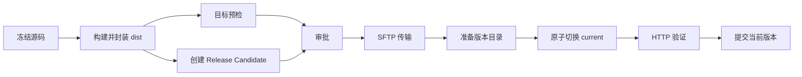
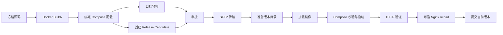

# 本地部署中心工作流化设计（通用产物）

> 状态：Draft  
> 适用范围：ShellSpan 本地部署中心  
> 目标版本：Deployment Workflow
> 最后更新：2026-09-17

## 1. 结论

本地部署中心应从当前固定的 Docker Compose 发布流程，演进为**部署领域的类型化工作流**。用户通过添加节点、连接节点并配置参数形成一个有向无环图（DAG）；运行时先把图编译为不可变执行计划，再沿用现有的预检、审批、审计、取消、恢复和回滚机制执行。

本设计作出以下核心决策：

1. **产物不等于 Docker 镜像。** 产物统一表示为内容寻址的 `Artifact Bundle`，Docker 镜像归档、前端 `dist` 文件树、二进制、安装包、压缩包和部署配置都是 Bundle 中带类型的组件。
2. **工作流不是任意脚本编排器。** 首版只提供由 native runtime 注册、版本化并经过安全审查的节点类型，不提供“执行任意 Shell”节点。
3. **连线传递的是类型化输出，不是路径字符串。** 节点端口传递 `SourceSnapshot`、`ArtifactBundle`、`TargetSnapshot`、`TransferReceipt`、`ReleaseCandidate`、`VerificationEvidence` 等句柄；文件系统位置由 runtime 管理。
4. **语义定义与画布布局分离。** 移动节点只修改布局，不改变工作流语义修订，也不使已生成的审批计划失效；节点、连线或参数变化才产生新的语义修订。
5. **运行前必须编译和冻结。** 工作流修订、源码快照、目标身份、产物摘要、节点版本、节点参数、固定副作用和补偿动作都进入不可变计划及审批摘要。
6. **回滚不是把 DAG 倒着执行。** 每个有副作用的节点由 runtime 声明固定、类型化的补偿行为；同一次运行中的自动恢复仅使用审批时冻结的上一版本，人工回滚则创建新的运行并重新审批。
7. **生产入口仅使用当前工作流。** 不提供旧版兼容编译、历史读取或混合执行；旧数据库记录保留但不读取、不转换、不自动删除。

首个可交付版本应同时提供两套模板：

- Docker Compose：覆盖当前能力并保持行为一致；
- 静态站点：构建或导入前端 `dist`，打包、传输到版本目录、原子切换 `current`、HTTP 验证，失败时恢复旧版本。

## 2. 背景与现状

### 2.1 当前能力

ShellSpan 当前已经具备一套安全边界明确的单主机 Docker Compose 部署链路：

```text
冻结 Git 源码
  → Docker Buildx 构建并生成内容寻址产物
  → SSH 只读预检
  → 创建不可变计划
  → native 审批
  → SFTP 传输并校验
  → 固定 RemoteRunner 执行
  → 健康检查 / Nginx reload
  → 激活版本或自动恢复
  → 事件、通知、历史与审计导出
```

现有实现的优点必须保留：

- Rust runtime 是唯一执行权限边界；
- 工作流不保存密码、私钥、Token 或命令文本；
- 工作流有修订号，运行冻结工作流、源码、目标和产物；
- 审批绑定计划摘要、有效期和固定动作；
- 产物、传输和远端 staging 均校验 SHA-256；
- 取消是协作式的，发生副作用后必须恢复或进入 `state_unknown`；
- 启动恢复先进行只读 reconciliation，不把 SSH 退出码直接当成部署结论；
- 事件有界、顺序连续且不可变，通知去重，审计数据脱敏。

### 2.2 当前限制

当前 `DeploymentWorkflowDefinition` 把以下概念固定在一个结构中：

- `DockerBuildxPlan`；
- Docker 镜像归档；
- Compose 文件、项目和服务；
- HTTP 健康检查；
- 可选 Nginx reload。

因此“工作流”实际上还是一个 Docker Compose 表单，产物清单也假定存在 `image`、`archive` 和 `composeFiles`。它无法自然描述：

- 前端 `dist` 目录直接发布；
- 已构建好的 zip/tar 包；
- 单个可执行文件和配套配置；
- 多个构建输出组成一个发布单元；
- 同一份产物使用不同部署策略；
- 节点级状态、重试、并行和证据查看。

### 2.3 产品边界

“本地部署中心”中的“本地”表示控制器、审批和审计运行在 ShellSpan 桌面端；目标仍可以是 SSH 连接配置指向的远端单机。

本设计不把 ShellSpan 变成通用 CI 平台。源码测试、复杂矩阵构建、跨集群调度和任意基础设施编排不是首版目标。工作流聚焦于：

> 从一个可验证的源码或已有产物出发，形成不可变发布候选，在明确目标上执行可审批、可审计、可恢复的部署。

## 3. 业内实践与取舍

| 产品/规范 | 可借鉴能力 | ShellSpan 的取舍 |
| --- | --- | --- |
| [Argo Workflows DAG](https://argo-workflows.readthedocs.io/en/latest/walk-through/dag/) | 用任务依赖表达 DAG；无依赖分支可并行；默认 fail-fast | 采用 DAG 和拓扑调度，但不暴露 Kubernetes/容器执行细节 |
| [Tekton Pipelines](https://tekton.dev/docs/pipelines/pipelines/) | Task Results 的引用同时形成数据依赖；`finally` 处理清理和通知 | 采用类型化输入/输出和独立 finalizer；不把可写共享 Workspace 作为主要节点协议 |
| [GitHub Actions Artifacts](https://docs.github.com/en/actions/tutorials/store-and-share-data) | 产物用于任务间传递和运行后留存；上传/下载时验证 SHA-256 | 所有跨节点文件输出先进入 runtime 管理的内容寻址存储，再以句柄传递 |
| [OCI Content Descriptor](https://github.com/opencontainers/image-spec/blob/main/descriptor.md) | 用 `mediaType`、`digest`、`size` 描述任意内容；消费前验证摘要和大小 | 采用相同核心字段构建通用产物描述符，但首版不要求接入 OCI Registry |
| [Argo Exit Handlers](https://argo-workflows.readthedocs.io/en/latest/walk-through/exit-handlers/) / Tekton `finally` | 主流程成功或失败后都可运行清理、通知等最终任务 | finalizer 与部署补偿分开；通知失败不能伪造主部署失败或成功 |

这些产品普遍证明了三个稳定抽象：

1. 控制流由依赖图表达；
2. 数据流由节点输出表达；
3. 大文件通过产物存储传递，而不是塞入参数或事件。

ShellSpan 不直接复制它们的 YAML 或任意脚本能力，因为桌面端直接持有 SSH 凭据并控制真实主机，必须采用更封闭的节点注册表和更严格的审批边界。

## 4. 目标与非目标

### 4.1 目标

- 通过节点和连线创建、查看、复制和运行部署工作流；
- Docker Compose、静态文件、二进制、压缩包等共享一套产物协议；
- 节点具备明确的输入、输出、执行位置、能力要求和风险等级；
- 图在保存和运行前进行环路、端口、路径、能力与审批覆盖校验；
- 运行视图可查看每个节点的状态、耗时、重试、有限日志和证据；
- 保留当前不可变审批、目标冻结、内容校验、取消、恢复和审计语义；
- 新节点能够在不修改工作流核心调度器的前提下注册；
- 生产部署入口、新运行和审计只读取 工作流 表与 工作流 协议；旧数据库内容原样保留但不进入产品入口；
- 宽窄工作台、AI 面板挤压场景下都可正常使用。

### 4.2 非目标

首版不支持：

- 任意 Shell/PowerShell/SSH 命令节点；
- 用户上传 JavaScript、Wasm 或原生插件作为执行器；
- 环路、递归工作流或动态生成无限节点；
- 跨工作流共享可变工作目录；
- Kubernetes、Nomad、云厂商发布和多主机滚动发布；
- 可视化编写 Dockerfile、Compose 或 systemd unit；
- 自动审批；
- 依赖未经验证的远端路径作为产物身份；
- 把日志、事件或数据库记录当作二进制产物存储。

## 5. 领域模型

### 5.1 核心概念

| 概念 | 含义 |
| --- | --- |
| Workflow | 用户维护的部署语义图 |
| Workflow Revision | 一份不可变的工作流语义定义及其摘要 |
| Layout Revision | 画布坐标、缩放和分组等纯 UI 信息，不参与部署计划摘要 |
| Node Type | runtime 注册的版本化节点能力，例如 `artifact.collect@1` |
| Node | 工作流中的节点实例，包含稳定 ID、类型、配置和输入绑定 |
| Port | 节点的类型化输入或输出 |
| Source Snapshot | 冻结的源码版本、dirty 状态和关键文件摘要 |
| Artifact Bundle | 一组不可变、内容寻址、带角色和媒体类型的组件 |
| Release Candidate | 已绑定目标、产物和部署策略但尚未生效的候选版本 |
| Run Plan | 工作流编译后的不可变执行计划 |
| Node Attempt | 某节点的一次实际执行尝试 |
| Receipt | 传输、准备、切换或服务操作产生的不可伪造结果句柄 |
| Evidence | 健康检查、摘要验证、远端状态等有界证据 |
| Compensation | runtime 为某个副作用节点定义的固定恢复动作 |

### 5.2 Artifact、Release 与 Deployment 分离

这三个概念不得混用：

- **Artifact** 回答“要发布的内容是什么”；
- **Release** 回答“这批内容在特定目标上以什么布局存在”；
- **Deployment** 回答“哪次运行把哪个 Release 变成了当前生效版本”。

同一个 `dist` Artifact 可以发布到测试环境和生产环境，形成两个 Release；同一个 Docker Artifact 也可以被不同 Compose 配置消费。目标地址、凭据、远端目录和运行状态不得写入 Artifact 身份。

### 5.3 数据流决定依赖

持久化定义以节点输入绑定为准，画布上的边只是绑定关系的 UI 投影：

```ts
interface PortBinding {
  fromNodeId: string;
  fromPort: string;
}

interface WorkflowNodeDefinition {
  id: string;
  type: string;
  typeVersion: number;
  displayName: string;
  inputs: Record<string, PortBinding>;
  config: Readonly<Record<string, unknown>>;
  timeoutSeconds: number;
  retry: NodeRetryPolicy;
  runWhen: 'allSucceeded' | 'anyFailed' | 'always';
}
```

这样可以避免同时保存 `edges` 和 `inputs` 导致两份真相不一致。连接端口时即完成类型检查；删除连线等价于删除输入绑定。

### 5.4 端口类型

首版端口使用封闭、版本化类型：

```ts
type DeploymentPortType =
  | 'source.snapshot'
  | 'artifact.bundle'
  | 'target.snapshot'
  | 'release.candidate'
  | 'transfer.receipt'
  | 'release.receipt'
  | 'activation.receipt'
  | 'verification.evidence'
  | 'control.approval'
  | 'scalar.string'
  | 'scalar.boolean'
  | 'scalar.integer';
```

约束如下：

- 文件内容只能通过 `artifact.bundle` 传递；
- 标量输出有大小、长度和敏感级别上限；
- Secret 只允许通过 credential reference 由 runtime 在执行时解析，不成为节点输出；
- 句柄不能被用户编辑成路径；
- 端口类型相同不代表任意消费者都可接受，消费者还要校验 Artifact 的 `role` 和 `mediaType`。

## 6. 工作流定义 工作流

### 6.1 顶层结构

```ts
interface DeploymentWorkflowDefinition {
  schemaVersion: 3;
  targets: Array<{
    id: string;
    connectionProfileId: string;
    remoteRoot: string;
  }>;
  parameters: WorkflowParameterDefinition[];
  nodes: WorkflowNodeDefinition[];
  outputs: Record<string, PortBinding>;
  policy: {
    failFast: true;
    maxParallelLocalNodes: number;
    releasesToKeep: number;
    automaticRestore: boolean;
  };
}
```

首版限制：

- 每个工作流最多 64 个节点；
- 每节点最多 16 个输入和 16 个输出；
- 一个工作流可以声明多个 target，但一次运行的副作用节点只能落在一个 target；
- DAG 必须至少包含一个 Artifact 生产者、一个审批节点、一个部署节点和一个验证节点；
- 语义 JSON 不超过 256 KiB；
- 节点 ID、端口名和 target ID 使用受限标识符；
- 所有超时、重试、并行度、文件数和产物大小都在 native validator 中设硬上限。

### 6.2 语义定义与布局定义

画布布局单独保存：

```ts
interface DeploymentWorkflowLayout {
  schemaVersion: 1;
  nodes: Record<string, { x: number; y: number; collapsed?: boolean }>;
  groups: Array<{ id: string; title: string; nodeIds: string[] }>;
  viewport?: { x: number; y: number; zoom: number };
}
```

- 语义修改：增加 workflow revision，旧计划立即不可复用；
- 布局修改：只增加 layout revision，不影响 workflow revision；
- `displayName` 作为审批和审计中的用户可见语义，修改它会增加 workflow revision；
- viewport 仅是个人 UI 状态，可不进入共享 layout revision。

### 6.3 条件与分支

首版不提供表达式语言。条件只允许对有界标量输出执行固定操作：

```ts
type NodeCondition =
  | { op: 'equals'; input: PortBinding; value: string | number | boolean }
  | { op: 'in'; input: PortBinding; values: Array<string | number | boolean> }
  | { op: 'exists'; input: PortBinding };
```

默认 `runWhen = allSucceeded`。`always` 仅允许 finalizer 节点，`anyFailed` 仅允许通知、证据收集等无部署副作用的节点。补偿和自动恢复不通过用户条件分支实现。

### 6.4 审批节点

`control.approval@1` 是画布上可见的系统节点：

- 一个工作流首版恰好一个；
- 所有远端写入、服务控制和流量切换节点必须以它为祖先；
- 它依赖源码、Artifact、target preflight 和 Release Candidate，确保审批前信息完整；
- 用户不能把有副作用节点连接到审批之前；
- 删除审批节点时编辑器立即标红，工作流不能启用或运行。

## 7. 通用产物模型

### 7.1 Artifact Bundle

Artifact Bundle 是一个带 manifest 的不可变发布输入。其结构借鉴 OCI Descriptor，但保持 ShellSpan 的本地存储和审批语义：

```ts
interface ArtifactDescriptor {
  name: string;
  role: 'application' | 'deployment-config' | 'metadata' | 'sbom' | 'signature' | 'auxiliary';
  mediaType: string;
  digest: `sha256:${string}`;
  size: number;
  platform?: {
    os?: string;
    architecture?: string;
    variant?: string;
  };
  annotations?: Readonly<Record<string, string>>;
}

interface ArtifactBundleManifest {
  schemaVersion: 2;
  artifactType: string;
  source: {
    revision: string;
    dirty: boolean;
    snapshotDigest: `sha256:${string}`;
  };
  components: ArtifactDescriptor[];
  producer: {
    nodeType: string;
    nodeTypeVersion: number;
    configDigest: `sha256:${string}`;
  };
  annotations: Readonly<Record<string, string>>;
}

interface ArtifactHandle {
  artifactReference: `deployment-artifact:sha256:${string}`;
  manifestDigest: `sha256:${string}`;
  contentDigest: `sha256:${string}`;
}
```

`artifactReference` 是 opaque handle，不暴露本地文件路径。`manifestDigest` 对规范化 manifest 计算；`contentDigest` 对按名称排序后的组件描述符集合计算，可用于判断内容是否可复用。创建时间等易变信息存入外部记录，不进入 `contentDigest`。

### 7.2 支持的组件

首版至少支持：

| 内容 | 推荐 mediaType | 典型生产节点 | 典型消费节点 |
| --- | --- | --- | --- |
| 静态文件树 | `application/vnd.shellspan.file-tree.tar+zstd` | `artifact.collect@1` | `release.prepare-files@1` |
| Docker/OCI 镜像归档 | `application/vnd.shellspan.oci-image.tar` | `build.docker-buildx@2` | `runtime.load-image@1` |
| Compose 配置 | `application/vnd.shellspan.compose+yaml` | `artifact.bundle-compose@1` | `deploy.compose@2` |
| 单个二进制 | `application/octet-stream` | `artifact.collect@1` | 后续 `deploy.binary-service@1` |
| 通用 zip | `application/zip` | `artifact.import@1` | 与显式声明兼容的解包节点 |
| SBOM | `application/spdx+json` 或 `application/vnd.cyclonedx+json` | 后续扫描节点 | 审批与审计，不直接部署 |

`artifactType` 和 `mediaType` 用于兼容性与展示，不直接授予执行权限。消费节点必须由 native registry 声明允许的 `role + mediaType` 组合；未知类型可以保存和显示，但不能被未知执行器消费。

### 7.3 文件树规则

静态 `dist` 和通用文件集按确定性规则打包：

- 输入路径必须相对 Source Snapshot 根目录；
- glob 由 runtime 实现并限制数量、深度和总文件数；
- 拒绝绝对路径、`..`、设备文件、socket、FIFO 和逃逸根目录的链接；
- 首版默认拒绝符号链接；后续若支持，只允许不逃逸的相对链接并进入 manifest；
- 目录项按规范化 UTF-8 POSIX 路径排序；
- mtime 归一化，权限只保留受支持的可执行位；
- Windows 与 Unix 上产生相同逻辑输入时应得到相同 `contentDigest`；
- 解包前验证数量、总大小、单文件大小和目标边界，防止 zip-slip/tar traversal 与解压炸弹；
- 发布目录不可被原地覆盖，冲突的相同 release ID 必须逐项校验后一致才可复用。

### 7.4 产物存储

首版继续使用应用数据目录中的本地 CAS：

```text
deployment-artifacts/
  manifests/sha256/<digest>.json
  blobs/sha256/<digest>
  leases/<run-id>/<artifact-digest>
```

要求：

- 临时文件写入、fsync、摘要校验后再原子发布；
- manifest 只能引用已验证 blob；
- run 持有 lease 时不得清理；
- 清理排除当前/上一 Release、未结束运行、审计保留期内产物；
- 数据库只保存 descriptor 和引用关系，不把 blob 存进 SQLite；
- 后续可增加 OCI Registry、S3 或 HTTP artifact provider，但 provider 只改变存储位置，不改变 Artifact 协议。

## 8. 节点模型与首版节点目录

### 8.1 节点描述符

每个节点类型由 Rust runtime 注册：

```rust
pub struct DeploymentNodeTypeSpec {
    pub type_name: &'static str,
    pub type_version: u32,
    pub inputs: &'static [PortSpec],
    pub outputs: &'static [PortSpec],
    pub execution_domain: ExecutionDomain,
    pub effect_class: EffectClass,
    pub capabilities: &'static [Capability],
    pub config_schema_version: u32,
}
```

执行器至少提供：

```rust
trait DeploymentNodeExecutor {
    fn validate_config(&self, config: &serde_json::Value) -> Result<(), ValidationError>;
    fn plan(&self, input: FrozenNodeInput) -> Result<PlannedNode, PlanError>;
    async fn execute(&self, input: VerifiedNodeInput, ctx: NodeContext)
        -> Result<NodeOutput, NodeFailure>;
    async fn reconcile(&self, input: ReconcileInput, ctx: ReadOnlyContext)
        -> Result<ReconcileEvidence, ReconcileFailure>;
    async fn compensate(&self, input: CompensationInput, ctx: NodeContext)
        -> Result<CompensationReceipt, NodeFailure>;
}
```

并非每个节点都实现 `reconcile` 或 `compensate`。任何 `effect_class` 高于 `RemoteRead` 的节点，若不能提供幂等键和可靠的 reconciliation 规则，不得进入首版 registry。

### 8.2 副作用分类

```ts
type EffectClass =
  | 'pure'
  | 'localRead'
  | 'localBuild'
  | 'remoteRead'
  | 'remoteWrite'
  | 'serviceControl'
  | 'trafficSwitch'
  | 'cleanup';
```

- `pure`、`localRead` 可安全并行；
- `localBuild` 使用有界本地进程和独立 workspace；
- `remoteRead` 可在审批前运行，但必须保证无写入；
- `remoteWrite` 及以上必须位于审批节点之后；
- 同一 target 的 `remoteWrite`、`serviceControl`、`trafficSwitch` 串行执行并持有部署锁；
- `cleanup` 首版仅能处理 runtime 拥有且不在保留集合中的临时内容，不自动删除已发布 Release。

### 8.3 MVP 节点目录

| 节点类型 | 执行位置 | 主要输入 | 主要输出 | 副作用 |
| --- | --- | --- | --- | --- |
| `source.snapshot@1` | 本地 | 工作流源码目录 | `SourceSnapshot` | localRead |
| `build.package-script@1` | 本地 | `SourceSnapshot` | file-tree `ArtifactBundle` | localBuild |
| `build.docker-buildx@2` | 本地 | `SourceSnapshot` | image `ArtifactBundle` | localBuild |
| `artifact.collect@1` | 本地 | `SourceSnapshot` | file-tree `ArtifactBundle` | localRead |
| `artifact.bundle-compose@1` | 本地 | image Bundle + Compose 文件 | release `ArtifactBundle` | pure |
| `target.preflight@2` | 远端 | target + Bundle | `TargetSnapshot` | remoteRead |
| `release.create-candidate@1` | 本地 | Bundle + target snapshot | `ReleaseCandidate` | pure |
| `control.approval@1` | native UI | candidate + preflight | approval token | control |
| `transfer.sftp@2` | 远端 | Bundle + approval | `TransferReceipt` | remoteWrite |
| `release.prepare-compose@1` | 远端 | Compose transfer receipt | `ReleaseReceipt` | remoteWrite |
| `release.prepare-files@1` | 远端 | file-tree receipt | `ReleaseReceipt` | remoteWrite |
| `runtime.load-image@1` | 远端 | image receipt | image evidence | remoteWrite |
| `deploy.compose@2` | 远端 | image/config evidence | deployment receipt | serviceControl |
| `deploy.static-switch@1` | 远端 | prepared file release | activation receipt | trafficSwitch |
| `verify.http@2` | 目标侧/控制端 | activation/deployment receipt | verification evidence | remoteRead |
| `proxy.nginx-reload@2` | 远端 | verified evidence | service receipt | serviceControl |
| `release.commit@1` | 远端 | verified evidence | active release identity | trafficSwitch |
| `finalize.notify@1` | 本地 | run outcome | receipt | finalizer |

### 8.4 前端构建节点

`build.package-script@1` 用于“源码内已有前端项目，需要先生成 dist”的场景。它不是任意命令节点，配置只允许：

```ts
interface PackageScriptBuildConfig {
  packageManager: 'pnpm' | 'npm' | 'yarn' | 'bun';
  workingDirectory: string;
  installMode: 'frozen' | 'skip';
  scriptName: string;
  outputDirectory: string;
  environmentRefs: string[];
}
```

安全约束：

- `scriptName` 只能引用冻结 `package.json` 中存在的脚本名，不接受命令或参数；
- runtime 使用固定 executable + argv，不通过 shell 拼接；
- lockfile、`package.json` 和源码修订进入计划；
- UI 明确提示该节点会执行仓库中受版本控制的构建脚本；
- workspace 独立、可取消、限制输出和超时；
- `outputDirectory` 必须位于 workspace 内，构建成功后由该复合节点按确定性文件树规则直接产出 Artifact Bundle；workspace 本身不跨节点暴露；
- 环境变量仅通过 allowlisted credential/config reference 注入，值不进入日志或摘要。

如果用户已有外部构建好的 `dist`，可跳过该节点，让 `artifact.collect` 从 Source Snapshot 中采集，或使用后续的 `artifact.import@1` 文件选择器节点导入本地内容。

## 9. 工作流编译与运行

### 9.1 保存时校验

保存和启用工作流前，native compiler 执行：

1. schema、数量、长度和 JSON 大小校验；
2. node type/version 存在性校验；
3. 节点配置的 discriminated schema 校验；
4. 输入必填、端口存在和端口类型校验；
5. 环路、孤立副作用节点和不可达节点校验；
6. Artifact `role + mediaType` 兼容性校验；
7. target 引用和远端根目录校验；
8. 审批节点覆盖校验；
9. 补偿链和验证节点覆盖校验；
10. Secret literal、绝对逃逸路径和危险配置校验。

前端可使用同源的只读节点目录即时提示，但 native validator 是最终权威。

### 9.2 运行前编译

用户点击“准备发布”后：

1. 加载精确 workflow revision；
2. 冻结运行参数和 target profile revision；
3. 创建 Source Snapshot；
4. 执行审批前允许的本地构建、Artifact 和远端只读预检节点；
5. 校验所有必需输出均已产生；
6. 展开复合节点为固定 runtime actions；
7. 为每个节点计算配置摘要、输入摘要和幂等键；
8. 生成拓扑分层、超时、重试、锁和补偿计划；
9. 生成 canonical Run Plan、`planDigest` 和失效时间；
10. 进入 native 审批。

计划创建后不得原地修改。源码、配置、target、Artifact、节点实现版本或能力探测变化，都要求创建新计划。

### 9.3 调度规则

- 默认 fail-fast：节点失败后不再调度新的普通下游节点；
- 已运行节点允许完成或响应取消；
- 无依赖的本地只读/构建节点可在 `maxParallelLocalNodes` 上限内并行；
- 同一 target 的副作用节点按计划顺序串行；
- finalizer 在主图结束后执行，不参与主部署是否成功的判断；
- 节点只可读取显式输入，不能读取其他节点的临时目录；
- 每次尝试使用 `runId/nodeId/attempt` 幂等键；
- 自动重试仅用于 registry 声明为可重试且尚未产生不可逆副作用的失败；
- `serviceControl` 或 `trafficSwitch` 失败前必须先 reconcile，不能盲目重试。

### 9.4 节点状态

```ts
type DeploymentNodeStatus =
  | 'pending'
  | 'ready'
  | 'running'
  | 'awaitingApproval'
  | 'succeeded'
  | 'skipped'
  | 'retryWaiting'
  | 'cancelRequested'
  | 'canceled'
  | 'failed'
  | 'stateUnknown'
  | 'compensating'
  | 'compensated';
```

顶层运行状态继续兼容当前 `planned`、`awaiting_approval`、`approved`、`in_progress`、`verifying`、`succeeded`、`cancel_requested`、`canceled`、`failed` 和 `state_unknown`。节点状态是更细的投影，不另造一套互相冲突的运行真相。

## 10. 审批、取消、恢复与回滚

### 10.1 审批摘要

审批摘要至少包含：

- workflow ID、语义 revision、definition digest；
- run ID、operation kind、触发来源、有效期；
- Source Snapshot revision、dirty 状态和摘要；
- 每个 Artifact Bundle 的类型、组件、大小和 digest；
- target profile ID/revision、主机身份和远端根；
- 当前、目标和可恢复 Release；
- 按执行顺序列出的副作用节点、固定 actions 和风险级别；
- 预计的服务控制、流量切换、Nginx reload 和补偿动作；
- preflight 结果、警告和能力缺口；
- retention policy。

审批摘要不包含 Secret、私钥、明文环境变量、可直接复用的本地绝对路径或任意远端命令。用户批准的是摘要指向的完整 canonical plan，而不是节点名称列表。

### 10.2 补偿规则

补偿由节点类型定义，不由用户自由连线：

| 正向节点 | 冻结信息 | 固定补偿 |
| --- | --- | --- |
| `deploy.static-switch` | 原 `current` release、目标 release、链接证据 | 原子恢复旧 `current` |
| `deploy.compose` | 上一 release 的镜像与 Compose 摘要 | 使用冻结输入执行固定 `up -d --no-build --pull never` |
| `proxy.nginx-reload` | reload 前后的健康证据 | 仅在发布已恢复后重新验证；不回滚未知 Nginx 配置 |
| `release.prepare-files` | staging/release 身份 | 未激活时保留或标记可清理，不删除已发布 release |

同一次运行只有在以下条件全部满足时才能自动恢复：

- 上一 Release 在审批摘要中已冻结；
- 对应补偿 action 已进入 plan digest；
- 远端 ledger 和 receipt 连续且可验证；
- target、Artifact 和 release 身份未漂移。

否则运行进入 `state_unknown`，要求只读 reconciliation。人工“回滚到某版本”始终创建一个新的 `rollback` run，重新 preflight 和审批。

### 10.3 恢复

应用重启后先从本地数据库发现未完成 run，再按节点执行 reconciliation：

- 读取固定 runner identity、request、launch marker、远端事件 ledger 和 status；
- 验证节点版本、plan digest、Artifact、receipt、target 和 release；
- 只观察，不在 discovery/reconciliation 阶段传输、切换、重启或删除；
- 能证明未开始副作用时，可回到 `approved`；
- 能证明目标健康时，恢复为成功；
- 能证明上一版本已恢复且健康时，记录 compensated outcome；
- 无法形成完整证据时保持 `state_unknown`。

## 11. 两套首版工作流模板

### 11.1 静态站点



模板默认配置：

- `packageManager = pnpm`，用户可选 npm/yarn/bun；
- `scriptName = build`；
- `outputDirectory = dist`；
- 远端布局为 `<remoteRoot>/releases/<releaseId>`；
- `<remoteRoot>/current` 使用原子相对符号链接切换；
- 健康检查成功后提交 Release；
- 健康检查失败则恢复原 `current` 并再次验证；
- Nginx reload 是可选固定节点，不要求用户提供命令文本。

如果目标环境不允许符号链接，首版应阻止该模板运行，而不是退化为原地覆盖。后续可以增加经过独立评审的 rename/swap 策略。

### 11.2 Docker Compose



该模板源自旧固定 Docker Compose 流程，继续保留：

- `linux/amd64` / `linux/arm64` 平台冻结；
- Buildx 镜像身份校验；
- Compose 文件、项目、服务和 pull policy；
- `--no-build`、固定 pull 行为和固定 runner；
- 自动恢复到审批时冻结的上一 Release。

## 12. 产品与交互设计

### 12.1 信息架构

部署中心分为三个主视图：

1. **工作流**：查看、创建、编辑、启用和复制工作流；
2. **运行**：按工作流或状态查看历史及正在进行的运行；
3. **产物**：查看内容摘要、来源、大小、引用运行和保留状态，首版可先作为工作流内 Drawer。

进入某个工作流后提供：

- `设计`：节点画布与配置；
- `准备发布`：运行审批前节点并生成计划；
- `运行记录`：以图和时间线查看历史；
- `版本`：查看当前、上一和可回滚 Release。

### 12.2 新建体验

新建工作流优先从模板开始：

- 静态站点；
- Docker Compose；
- 导入已构建文件（首版可标 Beta）；
- 空白工作流（高级）。

模板创建后仍是普通节点图，没有隐藏的另一套执行逻辑。系统可以锁定审批节点与必要恢复策略，但不锁定普通节点位置和可选验证方式。

### 12.3 编辑器布局

宽容器：

```text
┌ 工作流列表 ┬ 节点工具栏 / 校验结果 ───────────────┬ 节点配置 ┐
│ 搜索/状态  │                                      │ 输入输出 │
│ 模板/工作流│              画布                    │ 参数策略 │
│ 最近运行   │                                      │ 风险说明 │
└────────────┴──────────────────────────────────────┴──────────┘
```

中等容器：节点库和配置面板使用 Drawer，画布保持主区域。

窄容器：不强行缩小无限画布，改为按拓扑顺序展示可编辑的节点列表；每项显示上游、下游、状态和配置入口。连接操作使用“选择输出节点/端口”的表单完成。

响应式断点必须基于 `WorkbenchPage` container query，而不是只使用 viewport `sm/lg`。同级 Card 使用 `gap-3`，Header 保持默认高度，长配置面板使用完整的 `min-h-0` 收缩链。

### 12.4 节点卡片

设计态显示：

- 图标、可读名称和节点类型；
- 本地/远端执行标识；
- 输入/输出端口；
- 未配置、类型不匹配、能力缺失、未被审批覆盖等问题；
- 对应副作用等级。

运行态显示：

- 状态、开始时间、耗时和尝试次数；
- 有界进度，例如传输字节数；
- 产物摘要或 receipt；
- 有界日志预览和“查看完整审计证据”；
- `stateUnknown` 时的证据缺口及“开始只读恢复检查”。

### 12.5 审批体验

审批 Dialog 不展示内部枚举或节点 ID 作为主文案。按用户语义分组：

- 发布什么：来源、版本、Artifact 组件和摘要；
- 发布到哪里：连接配置、主机、目录；
- 将发生什么：传输、服务变更、流量切换；
- 如何验证：健康检查；
- 失败怎么办：自动恢复目标和可能进入未知状态的条件。

摘要变化、过期或输入漂移时，原批准按钮必须失效，并要求“重新准备发布”。

### 12.6 反馈规则

- 保存、构建完成、刷新、导入等一次性结果使用 Toast；
- 审批等待、运行中、恢复门禁和 `state_unknown` 使用上下文 Alert；
- 删除、停用、取消和人工回滚使用 Dialog；
- 不用 Toast 和 Alert 重复呈现同一错误；
- 所有用户可见文案进入中英文 i18n；
- Select 显示 label，不显示 node type、profile ID 或 `all/none` 原始值；
- 画布操作具备键盘替代路径，窄屏列表是完整可用的替代界面。

## 13. 后端架构

### 13.1 组件

```text
Workflow Repository
  ├─ semantic revisions
  └─ layout revisions
          │
          ▼
Workflow Compiler ── Node Registry / Port Registry
          │
          ▼
Immutable Run Plan ── Native Approval
          │
          ▼
Run Coordinator
  ├─ Local Executor
  ├─ Artifact CAS
  ├─ SSH/SFTP Target Executor
  ├─ Remote Fixed Runner
  ├─ Node Attempt Ledger
  └─ Reconciliation / Compensation
```

### 13.2 责任边界

- React 负责编辑体验、只读投影和发起高层操作；
- `src/lib/ipc/tauri.ts` 暴露类型化适配器；
- Rust 负责 schema、图、路径、端口、能力、审批覆盖和所有执行校验；
- Node Registry 在编译期静态链接，前端不能声明新执行器；
- Artifact CAS 负责内容和 manifest 的完整性；
- Run Coordinator 只执行 canonical plan，不再次解释用户画布；
- RemoteRunner 只接受 runtime 生成的固定 request，不接受节点配置中的命令文本；
- Agent 和 Quick Action 只能创建草稿或请求准备运行，无批准权。

### 13.3 复合节点

面向用户的节点可以编译为多个固定 action。例如 `deploy.compose@2` 可展开为：

```text
compose_config → compose_pull? → compose_up → capture_service_state
```

审批显示用户节点及展开后的固定动作；事件同时记录 `nodeId` 和 `actionKind`。这样 UI 保持清晰，底层仍能精确审计和恢复。

## 14. 持久化设计

建议新增或演进以下表：

| 表 | 作用 |
| --- | --- |
| `deployment_workflows` | 工作流身份、名称、enabled、head revision |
| `deployment_workflow_revisions` | 不可变语义 JSON、schema version、definition digest |
| `deployment_workflow_layouts` | 独立布局修订和 layout JSON |
| `deployment_runs` | 顶层运行状态、workflow revision、plan digest、审批摘要 |
| `deployment_run_nodes` | 每节点当前投影、最后 attempt、状态、输出摘要 |
| `deployment_node_attempts` | attempt 生命周期、执行器版本、幂等键、failure category |
| `deployment_run_outputs` | 有界标量、Artifact reference、receipt/evidence reference |
| `deployment_artifacts` | manifest descriptor、content digest、大小、保留信息 |
| `deployment_artifact_refs` | run/node/release 对 Artifact 的引用与 lease |
| `deployment_run_events` | 继续作为不可变连续事件账本，增加可选 node/attempt 维度 |
| `deployment_effect_receipts` | 泛化当前 transfer receipt，保存不可变副作用证明 |

约束：

- revision、plan、attempt、event 和 receipt 一旦进入执行不得修改身份字段；
- 当前投影可以由不可变事件恢复并进行一致性检查；
- Artifact blob 不进入数据库；
- 原始进程输出不进入事件 payload；
- 单事件、单输出、单日志段、单计划和审计导出继续有硬上限；
- 删除工作流默认变为归档/停用；有 run 或 Artifact 引用时不得直接删除。

## 15. IPC 与前端类型建议

新增高层命令，而不是为每种节点暴露一个可任意调用的 `invoke`：

```ts
listDeploymentNodeTypes(): Promise<DeploymentNodeTypeCatalog>;
validateDeploymentWorkflow(input): Promise<WorkflowValidationResult>;
createDeploymentWorkflow(input): Promise<DeploymentWorkflowRecord>;
updateDeploymentWorkflow(id, expectedRevision, input): Promise<DeploymentWorkflowRecord>;
updateDeploymentWorkflowLayout(id, expectedLayoutRevision, input): Promise<LayoutRecord>;
prepareDeploymentRun(input): Promise<DeploymentPrepareResult>;
approveDeploymentRun(input): Promise<DeploymentRunRecord>;
startDeploymentRun(input): Promise<DeploymentRunRecord>;
cancelDeploymentRun(input): Promise<void>;
reconcileDeploymentRun(input): Promise<DeploymentReconciliationResult>;
listDeploymentRunNodes(runId): Promise<DeploymentRunNode[]>;
listDeploymentNodeAttempts(runId, nodeId): Promise<DeploymentNodeAttempt[]>;
inspectDeploymentArtifact(reference): Promise<ArtifactBundleProjection>;
```

`prepareDeploymentRun` 负责调度审批前节点并生成计划；`startDeploymentRun` 只能消费精确的已批准 plan binding。前端不得按节点逐个调用 effectful command 来“解释”工作流。

进度事件统一为：

```ts
interface DeploymentNodeProgressEvent {
  operationId: string;
  runId: string;
  nodeId: string;
  attempt: number;
  sequence: number;
  phase: string;
  completed?: number;
  total?: number;
  unit?: 'bytes' | 'files' | 'steps';
  summaryKey: string;
}
```

`summaryKey` 对应本地化文案，不允许远端输出直接成为通知或 UI 标题。

## 16. 安全设计

### 16.1 不信任边界

以下内容全部视为不可信：

- 画布 JSON、导入的工作流和布局；
- 源码、`package.json`、Dockerfile、Compose、压缩包和 manifest；
- target profile、远端目录、主机输出和 ledger；
- Agent/模型生成的节点建议；
- Artifact provider 返回的内容和元数据。

所有校验必须在 Tauri/native 边界重复执行。

### 16.2 命令执行

- 工作流 JSON 中不出现 shell、命令模板或 interpreter；
- runtime 使用固定 executable 和 argv；
- `package-script` 的脚本正文来自被冻结的仓库文件，UI 明示其代码执行属性；
- SSH 远端继续使用安装的固定 runner 和结构化 request；
- 不允许把节点参数透传成远端 flags；
- stdout/stderr 有界、脱敏，并与结构化 receipt 分离。

### 16.3 凭据

- 节点只保存 credential/config reference；
- Secret 在执行瞬间解析，最小范围注入；
- Secret 不进入 Artifact、plan、event、日志、通知或审计导出；
- 引用变更会导致计划失效或要求重新预检；
- 第三方 Artifact provider 后续必须有独立权限与域名策略。

### 16.4 供应链

每个 Artifact 保留：

- source revision 和 dirty 标记；
- producer node type/version；
- config digest；
- component digest/size/mediaType；
- 可选 SBOM 和签名 descriptor。

首版只强制摘要，不承诺签名信任链。后续增加签名验证时，应作为独立 `verify.signature` 节点和审批证据，不改变 Artifact 的内容身份。

## 17. 切换与数据保留

### 17.1 工作流 唯一入口

- 部署中心、命令面板、主机部署入口、前端 store、类型化 IPC 和 native command 注册只使用 工作流；
- 不实现 旧版 定义转换、历史 renderer、Artifact 适配或旧运行恢复；
- 旧部署记录继续随 schema 存在，物理表改名为 `deployment_legacy_*`；生产代码不查询、转换或删除它们；
- 工作流运行必须全程使用同一编译计划、Artifact Bundle、receipt 和 reconciliation，不能半链路混用；
- 清理旧表或用户旧数据必须另行获得明确授权，不属于本设计的切换动作。

### 17.2 上线门禁

建议增加独立 restart-scoped gate，例如 `SHELLSPAN_DEPLOYMENT_WORKFLOW`：

- 关闭时禁止创建/修改/执行 工作流；
- 工作流 只读查看、取消、恢复和审计不受影响；
- 无效环境值 fail closed；
- 关闭 gate 不能使正在运行的工作流失去取消和恢复能力。

## 18. 分阶段实施

实施以 [`deployment-center-workflow-implementation-plan.md`](./deployment-center-workflow-implementation-plan.md) 的七个严格串行阶段为准：协议/编译器、持久化/CAS、Docker Compose、静态站点、编辑器、运行与回滚体验、可靠性与最终切换。阶段 6 完成后生产入口只注册 工作流。

systemd、外部 Artifact Provider、多主机、签名策略、Kubernetes、Nomad 和任意插件执行器均是明确延期项；后续也必须经过 native registry、不可变计划、人工审批、receipt 和 reconciliation，不能借“自定义节点”形成旁路。

## 19. 验收标准

### 19.1 功能

- 用户可从模板创建静态站点和 Docker Compose 工作流；
- 可添加、删除、连接、配置节点并得到即时校验；
- `dist`、Docker 镜像和通用文件组件使用同一 Artifact Bundle 协议；
- 保存后重开，语义、布局和修订准确恢复；
- 移动节点不使已准备计划失效，修改参数或连线会使其失效；
- 运行视图准确显示节点状态、尝试、产物、证据和顶层状态；
- 人工回滚创建新 run，不修改原 run。

### 19.2 安全与一致性

- 环路、类型错误、审批绕过、逃逸路径和 Secret literal 在 native 层拒绝；
- Artifact 任一 blob、manifest、大小或 mediaType 被篡改时消费失败；
- 远端解包无法覆盖 release 根外内容；
- 工作流定义、事件和日志中不存在明文凭据；
- effectful 节点没有已批准精确 plan 时无法调用；
- Agent 或 Quick Action 无法批准运行；
- 旧审批摘要、事件和 Artifact 不被迁移任务重写。

### 19.3 可靠性

- 构建、传输、准备、切换、验证各阶段取消均有确定结论；
- 切换前取消不会改变当前版本；
- 切换后失败能证明恢复时记录 compensated outcome；
- 无法证明远端状态时进入 `state_unknown`，不宣称成功或已回滚；
- 应用在每个副作用边界崩溃后都能通过只读 reconciliation 恢复；
- 重复提交相同幂等键不会重复产生副作用；
- 同一 target 并发工作流由锁明确拒绝或排队，不交错执行。

### 19.4 UI

- 宽、中、窄三种容器宽度完成实际渲染检查；
- 画布和列表编辑能力等价；
- 中英文键集合一致；
- 键盘可完成选节点、查看错误、修改配置和连接端口；
- 长配置、运行日志和审批 Dialog 的 Header/Footer 固定且仅正文滚动；
- Toast、Alert、Dialog 不重复报告同一状态。

### 19.5 测试

- compiler：DAG、端口、条件、审批覆盖、canonical digest 属性测试；
- Artifact：跨平台确定性、篡改、链接、路径穿越、解压炸弹和并发发布测试；
- executor：每个节点 validate/plan/execute/reconcile/compensate 契约测试；
- repository：不可变 revision、attempt、event、receipt 和迁移测试；
- frontend：可读 label、节点连接、CardAction、响应式列表、Toast 去重测试；
- e2e：Docker Compose、静态 `dist`、失败恢复、断网未知态、崩溃/重启恢复、审计导出和人工回滚。

## 20. 主要风险与对策

| 风险 | 对策 |
| --- | --- |
| 工作流演变成任意远程执行器 | 固定 Node Registry；无 Shell 节点；effectful 节点必须有计划、审批和 reconcile |
| “通用产物”退化为无类型 zip | 使用 descriptor、role、mediaType、digest、size；消费者声明兼容矩阵 |
| 画布与真实执行不一致 | 输入绑定是唯一语义；运行只消费 compiler 产生的 canonical plan |
| 节点过细导致产品复杂 | UI 使用复合节点，runtime 展开固定 actions；模板优先 |
| 节点过粗导致不可审计 | 事件同时记录用户节点和固定 action；审批展示展开动作 |
| 自动重试重复副作用 | 幂等键 + receipt + 先 reconcile 后重试；高风险节点默认不自动重试 |
| dist 发布原地覆盖导致半发布 | 版本目录 + 原子 `current` 切换；不支持时阻止运行 |
| Artifact 占用磁盘 | 引用/lease/保留策略；首版不自动删除已发布 Release |
| 布局调整频繁使审批失效 | semantic revision 与 layout revision 分离 |
| 最终切换误读或删除旧数据 | 生产代码只查询 工作流 表；旧表保留且无自动清理；删除数据需独立授权 |

## 21. 需要在实现前冻结的产品决策

以下建议作为 工作流 的冻结结论，而不是在开发阶段反复变化：

1. 工作流是部署领域 DAG，不提供任意命令节点；
2. 首版恰好一个审批节点，一个运行只作用于一个 target；
3. 跨节点文件只通过 Artifact Bundle，不公开共享可写 workspace；
4. 静态站点只支持版本目录 + 原子 `current` 切换；
5. 自动恢复是 runtime 策略，不是用户自由绘制的失败分支；
6. layout revision 不参与 plan digest；
7. 旧版 历史数据不重写，新旧 Artifact 不混用；
8. Docker Compose 与静态站点必须共用 compiler、scheduler、approval 和 ledger，不能形成两套部署中心。

这组约束可以让产品在支持 `dist` 和其他产物的同时，仍保持当前 ShellSpan 最有价值的特征：执行过程可理解、变更可审批、结果可验证、失败可恢复、历史可审计。
