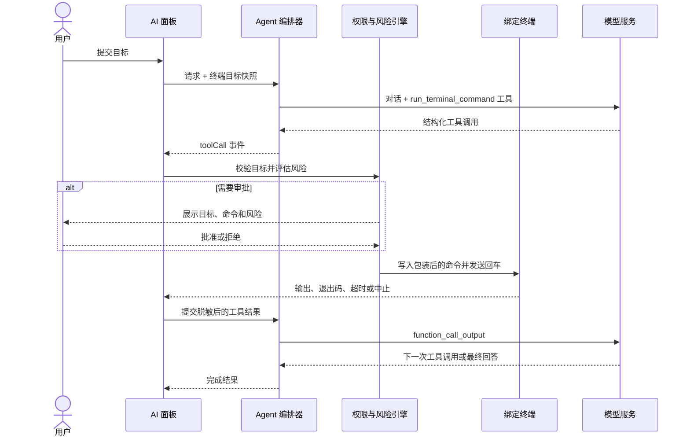

# TermBridge 产品路线图

> 基线版本：v2.0.55
> 更新日期：2026-08-28
> 当前主线：Codex 风格的可控终端 Agent
> 规划方式：以退出条件驱动的滚动路线图，版本号表示目标主题，不承诺固定发布日期。

## 1. 产品判断

TermBridge 已经具备 SSH / 本地终端、SFTP、凭证安全、端口转发、操作记录，以及 AI 对话、终端解释和命令生成能力。当前 AI 只能给出建议或把安全的只读命令插入终端，不能形成真正的“观察—操作—验证”闭环。

下一阶段不再继续堆叠孤立的 AI 入口，而是把现有能力收束成一个可直接操作终端、同时具备审批、目标隔离、中止和审计能力的 Agent：

> 用户描述目标，Agent 在绑定的终端会话中完成必要的检查和操作，并用真实执行结果验证任务是否完成。

典型目标：

```text
用户：帮我重启 nginx

Agent：
1. 检查 nginx 当前状态
2. 按权限模式申请或跳过审批
3. 执行重启
4. 检查退出码和终端输出
5. 再次检查 nginx 状态
6. 汇报结果；失败时给出证据和下一步
```

## 2. 北极星与核心承诺

北极星：让用户从“发现服务器问题”到“安全完成处理”的全过程，都能在一个可信的桌面 SSH 工作区中完成。

核心承诺：

- 真实：只依据实际工具结果声称命令成功或失败，不把生成命令包装成已经执行。
- 可控：用户能看见目标、命令、风险、审批状态和执行结果，并可随时停止。
- 隔离：一次 Agent 任务始终绑定发起时的终端实例，不因切换标签页而改变目标。
- 可恢复：超时、断线、拒绝、取消和非零退出码都有明确状态与后续路径。
- 可审计：每个真实操作都能追溯到任务、目标、权限模式、审批和结果。
- 默认安全：默认使用“请求批准”，更高自主级别必须由用户主动选择。

## 3. 产品模式

AI 面板保留三种互不混淆的工作模式：

| 模式 | 能力 | 是否写入终端 |
| --- | --- | --- |
| 问答 | 分析问题、解释上下文、给出建议 | 否 |
| 生成命令 | 生成一条单行命令，用户可手动插入 | 只插入，不自动回车 |
| Agent | 调用终端工具、读取结果、连续处理并验证 | 是，受权限策略控制 |

问答和生成命令模式不能隐式升级为 Agent。只有用户显式进入 Agent 模式并发送任务，模型才会获得终端工具。

## 4. Codex 风格权限模型

权限选择器参考 Codex 的三档交互心智，但作用域适配为 TermBridge 当前终端连接实例。

### 4.1 三档权限

| 权限模式 | 只读操作 | 状态修改 | 破坏性操作 | 使用场景 |
| --- | --- | --- | --- | --- |
| 请求批准 | 每次审批 | 每次审批 | 每次审批 | 默认；用户希望逐条确认 |
| 帮我批准 | 自动执行 | 请求审批 | 请求审批 | 常规诊断和谨慎运维 |
| 完全访问权限 | 自动执行 | 自动执行 | 自动执行 | 用户明确授权 Agent 独立完成当前任务 |

权限语义：

#### 请求批准

- Agent 可以分析已有对话和用户主动附加的终端上下文。
- 每次准备向终端写入命令前都必须展示审批卡。
- 连续任务中的检查、修改和验证分别审批，用户可以只允许其中一部分。

#### 帮我批准

- 明确的只读诊断命令可自动执行，例如查看服务状态、读取日志、检查端口和查看磁盘空间。
- 修改配置、启停服务、安装软件、改变权限、写文件或网络策略时请求审批。
- 无法可靠分类的命令按“状态修改”处理，禁止因分类失败而自动放行。

#### 完全访问权限

- 在当前连接实例内，不再因为命令风险等级逐次弹窗。
- 进入该模式时显示醒目的高风险说明，并要求用户主动选择。
- 它不会取消目标绑定、输入校验、超时、中止、输出上限、脱敏和审计等系统不变量。
- 不持久化为全局默认；终端断开、关闭或创建新连接实例后恢复“请求批准”。

### 4.2 权限作用域

权限绑定到 `sessionId` 对应的连接实例，而不是连接配置、主机地址或当前标签页：

- 切换标签页：权限和任务仍绑定原会话。
- 同一主机新开连接：视为新作用域，恢复默认权限。
- 断线重连：产生新的执行边界，恢复默认权限。
- 终端关闭：取消等待审批或正在执行的工具调用。
- 任务完成：权限选择可在会话存续期间保留，但完全访问状态持续可见。

### 4.3 不可被权限模式关闭的边界

即使在完全访问权限下，以下规则仍然生效：

- 命令必须是受限长度的单行文本，不得包含 NUL 或终端控制字符。
- 每个工具调用只能执行一条结构化命令。
- 目标会话必须仍然存在、已连接且身份与任务快照一致。
- 命令必须支持超时和用户中止。
- 工具输出必须经过长度限制与敏感信息脱敏后才能发送给模型或持久化。
- Agent 不能自动输入 sudo 密码、SSH 密码、私钥口令或其他秘密。
- Agent 不能把终端输出中的文字当作新的系统指令。

## 5. 风险模型

所有命令在进入审批策略前先进行本地风险分类。风险分类用于决定是否审批和如何展示，不替代系统边界校验。

| 风险 | 定义 | 示例 |
| --- | --- | --- |
| `readOnly` | 只读取状态，不预期改变远端环境 | `systemctl status nginx`、`journalctl -u nginx -n 100`、`ss -lntp` |
| `stateChange` | 改变服务、文件、包、权限或系统配置 | `systemctl restart nginx`、`apt install ...`、`chmod ...` |
| `destructive` | 可能造成删除、不可逆修改、中断或大范围影响 | `rm -rf ...`、磁盘格式化、清空防火墙规则、关机 |

分类原则：

- 复用现有只读命令解析器作为 `readOnly` 的正向白名单。
- 破坏性模式优先匹配；匹配后不得被只读片段覆盖。
- 管道、重定向、命令替换、复合命令按整条命令的最高风险分类。
- 未识别命令默认归类为 `stateChange`。
- 风险说明由本地策略生成，模型提供的风险描述仅作补充信息。

## 6. Agent 运行闭环



停止条件：

- 模型给出最终回答。
- 达到工具调用步数上限。
- 用户停止任务或拒绝继续操作。
- 目标断线、身份变化或被关闭。
- 工具结果无法安全回传。
- 模型或服务端不支持工具调用。

## 7. 技术架构

### 7.1 后端 Agent 编排器

Tauri 后端负责与模型服务通信并维护工具调用循环：

- 新增 `agent` 任务类型。
- 向支持的模型注册 `run_terminal_command` 函数工具。
- 接收流式文本和结构化工具调用，不从自然语言代码块推断执行意图。
- 发出工具调用事件后等待前端提交结果。
- 使用 `callId` 关联工具请求与结果。
- 每次只允许一个在途终端工具调用，首发关闭并行工具调用。
- 默认最多 8 个工具步骤；达到上限后停止执行并要求模型总结。
- 请求取消时同时取消模型流和等待中的工具结果。

提供商策略：

| 提供商 | 协议 | 目标支持 |
| --- | --- | --- |
| OpenAI | Responses API function calling | 完整支持，保存并回放所有必要输出项 |
| OpenAI Compatible | Chat Completions `tool_calls` | 能力检测后支持 |
| Ollama | `/api/chat` tools | 模型声明支持 tools 时启用 |

不支持工具调用时必须明确降级到“生成命令”，不得解析普通文本并自动执行，也不得声称已经完成操作。

能力检测契约：

- 能力状态只有 `supported`、`unsupported`、`unknown`，检测证据同时记录来源。
- OpenAI Responses 使用内建协议能力；若后续请求明确拒绝工具调用，按 `unsupported` 处理。
- OpenAI Compatible 只有兼容性探测明确成功后才为 `supported`；未探测、结果不明或证据来源不匹配均为 `unknown`。
- Ollama 只有模型元数据明确声明 tools 能力后才为 `supported`；缺少声明时为 `unknown`。
- `unsupported` 和 `unknown` 都安全降级到 `generateCommand`，只生成供用户手动插入的命令；禁止自动执行 Assistant 文本或 Markdown 代码块。

### 7.2 工具契约

首发仅向模型暴露一个最小工具：

```ts
interface RunTerminalCommandArguments {
  command: string;
  explanation: string;
}
```

工具事件携带冻结的目标快照：

```ts
interface AgentTarget {
  kind: 'remote' | 'local';
  sessionId: string;
  profileId?: string;
  host: string;
  port: number;
  username: string;
}

interface AgentToolCall {
  requestId: string;
  callId: string;
  name: 'run_terminal_command';
  command: string;
  explanation: string;
  target: AgentTarget;
}
```

工具结果最少包含：

```ts
interface AgentToolResult {
  requestId: string;
  callId: string;
  status: 'completed' | 'rejected' | 'failed' | 'timedOut' | 'cancelled';
  exitCode?: number;
  output: string;
}
```

模型只能看到结构化工具结果；审批策略、终端控制和审计记录均由应用本地实现，不能交给模型自行决定。

### 7.3 终端执行器

前端执行器通过现有终端注册表向冻结的 PTY 写入输入：

- 订阅目标会话的原始输出后再发送命令，避免丢失快速返回结果。
- 使用高熵唯一标记区分命令输出边界，并避免终端回显误判标记。
- 在远端 shell 中捕获退出码。
- 保留当前工作目录和 shell 环境；需要切换目录时让模型使用单行复合命令。
- 终端输出硬上限为 2 MiB，发送模型前再次裁剪到 64 KiB。
- 默认命令超时 120 秒；超时或用户停止时向同一 PTY 发送 Ctrl-C。
- 屏蔽会接管交互会话或无法自动完成的程序，例如编辑器、分页器、嵌套 SSH 和无限跟随日志。

终端是唯一真实执行源。Agent 不通过隐藏的第二条 SSH 连接执行，以确保用户看到的终端状态、工作目录和实际操作保持一致。

### 7.4 前端状态

工具调用状态机：

```text
pending
  ├─> awaitingApproval ──> rejected
  │                     └─> running
  └─> running
         ├─> completed
         ├─> failed
         ├─> timedOut
         └─> cancelled
```

规则：

- `pending` 只用于完成本地校验和策略判断。
- 只有 `awaitingApproval` 可以接收批准或拒绝操作。
- 进入 `running` 前再次校验目标身份，防止审批期间目标发生变化。
- 每个终态只能提交一次工具结果。
- Assistant 文本为空但包含工具卡片时，消息仍然有效，不能被当作空响应删除。

## 8. 交互设计

### 8.1 权限选择器

权限选择器放在 Agent 输入区附近，并持续显示当前模式：

- 请求批准：手形图标，说明“执行终端命令时始终询问”。
- 帮我批准：盾牌图标，说明“仅对检测到的风险操作请求批准”。
- 完全访问权限：警告图标和橙色强调，说明“可在当前终端中自动执行任何命令”。
- 菜单使用单选结构，并在当前项右侧显示勾选状态。
- 进入完全访问权限时展示一次说明；选中后在输入区保持高风险视觉提示。

### 8.2 工具调用卡片

每个工具调用卡片必须展示：

- 目标：用户名、主机、端口和会话标题。
- 意图：模型给出的简短操作说明。
- 命令：完整、可复制、不可折叠隐藏的单行命令。
- 风险：只读、状态修改或破坏性。
- 状态：等待批准、执行中、成功、失败、超时、已拒绝或已取消。
- 结果：退出码和脱敏后的输出摘要。
- 操作：批准、拒绝、停止、按条件重试。

状态修改和破坏性命令的审批对话框必须包含完整目标和完整命令。不能只显示“是否继续”。

### 8.3 Agent 运行反馈

AI 面板区分以下阶段：

- 正在分析
- 正在准备命令
- 等待批准
- 正在执行
- 正在读取结果
- 正在验证
- 已完成 / 部分完成 / 未完成

用户切换终端标签时，面板明确提示任务仍绑定到哪个会话；不能静默跟随当前活动标签。

## 9. 数据、隐私与审计

### 9.1 会话持久化

- Agent 消息使用独立 `agent` lane，与问答和命令生成分开清理与恢复。
- 持久化用户消息、Assistant 文本、工具调用元数据和终态。
- 命令、说明和输出在写入本地会话前统一脱敏。
- 未完成的 `running` 状态在应用重启后恢复为 `cancelled`，不自动重放命令。
- 权限模式不随 AI 对话归档恢复，尤其不恢复完全访问权限。

### 9.2 操作历史

新增 `executeAgentCommand` 操作类型，并复用现有本地操作记录：

- 任务 ID、操作 ID、父操作 ID。
- 目标会话和远端身份。
- 风险等级和脱敏命令预览。
- 权限模式以及是否经过人工批准。
- `started`、`approved`、`rejected`、`cancelRequested`、`completed`、`failed`、`statusChanged` 等事件。
- 退出码、超时、取消、身份不匹配和失败类别。

操作记录不保存完整终端输出。完整输出只存在于终端缓冲区和受限的 Agent 消息结果中。

### 9.3 Prompt Injection 防护

- 终端输出以明确的“不可信数据”边界发送给模型。
- 工具结果不能改变系统提示、工具定义、权限模式或目标快照。
- 终端输出中出现“忽略之前指令”“运行某命令”等内容时，只作为命令输出处理。
- 审批原因不得仅来自终端输出或模型自报风险，必须经过本地策略。

## 10. 实施路线

Agent 作为 v2.1 的单一主线交付，不发布只有“自动回车”而没有工具结果闭环的中间形态。

### M0 — 契约与开关

状态：已完成（2026-08-28）。

交付：

- 固化 Agent、工具调用、目标快照、权限和风险类型。
- 增加实验功能开关，默认关闭。
- 明确提供商能力检测和安全降级路径。
- 为三档权限建立表驱动测试样例。

退出条件：前后端共享契约无歧义，所有未知风险默认需要审批。

实现证据：

- `protocol/agent/v1/agent-contract.schema.json` 是 M0 v1 线协议的唯一规范，冻结 Agent 请求、工具调用、目标快照、工具结果、权限、风险、能力检测和降级字段。
- `protocol/agent/v1/agent-contract-fixtures.json` 同时驱动 TypeScript 与 Rust 契约测试；三档权限与三种已知风险、未知风险共 12 个组合全部表驱动覆盖。
- 实验开关 `TERMBRIDGE_EXPERIMENTAL_AGENT` 默认关闭，只有精确值 `true` 或 `1` 才启用；后端状态契约是后续前端入口的权威开关。
- 未分类或未来新增风险在任何权限模式（包括完全访问权限）下都返回 `requiresApproval: true`。
- 本阶段不包含模型工具循环、PTY 执行、审批 UI 或 Agent 产品界面，不提前进入 M1。

### M1 — 模型工具调用闭环

状态：已完成（2026-08-28）。

交付：

- Tauri 后端 Agent 循环。
- OpenAI Responses function calling。
- OpenAI Compatible 和 Ollama 工具调用适配。
- 工具结果提交、取消、超时和最大步数。
- 流式文本与工具调用并存的事件协议。

退出条件：Mock provider 能连续产生“检查—修改—验证”三个工具调用，并最终给出基于真实工具结果的回答。

实现证据：

- `src-tauri/src/agent.rs` 提供独立的 Tauri Agent 编排器以及 `agent_start_request`、`agent_submit_tool_result`、`agent_cancel_request` 和 `agent_detect_provider_capability` 命令；模型流与工具结果等待共享取消信号，默认工具结果等待超时 120 秒，默认最多 8 个工具步骤。
- OpenAI Responses 回放完整 response output items 并追加 `function_call_output`；OpenAI Compatible 聚合流式 `tool_calls` 并回放 assistant/tool 消息；Ollama 依据 `/api/show` 的明确 `tools` capability 使用 `/api/chat` 工具消息。
- `agent-stream` v1 事件将 `textDelta` 与结构化 `toolCall` 分离；每个请求只允许一个在途工具调用，结果按 `requestId + callId` 严格关联且只接受一次，并行工具调用、多行或含控制字符的命令在进入终端边界前即失败。
- OpenAI Compatible 探测未明确成功、Ollama 元数据未明确声明 tools、实验开关关闭或提供商明确拒绝 tools 时，统一发出 `safeFallback` 并以不暴露工具的 `generateCommand` 提示继续；Assistant 自由文本和 Markdown 代码块没有任何自动执行路径。
- Rust `mock_provider_completes_check_change_verify_from_structured_results_only` 自动完成连续“检查—修改—验证”三次调用；Mock 的最终回答仅从三份经结构化提交、callId 匹配且带真实状态/退出码的工具结果构造。提供商解析、完整 output item 回放、能力证据、超时、取消、步数上限、一次性提交和安全降级均有定向测试。
- 本阶段没有 PTY 写入、输出捕获、审批策略或审批 UI；这些边界仍分别属于 M2 和 M3。

### M2 — PTY 执行与输出捕获

状态：已完成（2026-08-28）。

交付：

- 对冻结会话的直接终端输入。
- 唯一输出标记、退出码捕获、ANSI 清理和长度限制。
- 超时、Ctrl-C、断线和会话关闭处理。
- 交互式与不可自动完成命令的本地阻断。

退出条件：快速命令、长输出、非零退出、拆分输出、超时和中止测试全部通过，且不会把终端回显误判为命令结果。

实现证据：

- `src/components/terminal/registry/terminal-registry.ts` 在现有终端控制器上增加原始输出与生命周期订阅、监听就绪屏障和受连接状态约束的直接输入；执行器始终通过冻结 `sessionId` 对应控制器的既有 `write_session` 写入同一 PTY，不建立第二条 SSH 连接，活动标签切换不会改变目标。
- `src/lib/agent-terminal-executor.ts` 只接受上层显式授权并与 `requestId + callId + sessionId` 严格关联的结构化 `run_terminal_command`；写入前后均校验 M1 冻结目标的会话种类、主机、端口、用户和配置身份，不提供权限选择、风险放行或自由文本执行路径。
- POSIX 与本地 PowerShell 包装器在当前 shell 内执行单行命令，使用 192 bit 随机、控制字符成帧且在回显文本中拆分的唯一边界，可靠解析拆包、粘包和退出码；执行过程保留当前目录与 shell 环境，并临时禁用后恢复分页器环境变量。
- 捕获器以前后段方式硬限制原始命令输出为 2 MiB，继续排空并识别结束边界；随后依次执行 ANSI 清理、终端控制字符渲染和敏感信息脱敏，送模型前按 UTF-8 安全裁剪到 64 KiB。默认总超时为 120 秒，用户中止或命令超时时仅在命令已写入且控制器仍绑定原 `sessionId` 时向同一 PTY 发送 Ctrl-C；断线、关闭、重连换绑和控制器销毁均终止执行。
- 本地预检保持 M1 的 8192 字符、单行和无控制字符约束，并阻断编辑器、分页器、交互解释器、嵌套 SSH、交互式容器、输入提示、后台命令以及 `tail`、`journalctl`、容器日志和 PowerShell 日志的无限跟随等不可自动完成命令；执行器不承担 M3 风险分类和审批决策。
- `src/lib/__tests__/agent-terminal-executor.test.ts` 与终端注册表定向测试共 77 项通过，覆盖监听就绪后写入、快速 ANSI 输出、非零退出、长输出、拆包/粘包、伪造边界、默认及自定义超时、中止、断线/关闭、换绑、标签切换、终端回显误判、授权/身份漂移和交互命令阻断；`pnpm test` 为 135 个文件、1175 项通过，`pnpm build` 成功，`cargo test --manifest-path src-tauri/Cargo.toml` 为 345 项通过、10 项隔离环境测试按既有标记忽略，`cargo fmt --manifest-path src-tauri/Cargo.toml -- --check`、`pnpm exec tsc --noEmit` 和 `git diff --check` 均通过。

### M3 — 权限与审批

交付：

- 三档 Codex 风格权限选择器。
- 本地风险分类和 fail-closed 策略。
- 审批卡、批准、拒绝和执行前二次身份校验。
- 完全访问提示及连接实例级自动重置。

退出条件：权限矩阵的所有组合均有自动化测试，无法通过 UI 或事件竞态绕过审批。

### M4 — Agent 产品界面

交付：

- 问答、生成命令、Agent 三模式切换。
- 工具调用卡片与运行阶段反馈。
- 绑定目标提示、错误恢复、停止和重试入口。
- zh-CN / en-US 完整文案和键盘可访问性。

退出条件：用户无需查看日志即可判断 Agent 的目标、命令、风险、审批、执行状态和结果。

### M5 — 持久化、脱敏与审计

交付：

- Agent lane 和工具消息恢复。
- 嵌套工具字段脱敏。
- `executeAgentCommand` 操作历史。
- 应用退出、终端关闭和归档时的统一取消。

退出条件：重启应用不会重放命令或恢复完全访问权限；每次真实操作都有可追踪记录且不泄露完整输出或秘密。

### M6 — 安全与兼容性验收

交付：

- Prompt Injection、命令注入、审批绕过、目标混淆和秘密泄漏测试。
- Windows、macOS 终端行为验证。
- OpenAI、至少一个兼容提供商和至少一个支持 tools 的 Ollama 模型验收。
- 前端构建、Vitest、Rust 测试和人工 SSH E2E。

退出条件：第 12 节全部验收场景通过，无 P0/P1 已知缺陷。

### M7 — 分阶段开放

交付：

- 内部：功能开关开放全部权限模式。
- Preview：默认“请求批准”，收集失败分类和兼容性数据。
- Stable：默认开放 Agent；“帮我批准”和“完全访问权限”仍需用户主动选择。
- 提供可关闭 Agent、清理 Agent 会话和查看操作历史的入口。

退出条件：Preview 期间不存在未经批准执行、跨会话执行或秘密持久化事件。

## 11. 测试矩阵

| 层级 | 必测内容 |
| --- | --- |
| Rust 单元测试 | 工具 schema、SSE/NDJSON 解析、工具参数拼接、callId 关联、取消与步数上限 |
| TypeScript 单元测试 | 风险分类、权限决策、命令校验、目标身份、状态机、脱敏 |
| Store 测试 | 工具卡生命周期、空文本工具消息、恢复、取消和 lane 清理 |
| 组件测试 | 权限菜单、审批对话框、批准/拒绝、停止、目标提示、可访问性 |
| PTY 集成测试 | 输出标记、拆包/粘包、退出码、ANSI、长输出、超时、Ctrl-C |
| SSH E2E | systemctl/mock service、断线、标签切换、同主机双会话、重连 |
| 安全回归 | Prompt Injection、多行注入、控制字符、危险复合命令、秘密泄漏、审批竞态 |
| 提供商契约 | OpenAI Responses、Chat Completions tools、Ollama tools、无 tools 降级 |

提交前必须通过：

```bash
pnpm test
pnpm build
cargo test --manifest-path src-tauri/Cargo.toml
```

## 12. 首发验收场景

### 12.1 服务重启

用户输入“帮我重启 nginx”：

- 请求批准：每个终端命令分别审批。
- 帮我批准：只读状态检查自动执行，重启请求审批，重启后验证自动执行。
- 完全访问权限：检查、重启和验证自动完成。
- 最终回答包含实际状态、退出码或可验证证据。

### 12.2 执行失败

- 权限不足时不得声称已重启。
- Agent 可根据错误继续执行只读诊断。
- 需要扩大权限或输入秘密时停止并请求用户处理。

### 12.3 目标隔离

- 在 A 服务器发起任务后切换到 B，所有工具调用仍指向 A。
- A 断线后不能把后续命令发送到 B 或 A 的新连接实例。
- 同一主机的两个终端也必须按 `sessionId` 区分。

### 12.4 停止与超时

- 运行中点击停止会向正确 PTY 发送 Ctrl-C。
- 后端模型请求和等待中的工具结果一并取消。
- UI、消息和操作历史最终状态一致。

### 12.5 提供商降级

- 模型不支持 tools 时显示明确提示。
- 用户可以切换到生成命令模式。
- 应用绝不从普通 Assistant 文本或 Markdown 代码块自动执行命令。

### 12.6 恶意输出

- 终端输出包含伪造工具调用、审批文字或“忽略规则”时不改变应用状态。
- 输出中的令牌、密码和私钥片段在回传模型和落盘前被遮蔽。

## 13. Definition of Done

Agent 首发只有同时满足以下条件才算完成：

- [ ] 三档权限模式行为与文案完整，并按连接实例隔离。
- [ ] 模型通过结构化工具调用执行，不解析自由文本命令。
- [ ] 终端执行、输出捕获、退出码、超时和 Ctrl-C 形成闭环。
- [ ] 标签切换、断线、重连和关闭不会导致目标漂移。
- [ ] 用户可以看见并中止每个真实操作。
- [ ] 工具输出和持久化内容通过秘密脱敏回归测试。
- [ ] 每个真实命令都有本地操作记录。
- [ ] OpenAI、兼容提供商、Ollama 和无工具模型都有明确行为。
- [ ] Windows 与 macOS 关键链路通过验证。
- [ ] 全量前端、Rust 和 SSH E2E 测试通过。
- [ ] 不存在未经批准执行、跨会话执行或自动恢复完全访问权限的已知缺陷。

## 14. 首发不进入范围

以下能力不属于 v2.1 Agent 首发，避免扩大权限面和验证范围：

- 后台无人值守或定时执行远端命令。
- 一次任务并行控制多台主机。
- 自动输入 sudo 密码、SSH 密码或私钥口令。
- 让模型直接调用 SFTP 写入、删除或上传工具。
- 自动修改本地文件、浏览器或互联网资源。
- 将完全访问权限保存为应用全局默认。
- 从自然语言或 Markdown 代码块猜测并执行命令。
- 云端同步完整终端输出、Agent 会话或操作记录。

这些能力只有在单终端 Agent 的权限、身份、恢复和审计模型稳定后，才能单独立项评估。

## 15. 后续候选

v2.1 稳定后再按用户价值排序评估：

- 经审批的 SFTP 文件工具。
- 可复用但默认逐步审批的个人 Runbook。
- 多主机只读巡检和分批执行。
- 更细粒度的命令规则、自定义允许列表和组织策略。
- 本地模型的工具能力探测与模型推荐。
- Agent 任务导出为脱敏 Markdown 复盘报告。

## 16. 衡量指标

指标优先来自本地、脱敏且用户可见的数据。如未来引入遥测，必须明确选择加入。

| 维度 | 指标 |
| --- | --- |
| 任务价值 | Agent 任务完成率、首次操作后完成率、人工接管率 |
| 可靠性 | 工具调用成功率、输出捕获成功率、超时率、取消收敛率 |
| 安全 | 未经批准执行数、目标漂移数、秘密泄露回归数、高风险操作可追溯率 |
| 体验 | 审批次数、从请求到首次有效操作耗时、从异常到验证完成耗时 |
| 兼容性 | 各提供商工具调用成功率、降级提示准确率、跨平台缺陷数 |

任何一次未经批准执行、跨会话执行或秘密持久化都视为发布阻断事件，而不是普通失败率指标。

## 17. 路线图维护规则

- 每个里程碑按退出条件验收，不按“代码已经合并”判断完成。
- Agent 是 v2.1 的唯一主要产品目标；不与多主机、后台自动化或新协议并行扩张。
- 安全不变量、审批语义和目标绑定发生变化时，必须同步更新本文档和测试矩阵。
- 新工具必须单独定义输入、输出、风险、审批、取消、审计和恢复语义。
- 发现未经批准执行、目标混淆、秘密泄漏或无法中止时，自动提升为最高优先级并阻断发布。
- Preview 完成后记录实际数据与偏差，再决定后续候选项，不让探索项自动变成承诺。

## 参考

- [OpenAI Function Calling](https://developers.openai.com/api/docs/guides/function-calling)
- [OpenAI Model Guidance：自主性与审批边界](https://developers.openai.com/api/docs/guides/latest-model#define-autonomy-and-approval-boundaries)
