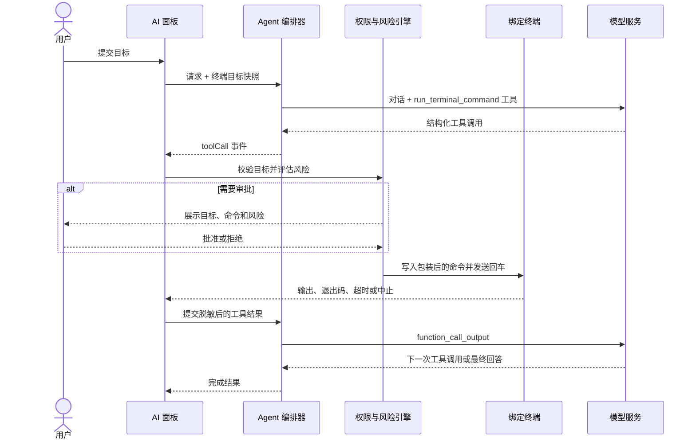

# TermBridge 产品路线图

> 基线版本：v2.0.55
> 更新日期：2026-08-29
> 当前主线：Codex 风格的可控终端 Agent
> 规划方式：以退出条件驱动的滚动路线图，版本号表示目标主题，不承诺固定发布日期。

## 1. 产品判断

TermBridge 已经具备 SSH / 本地终端、SFTP、凭证安全、端口转发、操作记录，以及 AI 对话、终端解释和命令生成能力。当前 AI 只能给出建议或把安全的只读命令插入终端，不能形成真正的“观察—操作—验证”闭环。

下一阶段不再继续堆叠孤立的 AI 入口，而是把现有能力收束成一个可直接操作终端、同时具备审批、目标隔离、中止和审计能力的 Agent：

> 用户描述目标，Agent 在绑定的终端会话中完成必要的检查和操作，并用真实执行结果验证任务是否完成。

典型目标：

```text
用户：帮我重启 nginx

Agent：
1. 检查 nginx 当前状态
2. 按权限模式申请或跳过审批
3. 执行重启
4. 检查退出码和终端输出
5. 再次检查 nginx 状态
6. 汇报结果；失败时给出证据和下一步
```

## 2. 北极星与核心承诺

北极星：让用户从“发现服务器问题”到“安全完成处理”的全过程，都能在一个可信的桌面 SSH 工作区中完成。

核心承诺：

- 真实：只依据实际工具结果声称命令成功或失败，不把生成命令包装成已经执行。
- 可控：用户能看见目标、命令、风险、审批状态和执行结果，并可随时停止。
- 隔离：一次 Agent 任务始终绑定发起时的终端实例，不因切换标签页而改变目标。
- 可恢复：超时、断线、拒绝、取消和非零退出码都有明确状态与后续路径。
- 可审计：每个真实操作都能追溯到任务、目标、权限模式、审批和结果。
- 默认安全：默认使用“请求批准”，更高自主级别必须由用户主动选择。

## 3. 产品模式

AI 面板保留三种互不混淆的工作模式：

| 模式 | 能力 | 是否写入终端 |
| --- | --- | --- |
| 问答 | 分析问题、解释上下文、给出建议 | 否 |
| 生成命令 | 生成一条单行命令，用户可手动插入 | 只插入，不自动回车 |
| Agent | 调用终端工具、读取结果、连续处理并验证 | 是，受权限策略控制 |

问答和生成命令模式不能隐式升级为 Agent。只有用户显式进入 Agent 模式并发送任务，模型才会获得终端工具。

## 4. Codex 风格权限模型

权限选择器参考 Codex 的三档交互心智，但作用域适配为 TermBridge 当前终端连接实例。

### 4.1 三档权限

| 权限模式 | 只读操作 | 状态修改 | 破坏性操作 | 使用场景 |
| --- | --- | --- | --- | --- |
| 请求批准 | 每次审批 | 每次审批 | 每次审批 | 默认；用户希望逐条确认 |
| 帮我批准 | 自动执行 | 请求审批 | 请求审批 | 常规诊断和谨慎运维 |
| 完全访问权限 | 自动执行 | 自动执行 | 自动执行 | 用户明确授权 Agent 独立完成当前任务 |

权限语义：

#### 请求批准

- Agent 可以分析已有对话和用户主动附加的终端上下文。
- 每次准备向终端写入命令前都必须展示审批卡。
- 连续任务中的检查、修改和验证分别审批，用户可以只允许其中一部分。

#### 帮我批准

- 明确的只读诊断命令可自动执行，例如查看服务状态、读取日志、检查端口和查看磁盘空间。
- 修改配置、启停服务、安装软件、改变权限、写文件或网络策略时请求审批。
- 无法可靠分类的命令按“状态修改”处理，禁止因分类失败而自动放行。

#### 完全访问权限

- 在当前连接实例内，不再因为命令风险等级逐次弹窗。
- 进入该模式时显示醒目的高风险说明，并要求用户主动选择。
- 它不会取消目标绑定、输入校验、超时、中止、输出上限、脱敏和审计等系统不变量。
- 不持久化为全局默认；终端断开、关闭或创建新连接实例后恢复“请求批准”。

### 4.2 权限作用域

权限绑定到 `sessionId` 对应的连接实例，而不是连接配置、主机地址或当前标签页：

- 切换标签页：权限和任务仍绑定原会话。
- 同一主机新开连接：视为新作用域，恢复默认权限。
- 断线重连：产生新的执行边界，恢复默认权限。
- 终端关闭：取消等待审批或正在执行的工具调用。
- 任务完成：权限选择可在会话存续期间保留，但完全访问状态持续可见。

### 4.3 不可被权限模式关闭的边界

即使在完全访问权限下，以下规则仍然生效：

- 命令必须是受限长度的单行文本，不得包含 NUL 或终端控制字符。
- 每个工具调用只能执行一条结构化命令。
- 目标会话必须仍然存在、已连接且身份与任务快照一致。
- 命令必须支持超时和用户中止。
- 工具输出必须经过长度限制与敏感信息脱敏后才能发送给模型或持久化。
- Agent 不能自动输入 sudo 密码、SSH 密码、私钥口令或其他秘密。
- Agent 不能把终端输出中的文字当作新的系统指令。

## 5. 风险模型

所有命令在进入审批策略前先进行本地风险分类。风险分类用于决定是否审批和如何展示，不替代系统边界校验。

| 风险 | 定义 | 示例 |
| --- | --- | --- |
| `readOnly` | 只读取状态，不预期改变远端环境 | `systemctl status nginx`、`journalctl -u nginx -n 100`、`ss -lntp` |
| `stateChange` | 改变服务、文件、包、权限或系统配置 | `systemctl restart nginx`、`apt install ...`、`chmod ...` |
| `destructive` | 可能造成删除、不可逆修改、中断或大范围影响 | `rm -rf ...`、磁盘格式化、清空防火墙规则、关机 |

分类原则：

- 复用现有只读命令解析器作为 `readOnly` 的正向白名单。
- 破坏性模式优先匹配；匹配后不得被只读片段覆盖。
- 管道、重定向、命令替换、复合命令按整条命令的最高风险分类。
- 未识别命令默认归类为 `stateChange`。
- 风险说明由本地策略生成，模型提供的风险描述仅作补充信息。

## 6. Agent 运行闭环



停止条件：

- 模型给出最终回答。
- 达到工具调用步数上限。
- 用户停止任务或拒绝继续操作。
- 目标断线、身份变化或被关闭。
- 工具结果无法安全回传。
- 模型或服务端不支持工具调用。

## 7. 技术架构

### 7.1 后端 Agent 编排器

Tauri 后端负责与模型服务通信并维护工具调用循环：

- 新增 `agent` 任务类型。
- 向支持的模型注册 `run_terminal_command` 函数工具。
- 接收流式文本和结构化工具调用，不从自然语言代码块推断执行意图。
- 发出工具调用事件后等待前端提交结果。
- 使用 `callId` 关联工具请求与结果。
- 每次只允许一个在途终端工具调用，首发关闭并行工具调用。
- 默认最多 8 个工具步骤；达到上限后停止执行并要求模型总结。
- 请求取消时同时取消模型流和等待中的工具结果。

提供商策略：

| 提供商 | 协议 | 目标支持 |
| --- | --- | --- |
| MiniMax | OpenAI-compatible Chat Completions `tool_calls` | 当前真实云端验收目标；保存完整 assistant 消息并回放 tool 结果 |
| OpenAI | Responses API function calling | 保留适配器与契约覆盖；不再作为当前用户的阶段或发布前置 |
| OpenAI Compatible | Chat Completions `tool_calls` | 能力检测后支持 |
| Ollama | `/api/chat` tools | 模型声明支持 tools 时启用 |

不支持工具调用时必须明确降级到“生成命令”，不得解析普通文本并自动执行，也不得声称已经完成操作。

能力检测契约：

- 能力状态只有 `supported`、`unsupported`、`unknown`，检测证据同时记录来源。
- MiniMax 复用 OpenAI-compatible 能力探测；只有指定结构化探测调用成功才为 `supported`，后续轮次必须回放含 `tool_calls` 的完整 assistant 消息和对应 tool 消息。
- OpenAI Responses 使用内建协议能力；若后续请求明确拒绝工具调用，按 `unsupported` 处理。
- OpenAI Compatible 只有兼容性探测明确成功后才为 `supported`；未探测、结果不明或证据来源不匹配均为 `unknown`。
- Ollama 只有模型元数据明确声明 tools 能力后才为 `supported`；缺少声明时为 `unknown`。
- `unsupported` 和 `unknown` 都安全降级到 `generateCommand`，只生成供用户手动插入的命令；禁止自动执行 Assistant 文本或 Markdown 代码块。

### 7.2 工具契约

首发仅向模型暴露一个最小工具：

```ts
interface RunTerminalCommandArguments {
  command: string;
  explanation: string;
}
```

工具事件携带冻结的目标快照：

```ts
interface AgentTarget {
  kind: 'remote' | 'local';
  sessionId: string;
  profileId?: string;
  host: string;
  port: number;
  username: string;
}

interface AgentToolCall {
  requestId: string;
  callId: string;
  name: 'run_terminal_command';
  command: string;
  explanation: string;
  target: AgentTarget;
}
```

工具结果最少包含：

```ts
interface AgentToolResult {
  requestId: string;
  callId: string;
  status: 'completed' | 'rejected' | 'failed' | 'timedOut' | 'cancelled';
  exitCode?: number;
  output: string;
}
```

模型只能看到结构化工具结果；审批策略、终端控制和审计记录均由应用本地实现，不能交给模型自行决定。

### 7.3 终端执行器

前端执行器通过现有终端注册表向冻结的 PTY 写入输入：

- 订阅目标会话的原始输出后再发送命令，避免丢失快速返回结果。
- 使用高熵唯一标记区分命令输出边界，并避免终端回显误判标记。
- 在远端 shell 中捕获退出码。
- 保留当前工作目录和 shell 环境；需要切换目录时让模型使用单行复合命令。
- 终端输出硬上限为 2 MiB，发送模型前再次裁剪到 64 KiB。
- 默认命令超时 120 秒；超时或用户停止时向同一 PTY 发送 Ctrl-C。
- 屏蔽会接管交互会话或无法自动完成的程序，例如编辑器、分页器、嵌套 SSH 和无限跟随日志。

终端是唯一真实执行源。Agent 不通过隐藏的第二条 SSH 连接执行，以确保用户看到的终端状态、工作目录和实际操作保持一致。

### 7.4 前端状态

工具调用状态机：

```text
pending
  ├─> awaitingApproval ──> rejected
  │                     └─> running
  └─> running
         ├─> completed
         ├─> failed
         ├─> timedOut
         └─> cancelled
```

规则：

- `pending` 只用于完成本地校验和策略判断。
- 只有 `awaitingApproval` 可以接收批准或拒绝操作。
- 进入 `running` 前再次校验目标身份，防止审批期间目标发生变化。
- 每个终态只能提交一次工具结果。
- Assistant 文本为空但包含工具卡片时，消息仍然有效，不能被当作空响应删除。

## 8. 交互设计

### 8.1 权限选择器

权限选择器放在 Agent 输入区附近，并持续显示当前模式：

- 请求批准：手形图标，说明“执行终端命令时始终询问”。
- 帮我批准：盾牌图标，说明“仅对检测到的风险操作请求批准”。
- 完全访问权限：警告图标和橙色强调，说明“可在当前终端中自动执行任何命令”。
- 菜单使用单选结构，并在当前项右侧显示勾选状态。
- 进入完全访问权限时展示一次说明；选中后在输入区保持高风险视觉提示。

### 8.2 工具调用卡片

每个工具调用卡片必须展示：

- 目标：用户名、主机、端口和会话标题。
- 意图：模型给出的简短操作说明。
- 命令：完整、可复制、不可折叠隐藏的单行命令。
- 风险：只读、状态修改或破坏性。
- 状态：等待批准、执行中、成功、失败、超时、已拒绝或已取消。
- 结果：退出码和脱敏后的输出摘要。
- 操作：批准、拒绝、停止、按条件重试。

状态修改和破坏性命令的审批对话框必须包含完整目标和完整命令。不能只显示“是否继续”。

### 8.3 Agent 运行反馈

AI 面板区分以下阶段：

- 正在分析
- 正在准备命令
- 等待批准
- 正在执行
- 正在读取结果
- 正在验证
- 已完成 / 部分完成 / 未完成

用户切换终端标签时，面板明确提示任务仍绑定到哪个会话；不能静默跟随当前活动标签。

## 9. 数据、隐私与审计

### 9.1 会话持久化

- Agent 消息使用独立 `agent` lane，与问答和命令生成分开清理与恢复。
- 持久化用户消息、Assistant 文本、工具调用元数据和终态。
- 命令、说明和输出在写入本地会话前统一脱敏。
- 未完成的 `running` 状态在应用重启后恢复为 `cancelled`，不自动重放命令。
- 权限模式不随 AI 对话归档恢复，尤其不恢复完全访问权限。

### 9.2 操作历史

新增 `executeAgentCommand` 操作类型，并复用现有本地操作记录：

- 任务 ID、操作 ID、父操作 ID。
- 目标会话和远端身份。
- 风险等级和脱敏命令预览。
- 权限模式以及是否经过人工批准。
- `started`、`approved`、`rejected`、`cancelRequested`、`completed`、`failed`、`statusChanged` 等事件。
- 退出码、超时、取消、身份不匹配和失败类别。

操作记录不保存完整终端输出。完整输出只存在于终端缓冲区和受限的 Agent 消息结果中。

### 9.3 Prompt Injection 防护

- 终端输出以明确的“不可信数据”边界发送给模型。
- 工具结果不能改变系统提示、工具定义、权限模式或目标快照。
- 终端输出中出现“忽略之前指令”“运行某命令”等内容时，只作为命令输出处理。
- 审批原因不得仅来自终端输出或模型自报风险，必须经过本地策略。

## 10. 实施路线

Agent 作为 v2.1 的单一主线交付，不发布只有“自动回车”而没有工具结果闭环的中间形态。

### M0 — 契约与开关

状态：已完成（2026-08-28）。

交付：

- 固化 Agent、工具调用、目标快照、权限和风险类型。
- 增加实验功能开关，默认关闭。
- 明确提供商能力检测和安全降级路径。
- 为三档权限建立表驱动测试样例。

退出条件：前后端共享契约无歧义，所有未知风险默认需要审批。

实现证据：

- `protocol/agent/v1/agent-contract.schema.json` 是 M0 v1 线协议的唯一规范，冻结 Agent 请求、工具调用、目标快照、工具结果、权限、风险、能力检测和降级字段。
- `protocol/agent/v1/agent-contract-fixtures.json` 同时驱动 TypeScript 与 Rust 契约测试；三档权限与三种已知风险、未知风险共 12 个组合全部表驱动覆盖。
- 实验开关 `TERMBRIDGE_EXPERIMENTAL_AGENT` 默认关闭，只有精确值 `true` 或 `1` 才启用；后端状态契约是后续前端入口的权威开关。
- 未分类或未来新增风险在任何权限模式（包括完全访问权限）下都返回 `requiresApproval: true`。
- 本阶段不包含模型工具循环、PTY 执行、审批 UI 或 Agent 产品界面，不提前进入 M1。

### M1 — 模型工具调用闭环

状态：已完成（2026-08-28）。

交付：

- Tauri 后端 Agent 循环。
- OpenAI Responses function calling。
- OpenAI Compatible（含 MiniMax）和 Ollama 工具调用适配。
- 工具结果提交、取消、超时和最大步数。
- 流式文本与工具调用并存的事件协议。

退出条件：Mock provider 能连续产生“检查—修改—验证”三个工具调用，并最终给出基于真实工具结果的回答。

实现证据：

- `src-tauri/src/agent.rs` 提供独立的 Tauri Agent 编排器以及 `agent_start_request`、`agent_submit_tool_result`、`agent_cancel_request` 和 `agent_detect_provider_capability` 命令；模型流与工具结果等待共享取消信号，默认工具结果等待超时 120 秒，默认最多 8 个工具步骤。
- OpenAI Responses 回放完整 response output items 并追加 `function_call_output`；OpenAI Compatible 聚合流式 `tool_calls` 并回放 assistant/tool 消息，其中 MiniMax M2.x 的累计流式内容与完整 assistant 消息均保留；Ollama 依据 `/api/show` 的明确 `tools` capability 使用 `/api/chat` 工具消息。
- `agent-stream` v1 事件将 `textDelta` 与结构化 `toolCall` 分离；每个请求只允许一个在途工具调用，结果按 `requestId + callId` 严格关联且只接受一次，并行工具调用、多行或含控制字符的命令在进入终端边界前即失败。
- OpenAI Compatible 探测未明确成功、Ollama 元数据未明确声明 tools、实验开关关闭或提供商明确拒绝 tools 时，统一发出 `safeFallback` 并以不暴露工具的 `generateCommand` 提示继续；Assistant 自由文本和 Markdown 代码块没有任何自动执行路径。
- Rust `mock_provider_completes_check_change_verify_from_structured_results_only` 自动完成连续“检查—修改—验证”三次调用；Mock 的最终回答仅从三份经结构化提交、callId 匹配且带真实状态/退出码的工具结果构造。提供商解析、完整 output item 回放、能力证据、超时、取消、步数上限、一次性提交和安全降级均有定向测试。
- 本阶段没有 PTY 写入、输出捕获、审批策略或审批 UI；这些边界仍分别属于 M2 和 M3。

### M2 — PTY 执行与输出捕获

状态：已完成（2026-08-28）。

交付：

- 对冻结会话的直接终端输入。
- 唯一输出标记、退出码捕获、ANSI 清理和长度限制。
- 超时、Ctrl-C、断线和会话关闭处理。
- 交互式与不可自动完成命令的本地阻断。

退出条件：快速命令、长输出、非零退出、拆分输出、超时和中止测试全部通过，且不会把终端回显误判为命令结果。

实现证据：

- `src/components/terminal/registry/terminal-registry.ts` 在现有终端控制器上增加原始输出与生命周期订阅、监听就绪屏障和受连接状态约束的直接输入；执行器始终通过冻结 `sessionId` 对应控制器的既有 `write_session` 写入同一 PTY，不建立第二条 SSH 连接，活动标签切换不会改变目标。
- `src/lib/agent-terminal-executor.ts` 只接受上层显式授权并与 `requestId + callId + sessionId` 严格关联的结构化 `run_terminal_command`；写入前后均校验 M1 冻结目标的会话种类、主机、端口、用户和配置身份，不提供权限选择、风险放行或自由文本执行路径。
- POSIX 与本地 PowerShell 包装器在当前 shell 内执行单行命令，使用 192 bit 随机、控制字符成帧且在回显文本中拆分的唯一边界，可靠解析拆包、粘包和退出码；执行过程保留当前目录与 shell 环境，并临时禁用后恢复分页器环境变量。
- 捕获器以前后段方式硬限制原始命令输出为 2 MiB，继续排空并识别结束边界；随后依次执行 ANSI 清理、终端控制字符渲染和敏感信息脱敏，送模型前按 UTF-8 安全裁剪到 64 KiB。默认总超时为 120 秒，用户中止或命令超时时仅在命令已写入且控制器仍绑定原 `sessionId` 时向同一 PTY 发送 Ctrl-C；断线、关闭、重连换绑和控制器销毁均终止执行。
- 本地预检保持 M1 的 8192 字符、单行和无控制字符约束，并阻断编辑器、分页器、交互解释器、嵌套 SSH、交互式容器、输入提示、后台命令以及 `tail`、`journalctl`、容器日志和 PowerShell 日志的无限跟随等不可自动完成命令；执行器不承担 M3 风险分类和审批决策。
- `src/lib/__tests__/agent-terminal-executor.test.ts` 与终端注册表定向测试共 77 项通过，覆盖监听就绪后写入、快速 ANSI 输出、非零退出、长输出、拆包/粘包、伪造边界、默认及自定义超时、中止、断线/关闭、换绑、标签切换、终端回显误判、授权/身份漂移和交互命令阻断；`pnpm test` 为 135 个文件、1175 项通过，`pnpm build` 成功，`cargo test --manifest-path src-tauri/Cargo.toml` 为 345 项通过、10 项隔离环境测试按既有标记忽略，`cargo fmt --manifest-path src-tauri/Cargo.toml -- --check`、`pnpm exec tsc --noEmit` 和 `git diff --check` 均通过。

### M3 — 权限与审批

状态：已完成（2026-08-28）。

交付：

- 三档 Codex 风格权限选择器。
- 本地风险分类和 fail-closed 策略。
- 审批卡、批准、拒绝和执行前二次身份校验。
- 完全访问提示及连接实例级自动重置。

退出条件：权限矩阵的所有组合均有自动化测试，无法通过 UI 或事件竞态绕过审批。

实现证据：

- `src/lib/agent-command-risk.ts` 在进入权限策略前执行完全本地的命令分类：破坏性签名先于所有只读判断，简单管道和复合命令逐段复用既有 `isSafeReadOnlyCommand` 正向白名单并取整条命令最高风险，重定向、命令替换、复杂或未知语法统一 fail-closed 为 `stateChange`。M0 的未知风险值仍在三档权限下全部要求审批。
- `src/stores/agentPermissionStore.ts` 将权限与冻结的 `sessionId`、会话种类、配置、主机、端口和用户名共同绑定；只允许已连接实例提权。断线、错误、关闭、删除、身份漂移以及产生新 `sessionId` 的重连都会删除内存授权，新连接和替换连接均恢复 `requestApproval`，切换标签不改变原实例权限。
- `src/lib/agent-approval-controller.ts` 是结构化 `toolCall` 到 M2 PTY 执行器之间的策略闸门。它冻结命令和目标，使用不透明 `approvalId` 严格限定只有 `awaitingApproval` 能批准或拒绝，在进入 `running` 前重新校验 `sessionId` 与完整身份，随后仍由 M2 在写入前再次校验；事件重放、旧审批、批准/拒绝并发、权限变化和返回结果身份错配都不能重复执行或重复提交，每个终态只向 M1 提交一次。
- `src/components/ai/agent-permission-selector.tsx` 与 `agent-approval-card.tsx` 复用现有 shadcn Button、DropdownMenu 单选组、Alert、AlertDialog、Badge 和 Card，提供三档权限、完全访问橙色高风险说明、完整冻结目标/命令展示以及批准/拒绝交互；完全访问只改变风险审批决策，不绕过 M0/M2 的单行与控制字符校验、目标绑定、交互命令阻断、超时、中止、输出上限和脱敏边界。本阶段未增加 M4 的 Agent 模式、消息流或完整产品界面。
- `src/lib/__tests__/agent-command-risk.test.ts`、`agent-approval-controller.test.ts`、`src/stores/__tests__/agentPermissionStore.test.ts` 和组件测试覆盖本地分类、已知权限矩阵、未知风险 fail-closed、连接实例隔离/重置、完整目标展示及审批竞态；连同 M0 契约矩阵和 M2 执行器回归的定向运行共 6 个文件、118 项通过。
- 全量验证：`pnpm test` 为 139 个文件、1226 项通过；`pnpm build` 成功；`cargo test --manifest-path src-tauri/Cargo.toml` 为 345 项通过、10 项隔离环境测试按既有标记忽略；`cargo clippy --manifest-path src-tauri/Cargo.toml --all-targets --all-features -- -D warnings`、`cargo fmt --manifest-path src-tauri/Cargo.toml -- --check`、`pnpm exec tsc --noEmit` 和 `git diff --check` 均通过。

### M4 — Agent 产品界面

状态：已完成（2026-08-28）。

交付：

- 问答、生成命令、Agent 三模式切换。
- 工具调用卡片与运行阶段反馈。
- 绑定目标提示、错误恢复、停止和重试入口。
- zh-CN / en-US 完整文案和键盘可访问性。

退出条件：用户无需查看日志即可判断 Agent 的目标、命令、风险、审批、执行状态和结果。

实现证据：

- `src/components/ai/ai-panel.tsx` 提供互斥且显式的“问答 / 生成命令 / Agent”三模式。前两种仍只调用既有 `ai_start_request`，Agent 只在实验开关、服务商结构化工具能力和已连接终端均通过后调用独立的 `AgentUiController`；入口在默认关闭时仍可见但不可启用，并向辅助技术说明问答和生成命令不会获得终端工具。Agent lane 仅保存在内存，未进入 M5 的持久化或审计范围。
- `src/lib/agent-ui-controller.ts` 在启动请求前完成 M1 事件监听，把结构化 `toolCall` 严格交给 M3 `AgentApprovalController`，再由 M2 PTY 执行器运行并将脱敏结果回传模型。拒绝、用户停止、结果回传失败、流目标错配以及终端断线/关闭/身份变化会同时收敛本地工具与后端请求；单纯切换活动标签不会取消或重绑定。条件重试生成新请求，但复用原目标快照且仅在原连接身份仍有效时开放。
- `src/stores/agentStore.ts` 与 `src/components/ai/agent-run-view.tsx` 形成独立 Agent 产品状态流：展示正在分析、准备命令、等待批准、执行、读取结果、验证、完成/部分完成/未完成；非零退出码、失败工具或步骤上限不会被汇总为完全完成。Assistant 文本为空但携带工具卡时消息保留有效；没有文本也没有工具的空响应才失败。
- `src/components/ai/agent-approval-card.tsx` 复用项目现有 shadcn Card、Badge、Button、AlertDialog 与 Alert，展示冻结目标标题和完整 `user@host:port · sessionId`、意图、完整单行命令、本地风险、工具状态、退出码及有界脱敏输出摘要，并提供复制、批准、拒绝、停止和满足原目标条件时的整任务重试。`src/locales/en-US.ts` 与 `zh-CN.ts` 覆盖全部模式、阶段、状态、降级和恢复文案，状态使用 live region，消息区、对话框与所有操作均具备语义标签和键盘焦点行为。
- 定向回归命令 `pnpm exec vitest run src/stores/__tests__/agentStore.test.ts src/lib/__tests__/agent-ui-controller.test.ts src/components/ai/__tests__/agent-permission-approval.test.tsx src/components/ai/__tests__/agent-run-view.test.tsx src/components/ai/__tests__/ai-panel.test.ts` 覆盖三模式工具隔离、完整逐条批准、自动只读、拒绝、停止与 Ctrl-C 协调、后端结果超时、目标漂移/标签切换、同目标重试、空文本工具消息、非零退出和步骤上限、状态与辅助技术语义，共 5 个文件、55 项通过。
- 本地浏览器 QA：在 1280×900 中文桌面视口验证冻结目标横幅、已完成只读卡、等待批准的状态修改卡、完整命令/风险/退出码/`[REDACTED]` 输出以及批准确认对话框；Esc 可关闭对话框并把焦点还给“批准”。在 390×844 英文视口验证工具卡、输出和批准/拒绝/停止操作区无横向溢出（`scrollWidth === viewportWidth === 390`）；只挂载生产组件的只读 QA 页面无 console warning/error。真实本地应用页同时验证实验开关默认关闭、三模式入口可见、问答与生成命令显式切换及 Agent 禁用原因；普通浏览器中预期存在的 Tauri IPC 不可用日志不作为桌面运行结果。
- 全量验证：`pnpm test` 为 142 个文件、1246 项通过；`pnpm build` 成功（仅既有 Vite 500 kB chunk 提示）；`cargo test --manifest-path src-tauri/Cargo.toml` 为 345 项通过、10 项隔离环境测试按既有标记忽略；`cargo clippy --manifest-path src-tauri/Cargo.toml --all-targets --all-features -- -D warnings`、`cargo fmt --manifest-path src-tauri/Cargo.toml -- --check`、`pnpm exec tsc --noEmit` 和 `git diff --check` 均通过。

### M5 — 持久化、脱敏与审计

状态：已完成（2026-08-28）。

交付：

- Agent lane 和工具消息恢复。
- 嵌套工具字段脱敏。
- `executeAgentCommand` 操作历史。
- 应用退出、终端关闭和归档时的统一取消。

退出条件：重启应用不会重放命令或恢复完全访问权限；每次真实操作都有可追踪记录且不泄露完整输出或秘密。

实现证据：

- `src/lib/agent-sessions.ts`、`src/stores/agentStore.ts` 与 `src-tauri/src/ai_sessions.rs` 为每个独立 Agent 请求追加原子 `{ run, messages, tools }` 快照，恢复用户消息、Assistant 文本、工具调用元数据和终态；同一 `requestId` 只采用最后一份快照，Agent lane 可单独清理。磁盘中的 `running`、流式消息以及 `pending` / `awaitingApproval` / `running` 工具在加载时统一收敛为 `cancelled`，删除可操作的 `approvalId`，不设置 `activeRequestId`，也没有启动、重试或 PTY 写入恢复路径。
- 权限授权继续只存在于 `src/stores/agentPermissionStore.ts` 的连接实例内存中；历史快照保留任务当时的权限模式用于解释和审计，但 hydrate 不接触权限 store。因此归档或重启后即使历史任务记录为 `fullAccess`，新连接仍从 `requestApproval` 开始。
- `src/lib/terminal-output-buffer.ts` 与新增 Rust `src-tauri/src/redaction.rs` 提供等价的递归脱敏边界：敏感键不受嵌套层级和数组影响，每个字符串叶子继续应用密码、token、Authorization、URL 凭据、私钥、AWS、GitHub token 和 JWT 规则。Agent 工具结果在回传模型前、Agent/普通 AI 消息在 IPC 与 JSONL 落盘前均再次脱敏，测试确认不会修改 UI 中的原对象。
- 数据库 schema v6 为操作历史增加 `permission_mode`、`human_approved` 和 Agent 查询索引；`executeAgentCommand` 记录 `taskId`、`operationId`、`parentOperationId`、冻结目标、风险、脱敏命令预览、权限与人工批准状态，以及 `started`、`approved`、`rejected`、`cancelRequested`、`completed`、`failed`、`statusChanged` 事件、退出码和超时/取消/身份不匹配/失败分类。输入结构以 `deny_unknown_fields` 拒绝终端输出字段，前端审计器也从不复制工具输出；v5→v6 迁移保留既有记录。
- `src/lib/agent-ui-controller.ts`、`agent-lifecycle.ts`、`ai-sessions.ts` 与 Rust `AgentRequestRegistry` 统一应用退出、更新重启、终端关闭和会话归档的取消顺序：先冻结取消意图并终止等待审批/PTY/模型/工具结果，再等待终态审计与 Agent 快照落盘，最后归档。后端对“取消先于注册”保留有界 tombstone，并在退出/重启时取消全部请求，避免迟到启动重放；工具 store 与审批控制器均保证首个终态胜出且只提交一次。数据层已提供关闭 Agent、按 conversation 清理 Agent lane 和按任务查询 Agent 操作历史的能力；M7 的公开入口与发布策略未提前实现。
- 定向回归覆盖 JSONL 恢复、重启不重放、完全访问不恢复、嵌套秘密在模型/磁盘边界脱敏、v5→v6 迁移、Agent lane 清理、取消/超时/迟到回调竞态、审计事件关联与完整输出不进入操作历史。全量验证：`pnpm test` 为 144 个文件、1260 项通过；`pnpm build` 成功（仅既有 Vite 500 kB chunk 提示）；`cargo test --manifest-path src-tauri/Cargo.toml` 为 353 项通过、10 项隔离环境测试按既有标记忽略；`cargo clippy --manifest-path src-tauri/Cargo.toml --all-targets --all-features -- -D warnings`、`cargo fmt --manifest-path src-tauri/Cargo.toml -- --check`、`pnpm exec tsc --noEmit` 和 `git diff --check` 均通过。

### M6 — 安全与兼容性验收

状态：历史阶段已完成（2026-08-29；OpenAI Responses 现场验收当时经产品授权豁免）。当前 MiniMax 替代现场验收见“阶段二”，不将历史豁免改写为通过。

交付：

- Prompt Injection、命令注入、审批绕过、目标混淆和秘密泄漏测试。
- Windows、macOS 终端行为验证。
- OpenAI、至少一个兼容提供商和至少一个支持 tools 的 Ollama 模型验收。
- 前端构建、Vitest、Rust 测试和人工 SSH E2E。

退出条件：第 12 节全部验收场景通过，无 P0/P1 已知缺陷。

收口复核：

- 基线提交为 `05fa6b3`，保存的 M6 WIP 为 `2378dd6`，detached 最终提交 `a6b340d` 已接回 M6 分支并累计集成于 `8f7ad72`；真实 Windows 收口修复完成于 `11dbb1d`。复核确认迟到或重叠 `toolCall` 在进入完全访问执行路径前 fail-closed；终端文本不能伪造结构化审计类别；引号包围且包含空白、shell 标点的秘密会在模型与持久化边界前脱敏；兼容提供商探测只有收到指定结构化探测调用才为 `supported`，截断或无明确证据的响应为 `unknown` 并安全降级。
- 累计缺陷分级为 P0 0、P1 2、P2 1、P3 7，现已全部关闭：P1 为 PowerShell 生产 wrapper 退出码丢失与 ConPTY 错用 Win32 input mode 导致前端 VT 输入不兼容；P2 为异步 locale 切换在高并发测试下不触发重渲染；P3 包含 Windows 验收脚本参数边界、SSH E2E 失败清理、WIP rustfmt、macOS Petdex 接受流的非阻塞状态、ConPTY 测试生命周期边界、Windows 测试模块导入，以及 [`main` 合并后 run 33234155897](https://github.com/hi-fullmoon/TermBridge/actions/runs/33234155897) 暴露的全量 Vitest 高负载下原生 PowerShell 验收夹具固定 10 秒超时。最后一项曾按 2026-08-29 产品授权接受风险并延期，现已由下述阶段一独立收口关闭。
- 产品例外决策：环境无 OpenAI API key，且不为验收获取或替代凭证。2026-08-29 产品授权明确豁免 OpenAI Responses 现场请求；豁免不改写为“现场通过”，非现场 SSE、完整 output item 回放、`function_call_output` 和安全降级契约测试仍作为明确行为证据。

第 12 节逐项证据：

| 场景 | 结论 | 证据 |
| --- | --- | --- |
| 12.1 服务重启 | 通过（自动化与隔离 SSH） | 三档权限矩阵覆盖逐条审批、只读自动批准和完全访问；Rust 结构化工具循环完成“检查→重启→验证”；隔离 SSH mock service 验证 `inactive→restart accepted→active` 且重启计数严格为 1。 |
| 12.2 执行失败 | 通过（自动化与隔离 SSH） | 非零退出码不会得到完成状态；结构化失败结果仍可进入下一轮诊断；系统提示禁止索取或输入秘密；隔离 SSH 的 root-only 读取失败且错误结果不泄露受保护内容。 |
| 12.3 目标隔离 | 通过（自动化与隔离 SSH） | 标签切换继续写入冻结会话；断线、控制器替换、同主机不同 `sessionId`、配置身份漂移均 fail-closed；隔离 SSH 身份漂移探测确认不会连接旧目标或跳板。 |
| 12.4 停止与超时 | 通过（自动化与隔离 SSH） | 停止与超时向同一 PTY 发送 Ctrl-C，同时取消模型请求与工具等待；首个终态胜出，UI、快照和审计收敛；隔离 SSH 覆盖取消、超时和迟到结果。 |
| 12.5 提供商降级 | 通过（契约与本机现场） | `unsupported` / `unknown` 只产生显式 `generateCommand` 降级且不暴露工具；普通文本与 Markdown 从不自动执行；本机 `smollm:135m` 现场验证无 tools 降级。 |
| 12.6 恶意输出 | 通过（自动化与隔离 SSH） | 伪造工具调用、`APPROVED` 与“忽略规则”只作为不可信输出；带真实退出码的恶意文本不能污染审计类别；密码、token、私钥及带引号秘密在模型/落盘前脱敏。 |

平台与提供商证据：

| 验收项 | 结论 | 2026-08-29 证据 |
| --- | --- | --- |
| macOS zsh / PTY | 通过（现场） | macOS 26.6.2 arm64 上原生 `/bin/zsh` 生产 wrapper、ANSI/引号秘密/非零退出码通过；`portable-pty` 原生 PTY 的生产边界协议通过。 |
| Windows PowerShell / ConPTY | 通过（真实 `windows-2025` runner） | GitHub Actions [run 33233185875](https://github.com/hi-fullmoon/TermBridge/actions/runs/33233185875) 的 Windows job `99049462258` 在提交 `11dbb1d` 上全绿：原生 Windows PowerShell 执行生产 wrapper 并正确保留非零退出码 7；真实 ConPTY 接收原始 VT 输入，输出 `termbridge-conpty-smoke` 并以 7 退出。同一 job 的 build、Agent 契约、Petdex、Clippy 和全量 Rust 均通过。 |
| Ollama 原生 tools | 通过（现场） | 本机 Ollama `qwen3:0.6b` 经 `/api/show` tools 元数据、`/api/chat` 结构化调用、工具结果回放和最终总结通过。 |
| Chat Completions tools | 通过（现场） | 同一本机 `qwen3:0.6b` 经 Ollama `/v1/chat/completions` 完成强制能力探测、结构化调用、结果回放和总结；探测预算为 256 tokens，无明确结构化证据时保持 `unknown`。 |
| 无 tools 降级 | 通过（现场） | 本机 Ollama `smollm:135m` 元数据判定 `unsupported`，只返回无工具的生成命令降级文本，没有 `toolCall`。 |
| OpenAI Responses | 历史豁免（现场未执行；非当前前置） | 环境中没有 `TERMBRIDGE_M6_OPENAI_LIVE`、模型配置或 `OPENAI_API_KEY`，未发起现场请求；2026-08-29 获得产品明确授权豁免该现场验收。Responses SSE、完整 output item 回放、`function_call_output` 和安全降级非现场契约测试均通过。用户当前不使用 OpenAI，该适配器可以保留，但不再作为其阶段或发布前置。 |
| MiniMax OpenAI-compatible tools | 替代验收待现场 | 独立现场入口只接受 `MINIMAX_API_KEY` 与 `TERMBRIDGE_M6_MINIMAX_*`，不复用 OpenAI 凭证；国内默认根地址为 `https://api.minimaxi.com`（后端补 `/v1`），默认模型为 `MiniMax-M2.7`。结构化 `tool_calls`、完整 assistant 回放、tool 结果关联和最终总结的契约覆盖已就绪；没有本机密钥时不发起请求，也不记录为通过。 |
| 隔离 SSH/SFTP | 通过（现场） | `pnpm test:e2e:ssh` 单次构建镜像供目标与跳板复用，10/10 通过并在结束后删除容器、卷与 Compose 网络。 |

本轮验证：`pnpm test:agent:security` 为 103/103；macOS 原生 zsh/PTY 与 Windows 原生 PowerShell/ConPTY 平台门禁均通过；提供商非现场定向测试为 17 通过、4 个现场用例按标记忽略，随后 Ollama tools、无 tools 和 Chat Completions 三个现场用例分别通过；SSH E2E 为 10/10。集成后全量 `pnpm test` 为 150 个文件、1288 通过、1 个平台条件跳过；`pnpm build` 成功（仅既有 500 kB chunk 提示）；Rust 在 macOS/本机为 368 单元测试 + 5 Petdex 通过、16 忽略，在 Windows 为 365 单元测试 + 5 Petdex 通过、15 忽略。[Quality Gate run 33233185875](https://github.com/hi-fullmoon/TermBridge/actions/runs/33233185875) 的前端审计、macOS、Windows 和隔离 SSH 四个 job 全部通过；Clippy `-D warnings`、rustfmt、独立 TypeScript 和 `git diff --check` 均通过。

退出判断：第 12 节自动化与本机/隔离 SSH 场景通过，macOS 与真实 Windows 关键链路已取证，没有剩余 P0/P1 已知缺陷。OpenAI Responses 现场验收经产品授权豁免，合并后 Windows 夹具超时作为已接受延期的 P3 记录。基于上述明确例外与风险接受，M6 标记完成，第 13 节复选框勾选，M7 可在独立任务窗口开始。

### M7 — 分阶段开放

状态：已完成（2026-08-29）。

交付：

- 内部：功能开关开放全部权限模式。
- Preview：默认“请求批准”，收集失败分类和兼容性数据。
- Stable：默认开放 Agent；“帮我批准”和“完全访问权限”仍需用户主动选择。
- 提供可关闭 Agent、清理 Agent 会话和查看操作历史的入口。

退出条件：Preview 期间不存在未经批准执行、跨会话执行或秘密持久化事件。

实现证据：

- Rust `src-tauri/src/agent_contract.rs` 提供权威的 `disabled / internal / preview / stable` 发布策略与 `TERMBRIDGE_AGENT_ROLLOUT` 配置：未配置的新安装进入 Stable，未知显式值 fail-closed；既有 `TERMBRIDGE_EXPERIMENTAL_AGENT=true|1` 兼容映射为 Internal，显式旧版关闭仍保持关闭。Internal、Preview、Stable 均声明三档权限模式，但默认权限固定为 `requestApproval`；只有 Preview 开启本地诊断，Stable 默认开放 Agent。`.env.example` 同步记录阶段值和旧开关迁移语义。
- 后端 `AgentRuntimeAccess` 在偏好同步前默认关闭；`agent_detect_provider_capability` 和 `agent_start_request` 同时检查发布策略与用户开关。`agent_set_enabled(false)` 先关闭运行权限并取消全部已注册请求，前端 `AgentUiController` 也在启动和重试前复核用户开关。关闭、重连、重启或清理时会重置连接实例内存中的权限绑定，因此“帮我批准”和“完全访问权限”仍只能由用户在当前连接主动选择，不会成为发布阶段或持久化默认值。
- `src/lib/agent-rollout-audit.ts` 只在 Preview 把兼容性结论和任务终态写入本地操作历史，使用 `detectAgentProviderCapability` / `runAgentTask`、受控失败分类和已冻结目标；相同服务商协议结论会去重，所有非成功终态均有受控分类。记录不接收提示词、目标描述、模型文本、完整终端输出、服务地址、模型名称或凭据；`src-tauri/src/operation_history.rs` 继续以白名单 action、严格反序列化和命令脱敏执行持久化边界。真实命令仍只来自结构化 `run_terminal_command`，并继续走既有风险判断、逐条审批、目标冻结、PTY 执行、结果脱敏和 Agent 审计链路。
- `src/components/ai/ai-settings-section.tsx` 使用现有 shadcn Card、Field、Switch、AlertDialog、Badge 与 Button 提供公开管理入口：显示当前发布阶段、启用/关闭 Agent、解释高权限非默认和 Preview 本地数据范围、查看按 Agent 分类筛选的操作历史，以及确认后清理所有本地 conversation 的 Agent lane。关闭与清理都会先取消并等待活动任务收敛、刷新 Agent 快照，再清除会话；普通问答和生成命令数据不受影响。zh-CN / en-US 文案与组件测试覆盖这些入口和键盘可访问的语义控件。
- Preview 退出门禁采用本任务窗口内的可重复自动化验收，不声称存在远程遥测或外部 cohort 数据：三档权限、结构化调用、审批竞态、目标漂移/迟到工具调用、重启恢复、嵌套秘密脱敏和本地审计回归均通过，新增用例确认关闭后不能启动或重试、兼容性记录按协议去重、未知失败仍归入受控类别、Preview 记录不含提示词/模型标识/目标描述/输出。未发现未经批准执行、跨会话执行或秘密持久化事件。
- 定向验证：`pnpm test:agent:security` 为 8 个文件、107 项通过；M7 设置、AI 面板、历史筛选与偏好同步回归为 4 个文件、51 项通过；Rust 发布策略 10 项、操作历史 7 项以及关闭/注册竞态 1 项通过。全量验证：`pnpm test` 为 152 个文件、1296 项通过、1 项平台条件跳过；`pnpm build` 成功（仅既有 Vite 500 kB chunk 提示）；`cargo test --manifest-path src-tauri/Cargo.toml --locked` 为 373 项单元测试与 5 项 Petdex 契约探针通过、16 项需显式现场环境的测试按既有标记忽略；`cargo clippy --manifest-path src-tauri/Cargo.toml --all-targets --all-features --locked -- -D warnings`、rustfmt、独立 TypeScript 和 `git diff --check` 均通过。
- M6 已接受的 OpenAI 例外保持原样：本轮没有 OpenAI API key，未发起 OpenAI Responses 现场请求，其结论仍是产品授权“豁免（现场未执行）”而非现场通过。该记录现在只描述历史事实；当前用户的云端替代门禁是下述阶段二 MiniMax 验收。M7 本轮当时没有修复或重跑合并后 Windows 全量 Vitest 的原生 PowerShell 固定 10 秒超时；该延期 P3 后续已由下述阶段一独立收口关闭。

退出判断：本任务窗口完成 Internal、Preview、Stable 策略、公开管理入口与本地诊断闭环；Preview 自动化验收中上述三类发布阻断事件均为 0，M7 标记完成。实际后续 Preview 数据仍应按第 17 节维护规则记录偏差，不会自动扩张为后续候选承诺。

### 阶段一 — Windows 高负载原生 PowerShell 夹具收口

状态：已关闭（2026-08-29）。

- 根因限定在 `src/lib/__tests__/agent-platform-acceptance.test.ts` 的测试夹具：它从 `spawn()` 起使用不可续期的固定 10 秒墙钟，并以两个互不关联的定时器写入、关闭 stdin；在全量 Vitest 的 Windows 高负载调度下，即使子进程已启动、stdin 已接收或 stdout/stderr 正在产生有效协议进度，夹具仍会在总墙钟到点时误报超时。生产 PowerShell wrapper、ConPTY、退出码、取消和安全边界没有参与该故障，也未作修改。
- 修复把原有 10 秒限制改为进度感知的 idle deadline：进程启动、完整 stdin 提交和每个 stdout/stderr 数据块都会刷新 idle deadline；另保留不可由进度刷新的 30 秒 hard deadline，超时仍终止子进程。stdin 只在 Node 确认完整写入已接收后关闭，消除固定 50 毫秒 EOF 竞态；原生 wrapper 的非零退出码 7、捕获内容、秘密文本和唯一边界标记断言全部保留。
- 新增确定性 fake-timer 回归，分别证明有效进度会刷新 idle deadline，以及持续进度不能延长 hard deadline。Windows 定向文件连续 5 轮均为 3 项通过、1 项 macOS 条件跳过；高负载全量 `pnpm test -- --reporter=dot --silent` 为 153 个文件、1311 项通过、1 项平台条件跳过，耗时 359.92 秒；`pnpm build` 成功，仅有既有的 500 kB chunk 提示。
- `pnpm test:agent:platform` 的 Vitest/原生 PowerShell 部分为 3 项通过、1 项 macOS 条件跳过；随后 Cargo `real_` 在执行测试前被本机 `x86_64-pc-windows-gnu`、Windows 原生 Perl 与 vendored OpenSSL 的冷编译环境组合阻断。该环境问题不在阶段一代码范围，Rust 生产代码本轮零修改；同一 Windows 主机的主工作区此前已通过该门禁中的 2 个 `real_` 测试，真实 Windows/ConPTY 证据继续有效。

### 阶段二 — MiniMax 云端工具调用替代验收

状态：实现与无凭证契约复核已完成；真实现场待本机安全提供 `MINIMAX_API_KEY`，尚未记录为通过。

- 用户明确不使用 OpenAI。OpenAI Responses 适配器与历史豁免记录继续保留，但不再作为当前用户的阶段或发布前置；MiniMax 官方 OpenAI-compatible Chat Completions 是当前唯一真实云端替代验收目标。
- 国内默认服务根地址为 `https://api.minimaxi.com`，由后端统一补 `/v1`；默认模型为 `MiniMax-M2.7`。现场脚本只允许 MiniMax 官方 HTTPS 服务根 `api.minimaxi.com` 或 `api.minimax.io`，防止凭证被发送到兼容或非官方端点。
- 独立环境变量为 `TERMBRIDGE_M6_MINIMAX_LIVE`、`TERMBRIDGE_M6_MINIMAX_BASE_URL`、`TERMBRIDGE_M6_MINIMAX_MODEL` 和 `MINIMAX_API_KEY`。脚本不会读取或转用 `OPENAI_API_KEY`，并在 MiniMax Cargo 子进程环境中主动移除 OpenAI 凭证变量。
- `pnpm test:agent:providers:minimax:live` 是不依赖 Ollama 的唯一 MiniMax 现场入口。它必须完成能力探测、结构化 `run_terminal_command` 调用、含 `tool_calls` 的完整 assistant 消息回放、按提供商 call ID 关联的 tool 结果回放，以及包含 `termbridge-live-provider-ok` 的最终总结。
- 密钥只能由用户在本机当前进程通过隐藏输入或可信秘密注入方式临时设置；不得写入命令参数、聊天、日志、仓库文件或持久配置。没有密钥时入口在任何 Cargo 或网络调用前失败，历史 OpenAI 豁免和 MiniMax 待验收状态均不得改写。

## 11. 测试矩阵

| 层级 | 必测内容 |
| --- | --- |
| Rust 单元测试 | 工具 schema、SSE/NDJSON 解析、工具参数拼接、callId 关联、取消与步数上限 |
| TypeScript 单元测试 | 风险分类、权限决策、命令校验、目标身份、状态机、脱敏 |
| Store 测试 | 工具卡生命周期、空文本工具消息、恢复、取消和 lane 清理 |
| 组件测试 | 权限菜单、审批对话框、批准/拒绝、停止、目标提示、可访问性 |
| PTY 集成测试 | 输出标记、拆包/粘包、退出码、ANSI、长输出、超时、Ctrl-C |
| SSH E2E | systemctl/mock service、断线、标签切换、同主机双会话、重连 |
| 安全回归 | Prompt Injection、多行注入、控制字符、危险复合命令、秘密泄漏、审批竞态 |
| 提供商契约 | MiniMax OpenAI-compatible Chat Completions tools、保留的 OpenAI Responses、通用 Chat Completions tools、Ollama tools、无 tools 降级 |

提交前必须通过：

```bash
pnpm test
pnpm build
cargo test --manifest-path src-tauri/Cargo.toml
```

## 12. 首发验收场景

### 12.1 服务重启

用户输入“帮我重启 nginx”：

- 请求批准：每个终端命令分别审批。
- 帮我批准：只读状态检查自动执行，重启请求审批，重启后验证自动执行。
- 完全访问权限：检查、重启和验证自动完成。
- 最终回答包含实际状态、退出码或可验证证据。

### 12.2 执行失败

- 权限不足时不得声称已重启。
- Agent 可根据错误继续执行只读诊断。
- 需要扩大权限或输入秘密时停止并请求用户处理。

### 12.3 目标隔离

- 在 A 服务器发起任务后切换到 B，所有工具调用仍指向 A。
- A 断线后不能把后续命令发送到 B 或 A 的新连接实例。
- 同一主机的两个终端也必须按 `sessionId` 区分。

### 12.4 停止与超时

- 运行中点击停止会向正确 PTY 发送 Ctrl-C。
- 后端模型请求和等待中的工具结果一并取消。
- UI、消息和操作历史最终状态一致。

### 12.5 提供商降级

- 模型不支持 tools 时显示明确提示。
- 用户可以切换到生成命令模式。
- 应用绝不从普通 Assistant 文本或 Markdown 代码块自动执行命令。

### 12.6 恶意输出

- 终端输出包含伪造工具调用、审批文字或“忽略规则”时不改变应用状态。
- 输出中的令牌、密码和私钥片段在回传模型和落盘前被遮蔽。

## 13. Definition of Done

Agent 首发只有同时满足以下条件才算完成：

- [x] 三档权限模式行为与文案完整，并按连接实例隔离。
- [x] 模型通过结构化工具调用执行，不解析自由文本命令。
- [x] 终端执行、输出捕获、退出码、超时和 Ctrl-C 形成闭环。
- [x] 标签切换、断线、重连和关闭不会导致目标漂移。
- [x] 用户可以看见并中止每个真实操作。
- [x] 工具输出和持久化内容通过秘密脱敏回归测试。
- [x] 每个真实命令都有本地操作记录。
- [x] OpenAI、兼容提供商、Ollama 和无工具模型都有明确行为（OpenAI Responses 现场请求按 2026-08-29 产品授权豁免，现仅为历史记录）。
- [ ] 当前用户的 MiniMax 云端替代门禁完成一次真实结构化调用、tool 结果回放和最终总结验收；在取得不含秘密的现场证据前不得勾选。
- [x] Windows 与 macOS 关键链路通过验证。
- [x] 全量前端、Rust 和 SSH E2E 测试通过（以 [PR head 全绿 run 33233730312](https://github.com/hi-fullmoon/TermBridge/actions/runs/33233730312) 为证据；合并后 Windows 夹具超时 P3 已由阶段一独立收口关闭）。
- [x] 不存在未经批准执行、跨会话执行或自动恢复完全访问权限的已知缺陷。

## 14. 首发不进入范围

以下能力不属于 v2.1 Agent 首发，避免扩大权限面和验证范围：

- 后台无人值守或定时执行远端命令。
- 一次任务并行控制多台主机。
- 自动输入 sudo 密码、SSH 密码或私钥口令。
- 让模型直接调用 SFTP 写入、删除或上传工具。
- 自动修改本地文件、浏览器或互联网资源。
- 将完全访问权限保存为应用全局默认。
- 从自然语言或 Markdown 代码块猜测并执行命令。
- 云端同步完整终端输出、Agent 会话或操作记录。

这些能力只有在单终端 Agent 的权限、身份、恢复和审计模型稳定后，才能单独立项评估。

## 15. 后续候选

v2.1 稳定后再按用户价值排序评估：

- 经审批的 SFTP 文件工具。
- 可复用但默认逐步审批的个人 Runbook。
- 多主机只读巡检和分批执行。
- 更细粒度的命令规则、自定义允许列表和组织策略。
- 本地模型的工具能力探测与模型推荐。
- Agent 任务导出为脱敏 Markdown 复盘报告。

## 16. 衡量指标

指标优先来自本地、脱敏且用户可见的数据。如未来引入遥测，必须明确选择加入。

| 维度 | 指标 |
| --- | --- |
| 任务价值 | Agent 任务完成率、首次操作后完成率、人工接管率 |
| 可靠性 | 工具调用成功率、输出捕获成功率、超时率、取消收敛率 |
| 安全 | 未经批准执行数、目标漂移数、秘密泄露回归数、高风险操作可追溯率 |
| 体验 | 审批次数、从请求到首次有效操作耗时、从异常到验证完成耗时 |
| 兼容性 | 各提供商工具调用成功率、降级提示准确率、跨平台缺陷数 |

任何一次未经批准执行、跨会话执行或秘密持久化都视为发布阻断事件，而不是普通失败率指标。

## 17. 路线图维护规则

- 每个里程碑按退出条件验收，不按“代码已经合并”判断完成。
- Agent 是 v2.1 的唯一主要产品目标；不与多主机、后台自动化或新协议并行扩张。
- 安全不变量、审批语义和目标绑定发生变化时，必须同步更新本文档和测试矩阵。
- 新工具必须单独定义输入、输出、风险、审批、取消、审计和恢复语义。
- 发现未经批准执行、目标混淆、秘密泄漏或无法中止时，自动提升为最高优先级并阻断发布。
- Preview 完成后记录实际数据与偏差，再决定后续候选项，不让探索项自动变成承诺。

## 参考

- [MiniMax OpenAI API 兼容接口](https://platform.minimax.io/docs/api-reference/text-openai-api)
- [MiniMax API 概览](https://platform.minimax.io/docs/api-reference/api-overview)
- [OpenAI Function Calling](https://developers.openai.com/api/docs/guides/function-calling)
- [OpenAI Model Guidance：自主性与审批边界](https://developers.openai.com/api/docs/guides/latest-model#define-autonomy-and-approval-boundaries)
